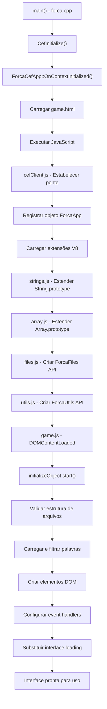
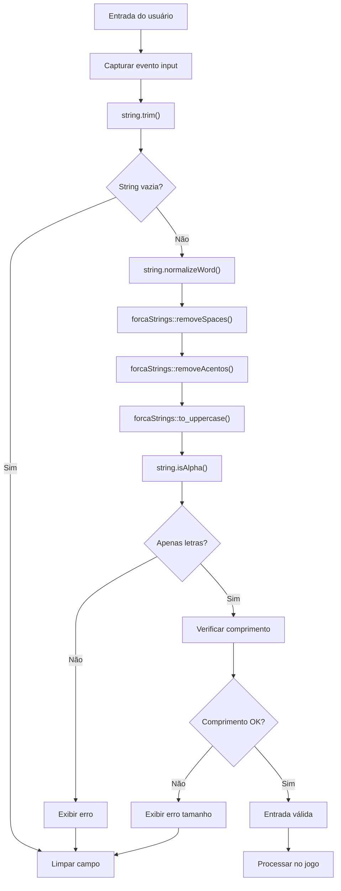
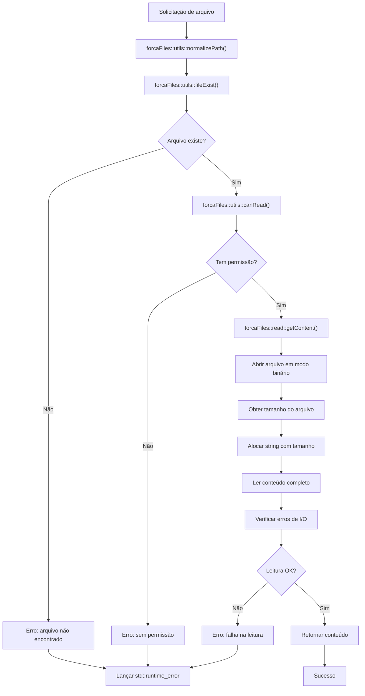

# 🎮 Jogo da Forca em C++

Um projeto acadêmico completo de Jogo da Forca desenvolvido em C++ com foco em boas práticas de programação, modularidade e robustez.

---

## Sumário

1. [Visão Geral do Projeto](#1-visão-geral-do-projeto-)
2. [Arquitetura e Estrutura de Pastas](#2-arquitetura-e-estrutura-de-pastas)
3. [Design de Módulos e Responsabilidades](#3-design-de-módulos-e-responsabilidades)
4. [Módulo forcaRegex (Expressões Regulares)](#4-módulo-forcaregex-expressões-regulares-)
5. [Módulo forcaStrings (Manipulação de Strings)](#5-módulo-forcastrings-manipulação-de-strings-)
6. [Módulo forcaFiles (Sistema de Arquivos)](#6-módulo-forcafiles-sistema-de-arquivos-)
7. [Módulo forcaUtils (Utilitários do Sistema)](#7-módulo-forcautils-utilitários-do-sistema-)
8. [Módulo forcaEncrypt (Criptografia e Codificação)](#8-módulo-forcaencrypt-criptografia-e-codificação-)
9. [Módulo forcaInterface (Interface e Ponte CEF)](#9-módulo-forcainterface-interface-e-ponte-cef-)
10. [Módulo JavaScript - Extensão do Motor V8](#10-módulo-javascript---extensão-do-motor-v8-)
11. [Frontend Web - Interface Gráfica do Usuário](#11-frontend-web---interface-gráfica-do-usuário-)
12. [Padrões de Projeto e Decisões de Design](#12-padrões-de-projeto-e-decisões-de-design-)
13. [Fluxograma de Execução](#13-fluxograma-de-execução-)
14. [Guia de Instalação e Compilação](#14-guia-de-instalação-e-compilação-)
15. [Referências e Links Úteis](#15-referências-e-links-úteis-)

---

## 1. Visão Geral do Projeto 🌟

O **Jogo da Forca** é uma aplicação multiplataforma híbrida que combina o poder do C++ moderno com a flexibilidade do JavaScript, utilizando o Chromium Embedded Framework (CEF) para criar uma interface gráfica web rica e responsiva, mantendo um backend nativo de alta performance.

### 1.1 Objetivos Principais 🎯

- **Robustez** 💪: Código modular, seguro e de fácil manutenção através de práticas modernas de C++
- **Performance** ⚡: Utilização de C++ para operações críticas
- **Extensibilidade** 🔌: Arquitetura pensada para fácil expansão de funcionalidades futuras
- **Familiaridade** 👨‍💻: APIs inspiradas em PHP e JavaScript para facilitar a curva de aprendizado

### 1.2 Tecnologias Utilizadas 🛠️

#### 1.2.1 Backend C++ 🖥️
- **Compilador**: C++17 ou superior (MSVC 2019+ no Windows e GCC/G++ 9.3+ no Linux)
- **CEF** (Chromium Embedded Framework): Versão 100+ para integração com o frontend web

#### 1.2.2 Frontend Web 🌐
- **HTML5**: Estrutura semântica e moderna
- **CSS3**: Estilização avançada com flexbox, grid e animações
- **JavaScript ES6+**: Funcionalidades modernas incluindo Promises, async/await, módulos

---

## 2. Arquitetura e Estrutura de Pastas

### 2.1 Estrutura Completa do Projeto

```
Projeto_Forca/
├── include/                    # Headers C++
│   ├── forcaInterface.h       # Interface CEF/Browser
│   ├── forcaFiles.h          # Sistema de arquivos
│   ├── forcaRegex.h          # Expressões regulares
│   ├── forcaStrings.h        # Manipulação de strings
│   ├── forcaUtils.h          # Utilitários gerais
│   └── forcaEncrypt.h        # Funções de criptografia
├── src/                       # Implementações C++
│   ├── forca.cpp             # Ponto de entrada principal
│   ├── forcaInterface.cpp    # Implementação da interface CEF
│   ├── forcaFiles.cpp        # Sistema de arquivos
│   ├── forcaRegex.cpp        # Expressões regulares
│   ├── forcaStrings.cpp      # Manipulação de strings
│   ├── forcaUtils.cpp        # Utilitários
│   └── forcaEncrypt.cpp      # Criptografia
└── files/                     # Recursos da aplicação
    ├── web/                   # Interface web
    │   ├── css/              # Estilos CSS
    │   │   ├── fonts.css     # Definições de fontes
    │   │   ├── game.css      # Estilos do jogo
    │   │   └── loading.css   # Estilos da tela de carregamento
    │   ├── html/             # Páginas HTML
    │   │   └── game.html     # Página principal do jogo
    │   ├── js/               # Scripts JavaScript
    │   │   ├── cefClient.js  # Bridge JS-C++
    │   │   ├── files.js      # Operações de arquivo
    │   │   ├── array.js      # Utilitários para arrays
    │   │   ├── utils.js      # Utilitários gerais
    │   │   ├── strings.js    # Manipulação de strings
    │   │   └── game.js       # Lógica principal do jogo
    │   └── assets/           # Recursos estáticos
    │       ├── images/       # Imagens da interface
    │       ├── svg/          # Ícones e gráficos vetoriais
    │       └── fonts/        # Fontes customizadas
    └── words/                 # Base de dados de palavras
        ├── default/          # Palavras padrão do sistema
        │   └── words.json    # Arquivo de palavras padrão
        └── custom/           # Palavras customizadas pelo usuário
            └── words.json    # Arquivo de palavras customizadas
```

### 2.2 Separação de Responsabilidades por Diretório 📁

- **include/**: Contém todos os headers (.h) do backend C++ organizados por módulo 📋
- **src/**: Implementações (.cpp) dos módulos de backend, com o código fonte completo 💻
- **files/web/**: Interface de usuário completa, incluindo estilos, scripts e recursos visuais 🎭
- **files/words/**: Base de dados de palavras segregada entre padrão e customizada 📚

### 2.3 Justificativas Arquiteturais

#### 2.3.1 Por que C++ para o Backend? 🧠

A escolha do C++ como linguagem principal para o backend foi motivada por várias necessidades específicas do projeto:

**Requisito Acadêmico** 🎓: Sendo primariamente um projeto de curso de C++, a implementação em C++ era um requisito fundamental, mas também uma oportunidade de demonstrar o poder da linguagem em um contexto prático e interativo.

**Ponte para JavaScript** 🌉: O C++ permite criar uma camada de abstração que expõe funcionalidades nativas ao JavaScript, essencialmente "enriquecendo" o ambiente JavaScript com capacidades que normalmente não estariam disponíveis em um navegador comum. Isso inclui a capacidade de trazer o mesmo motor regex usado pelo PHP (PCRE2) para o JS e implementar operações de arquivo nativas.

**Performance para Operações Intensivas** ⚡: Operações como manipulação intensiva de strings, processamento de expressões regulares complexas e operações de arquivo frequentes se beneficiam significativamente da performance nativa do C++, especialmente com textos Unicode e expressões regulares complexas.

**Demonstração de Integração** 🔄: O projeto serve como demonstração prática de como o C++ pode ser usado para estender e potencializar aplicações web através de uma arquitetura híbrida, um conceito cada vez mais relevante no desenvolvimento moderno.

#### 2.3.2 Por que CEF para a Interface? 🌐

O Chromium Embedded Framework foi escolhido por combinar o melhor dos dois mundos:

**Flexibilidade de Interface Web** 🎨: HTML5, CSS3 e JavaScript oferecem recursos modernos para criar interfaces ricas, responsivas e visualmente atraentes. A capacidade de usar frameworks CSS, animações avançadas e layouts flexíveis seria muito mais complexa em interfaces nativas tradicionais.

**Ponte C++/JavaScript Robusta** 🌉: O CEF fornece uma infraestrutura completa para expor funções C++ ao JavaScript e vice-versa, incluindo um wrapper para manipulação limitada do motor V8, permitindo que o projeto utilize a interface gráfica em linguagem web sem se desviar do seu propósito de criação em C++.

**Desenvolvimento Rápido** ⏱️: A experiência dos desenvolvedores com tecnologias web permite prototipagem e desenvolvimento mais rápidos da interface do usuário.

**Manutenibilidade** 🔧: Separar a lógica de apresentação (web) da lógica de negócio (C++) facilita a manutenção e permite que diferentes desenvolvedores trabalhem em diferentes camadas.

**Consistência Visual** 🎯: A interface web garante que a aplicação tenha aparência e comportamento consistentes entre diferentes sistemas operacionais.

#### 2.3.3 Arquitetura de Comunicação

```
┌─────────────────────────────────────┐
│          JavaScript Frontend        │
│    (game.js, strings.js, etc.)     │
└─────────────┬───────────────────────┘
              │ callUserFunc.sync/async
              │ ForcaApp global object
┌─────────────▼───────────────────────┐
│           CEF Bridge                │
│  (ApiBridgeHandler, ApiRouter)      │
└─────────────┬───────────────────────┘
              │ Function dispatch
              │ Lambda execution
┌─────────────▼───────────────────────┐
│         C++ Backend Modules         │
│ (forcaStrings, forcaFiles, etc.)    │
└─────────────────────────────────────┘
```

---

## 3. Design de Módulos e Responsabilidades

### 3.1 Backend C++

O backend é organizado em módulos especializados, cada um seguindo o Princípio da Responsabilidade Única (Single Responsibility Principle). Esta abordagem facilita a manutenção, teste e expansão do código, além de permitir uma integração clara com o frontend JavaScript através do CEF. 🧩

#### 3.1.1 Visão Geral dos Módulos C++ 🔍

**forcaRegex** 🔍: Implementa operações de expressões regulares usando PCRE2, oferecendo uma API familiar para validação de entrada, substituição e extração de texto baseada em padrões. Este módulo é crucial para processamento avançado de texto com suporte completo a Unicode.

**forcaStrings** 📝: Fornece manipulação avançada de strings com suporte Unicode via ICU, incluindo normalização, remoção de acentos, conversão de caixa e operações de texto visualmente corretas. Implementa operações familiares para desenvolvedores web.

**forcaFiles** 📂: Gerencia todas as operações de sistema de arquivos, incluindo leitura/escrita de arquivos em diferentes formatos (texto, binário, JSON, Base64), validação de paths e gerenciamento de permissões, garantindo segurança e portabilidade.

**forcaUtils** 🛠️: Contém funções utilitárias diversas que auxiliam outros módulos, como detecção de sistema operacional, validação booleana, manipulação de console e outras funções auxiliares que não se encaixam nos outros módulos especializados.

**forcaInterface** 🌉: Implementa a ponte entre C++ e JavaScript usando o CEF. Este módulo central gerencia o roteamento de funções, handlers de contexto, ciclo de vida do navegador, e expõe todas as funcionalidades nativas para o JavaScript, além de gerenciar o fallback de GPU.

#### 3.1.2 Módulos JavaScript 📱

O frontend JavaScript estende o ambiente de execução para criar uma API consistente, elegante e familiar, que utiliza as funcionalidades nativas do C++ por baixo dos panos:

**cefClient.js** 🔄: Implementa a ponte principal entre JavaScript e C++, fornecendo métodos para chamadas síncronas, assíncronas e sem retorno, além de gerenciar Promises e tratamento de erros. Este é o módulo central que conecta todo o JavaScript ao backend C++.

**strings.js** 📝: Estende o `String.prototype` nativo do JavaScript com métodos adicionais baseados no ICU, todos delegando para o backend C++ para operações complexas como normalização Unicode e manipulação de graphemes.

**array.js** 📊: Adiciona métodos utilitários para arrays, incluindo operações como `implode`, e outros helpers, permitindo manipulação avançada de coleções de dados integrada com funções C++.

**utils.js** 🛠️: Fornece funções utilitárias para o frontend, como validação, formatação, conversão de tipos e outras operações auxiliares que simplificam o desenvolvimento da interface do usuário.

**files.js** 📂: Expõe operações de sistema de arquivos para o JavaScript, permitindo que o frontend leia e escreva arquivos diretamente através de uma API segura e controlada pelo backend C++, algo normalmente impossível em JavaScript puro.

Cada um desses módulos segue uma filosofia de design consistente: fornecer APIs familiares, robustas e de alto desempenho, aproveitando o melhor de ambos os mundos (C++ e JavaScript) para criar uma experiência de desenvolvimento e de usuário superior. 🚀

---

# 4. Módulo forcaRegex (Expressões Regulares) 🔍

O módulo `forcaRegex` é um componente essencial do projeto do Jogo da Forca, dedicado a fornecer **funcionalidades robustas de expressões regulares**. Este módulo encapsula a complexidade da biblioteca PCRE2 (Perl Compatible Regular Expressions, versão 2), oferecendo uma API simplificada e familiar para manipulação de padrões complexos de texto.

## 4.1 Propósito e Papel no Projeto 🎯

### 4.1.1 Visão Geral

O `forcaRegex` atua como a **camada de serviço para operações de expressões regulares**, permitindo:

- **Validação de Entrada** 🔎: Verificar se a entrada do usuário (letras, palavras) segue um formato específico
- **Processamento de Texto** 📝: Manipular palavras, frases ou listas de palavras, extraindo informações ou transformando-as
- **Flexibilidade** 🧩: Lidar com caracteres especiais, acentuação e diferentes formatos de entrada
- **Integração** 🔄: Conectar-se a outras partes do projeto como `forcaStrings` e ao frontend JavaScript

### 4.1.2 Por que Expressões Regulares?

Expressões regulares são **padrões de texto** que permitem buscar, validar e manipular strings de forma avançada, oferecendo:

- **Flexibilidade**: Expressam padrões complexos em poucas linhas
- **Precisão**: Permitem validações extremamente específicas
- **Eficiência**: Otimizadas para processamento de texto
- **Universalidade**: Presentes em praticamente todas as linguagens de programação

### 4.1.3 Por que PCRE2?

A escolha da biblioteca PCRE2 foi motivada por:

1. **Compatibilidade com PHP** 🔄: Mesmo motor usado pelo PHP, garantindo sintaxe e comportamento idênticos
2. **Performance** ⚡: Implementação otimizada em C, extremamente rápida para grandes volumes de texto
3. **Recursos avançados** 🔧: Suporte a grupos nomeados, lookaheads, lookbehinds e Unicode
4. **Estabilidade** 🛡️: Biblioteca madura e amplamente testada
5. **Padrão da indústria** 🏭: Utilizada por Apache, nginx, PHP e muitos outros projetos

## 4.2 Estruturas de Dados e Arquitetura 📐

### 4.2.1 Estruturas de Dados Principais

O módulo implementa quatro estruturas fundamentais que trabalham em conjunto:

#### `struct RegexPattern`

```cpp
struct RegexPattern {
    std::string expression;     // Expressão regex limpa
    PCRE2_SPTR pattern;         // Ponteiro PCRE2 para o padrão
    PCRE2_SIZE length;          // Tamanho em bytes
    uint32_t options;           // Flags de compilação
    struct RegexCompile {       // Sub-estrutura para compilação
        int error_code;
        PCRE2_SIZE error_offset;
        pcre2_compile_context *context;
        pcre2_code *code;       // Código compilado
        ~RegexCompile();        // Destrutor RAII
    } compiled;
};
```

**Propósito**: Armazena um padrão de expressão regular compilado e suas configurações, incluindo a expressão original, flags e contexto de compilação. O destrutor da sub-estrutura `RegexCompile` é crucial para liberar a memória alocada pelo PCRE2, evitando vazamentos.

#### `struct RegexMatchData`

```cpp
struct RegexMatchData {
    pcre2_general_context *gcontext;
    pcre2_match_data *match_data;
    ~RegexMatchData();  // Destrutor RAII
};
```

**Propósito**: Gerencia os dados de match retornados pelo PCRE2 após uma operação de busca, garantindo liberação automática de recursos através do destrutor que chama `pcre2_match_data_free(match_data)` e `pcre2_general_context_free(gcontext)`.

#### `struct RegexStructData`

```cpp
struct RegexStructData {
    PCRE2_SIZE start;    // Posição inicial do match
    PCRE2_SIZE end;      // Posição final do match
    std::string match;   // Texto encontrado
};
```

**Propósito**: Armazena informações detalhadas sobre um único match, incluindo posições de início e fim na string original, além do texto correspondente ao match.

#### `struct RegexResult`

```cpp
struct RegexResult {
    // Membros públicos
    std::vector<int> int_keys;         // Índices dos grupos numéricos
    std::vector<std::string> string_keys;  // Nomes dos grupos nomeados
    bool match = false;                // Indica se houve match
    
    // Métodos principais
    bool key_exist(int key);
    bool key_exist(const std::string& key);
    void push(PCRE2_SIZE start, PCRE2_SIZE end, std::string match, int key);
    void push(PCRE2_SIZE start, PCRE2_SIZE end, std::string match, const std::string& key);
    std::vector<RegexStructData>* get(int key);
    std::vector<RegexStructData>* get(const std::string& key);
    
private:
    std::vector<std::vector<RegexStructData>> numberGroups;
    std::map<std::string, std::vector<RegexStructData>> namedGroups;
    std::string trim(const std::string& string);  // Função utilitária
};
```

**Propósito**: Esta é a estrutura principal que encapsula todos os resultados de uma operação de busca regex. Ela armazena tanto grupos numéricos quanto nomeados, permitindo acesso fácil a todos os matches encontrados. O método `get()` retorna um ponteiro para o vetor de matches de um grupo específico, permitindo acesso eficiente aos dados sem cópias desnecessárias.

### 4.2.2 Funções Principais da API

O módulo expõe uma API inspirada no PHP com cinco funções principais:

#### `createPattern()`

```cpp
std::unique_ptr<forcaRegex::RegexPattern> createPattern(const std::string& pattern);
```

**Propósito**: Analisa uma string de padrão regex no estilo PHP (`/pattern/flags`), extrai a expressão e flags, e compila o padrão usando PCRE2.

**Parâmetros**:
- `pattern`: A string contendo o padrão regex no formato `/pattern/flags` ou `#pattern#flags`

**Retorno**: Um `std::unique_ptr` para o padrão compilado, garantindo gerenciamento automático de memória.

**Exceções**: 
- `std::invalid_argument`: Se o padrão estiver malformado
- `std::runtime_error`: Se houver erro na compilação

#### `preg_match()`

```cpp
forcaRegex::RegexResult preg_match(
    const std::string& pattern, 
    const std::string& subject, 
    PCRE2_SIZE offset = 0
);
```

**Propósito**: Busca a **primeira ocorrência** de um padrão regex em uma string e retorna os grupos capturados.

**Parâmetros**:
- `pattern`: O padrão regex no formato `/pattern/flags`
- `subject`: A string onde será feita a busca
- `offset`: Posição onde iniciar a busca (opcional, padrão é 0)

**Retorno**: Um objeto `RegexResult` contendo o status do match e dados dos grupos capturados.

#### `preg_match_all()`

```cpp
forcaRegex::RegexResult preg_match_all(
    const std::string& pattern, 
    const std::string& subject, 
    PCRE2_SIZE offset = 0, 
    std::size_t limit = std::numeric_limits<size_t>::max()
);
```

**Propósito**: Busca **todas as ocorrências** de um padrão regex em uma string e retorna todos os grupos capturados.

**Parâmetros**:
- `pattern`: O padrão regex no formato `/pattern/flags`
- `subject`: A string onde será feita a busca
- `offset`: Posição onde iniciar a busca (opcional, padrão é 0)
- `limit`: Número máximo de matches a serem encontrados (opcional, padrão é ilimitado)

**Retorno**: Um objeto `RegexResult` contendo os matches encontrados e seus grupos.

#### `preg_replace()`

```cpp
std::string preg_replace(
    const std::string& pattern, 
    const std::string& subject, 
    const std::string& replacement, 
    PCRE2_SIZE offset = 0, 
    std::size_t limit = std::numeric_limits<size_t>::max()
);
```

**Propósito**: Substitui ocorrências de um padrão regex por um texto de substituição, com suporte a referências para grupos capturados.

**Parâmetros**:
- `pattern`: O padrão regex no formato `/pattern/flags`
- `subject`: A string onde serão feitas as substituições
- `replacement`: A string de substituição (pode conter referências como $0, $1, $name)
- `offset`: Posição onde iniciar as substituições (opcional, padrão é 0)
- `limit`: Número máximo de substituições (opcional, padrão é ilimitado)

**Retorno**: A string com as substituições realizadas.

#### `preg_split()`

```cpp
std::vector<std::string> preg_split(
    const std::string& pattern, 
    const std::string& subject, 
    std::size_t limit = std::numeric_limits<size_t>::max()
);
```

**Propósito**: Divide uma string em substrings usando um padrão regex como delimitador.

**Parâmetros**:
- `pattern`: O padrão regex que atuará como delimitador
- `subject`: A string a ser dividida
- `limit`: Número máximo de elementos a serem retornados (opcional, padrão é ilimitado)

**Retorno**: Um vetor de strings contendo as partes da string dividida.

### 4.2.3 Flags Suportadas

O `forcaRegex` implementa o mesmo conjunto de flags do PHP:

| Flag | Constante PCRE2 | Descrição |
|------|-----------------|-----------|
| `i` | `PCRE2_CASELESS` | Torna a busca case-insensitive (ignora maiúsculas/minúsculas) |
| `m` | `PCRE2_MULTILINE` | Faz `^` e `$` corresponderem ao início e fim de cada linha |
| `s` | `PCRE2_DOTALL` | Faz o ponto (`.`) incluir quebras de linha |
| `u` | `PCRE2_UTF` | Ativa o modo UTF-8 para suporte completo a Unicode |
| `x` | `PCRE2_EXTENDED` | Ignora espaços em branco no padrão, permitindo expressões mais legíveis |
| `U` | `PCRE2_UNGREEDY` | Inverte a "ganância" dos quantificadores (torna `*` e `+` não-gananciosos) |

## 4.3 Gestão de Memória e RAII 🧹

O módulo implementa técnicas avançadas para garantir segurança e evitar vazamentos de memória através do princípio RAII (Resource Acquisition Is Initialization).

### 4.3.1 RAII em Estruturas PCRE2

```cpp
~RegexCompile() {
    if (code != nullptr) pcre2_code_free(code);
    if (context != nullptr) pcre2_compile_context_free(context);
}

~RegexMatchData() {
    if (match_data != nullptr) pcre2_match_data_free(match_data);
    if (gcontext != nullptr) pcre2_general_context_free(gcontext);
}
```

**Benefícios**:
- Liberação automática de recursos quando os objetos saem de escopo
- Funcionamento correto mesmo quando exceções são lançadas
- Simplificação do código de tratamento de erros

### 4.3.2 Smart Pointers

Os padrões compilados são gerenciados com `std::unique_ptr`, proporcionando propriedade exclusiva, destruição automática e transferência segura de propriedade.

### 4.3.3 Contêineres STL

O módulo utiliza `std::vector` e `std::map` que gerenciam automaticamente a memória de seus elementos, garantindo alocação e desalocação automática para coleções de resultados.

## 4.4 Implementação Técnica Detalhada 🔬

### 4.4.1 Função createPattern()

Esta função é o coração do módulo, responsável por analisar e compilar padrões regex. Realiza normalização da entrada removendo espaços desnecessários, validação rigorosa do formato (`/pattern/flags` ou `#pattern#flags`), e mapeamento de flags para constantes PCRE2.

O processo de validação verifica se o padrão possui pelo menos 3 caracteres, delimitadores válidos (`/` ou `#`), e correspondência entre delimitadores de abertura e fechamento. As flags suportadas (`i`, `m`, `s`, `u`, `x`, `U`) são mapeadas estaticamente para suas respectivas constantes PCRE2.

Em caso de erro de compilação, a função fornece mensagens detalhadas incluindo a posição do erro, utilizando `pcre2_get_error_message()` para obter descrições legíveis dos erros PCRE2.

### 4.4.2 Função preg_match()

Implementa busca da primeira ocorrência com otimizações para casos triviais (early return para subject vazio ou offset além do limite). A função extrai grupos numéricos usando ponteiros de ovector e processa condicionalmente grupos nomeados quando presentes.

O processamento de grupos nomeados utiliza `pcre2_pattern_info()` para obter informações da tabela de nomes, iterando através das entradas para extrair nomes e números dos grupos, seguido pela extração das substrings correspondentes.

### 4.4.3 Função preg_match_all()

Estende a funcionalidade de `preg_match()` para encontrar todas as ocorrências, implementando controle de limite máximo e tratamento especial para matches de largura zero. Utiliza um mecanismo para prevenir loops infinitos incrementando o offset quando necessário.

O loop principal continua até que o offset atinja o final da string, o limite seja atingido, ou não haja mais matches. Para cada match encontrado, processa tanto grupos numéricos quanto nomeados usando a mesma lógica de `preg_match()`.

### 4.4.4 Função preg_replace()

Oferece otimização para `limit=1` utilizando `preg_match()` em vez de `preg_match_all()` para melhor performance. Implementa substituição sofisticada de grupos posicionais (`$0`, `$1`) e nomeados (`$name`), preservando partes não modificadas da string original.

O processo de substituição itera através dos matches encontrados, construindo a string de saída parte por parte: adiciona o texto entre matches, processa as substituições de grupos, e finaliza com o restante da string após o último match.

### 4.4.5 Função preg_split()

Implementa divisão de strings usando padrões regex como delimitadores, com a mesma otimização de `limit=1` das outras funções. Utiliza manipulação eficiente de offsets para evitar recálculos desnecessários e trata especificamente o último elemento quando o limite é atingido.

A função calcula as posições de divisão baseadas nos matches encontrados, extraindo substrings entre os delimitadores e gerenciando cuidadosamente os offsets para garantir que todas as partes da string sejam incluídas no resultado final.

## 4.5 Exemplos de Uso Práticos 🧪

Esta seção apresenta **exemplos reais** extraídos do projeto do Jogo da Forca, demonstrando como o módulo `forcaRegex` é utilizado na prática para operações concretas de manipulação de texto.

### 4.5.1 Conceitos Fundamentais

#### Padrões Unicode para Quebras de Linha
O projeto utiliza um padrão regex abrangente para detectar diferentes tipos de quebra de linha:
```regex
(?:\r\n|\r|\n|\v|\f|\x85|\x0b|\p{Zl}|\p{Zp})
```

**Componentes do Padrão**:
- `\r\n` (Windows), `\r` (Mac clássico), `\n` (Unix)
- `\v` (tab vertical), `\f` (form feed)  
- `\x85`, `\x0b` (caracteres de controle Unicode)
- `\p{Zl}` (separadores de linha Unicode), `\p{Zp}` (separadores de parágrafo Unicode)
- **Flag `u`**: Habilita processamento Unicode completo

#### Detecção Automática de RegExp JavaScript
O sistema detecta automaticamente se um parâmetro é um objeto RegExp JavaScript:
```cpp
// Lógica de detecção unificada
if( search->IsObject() && jsStringObj && jsStringObj->IsFunction() ) {
    CefRefPtr<CefV8Value> regexSource = search->GetValue("source");
    CefRefPtr<CefV8Value> regexFlags = search->GetValue("flags");
    
    if(regexSource && regexSource->IsString()) {
        std::string source = regexSource->GetStringValue();
        std::string flags = regexFlags->IsString() ? regexFlags->GetStringValue() : "";
        searchValue = "/" + source + "/" + flags;
        isRegex = true;
    }
}
```

**Processo Técnico**:
- **Duck Typing**: Verifica propriedades `source` e `flags`
- **Conversão de Formato**: JS (`/pattern/flags`) → PCRE2 (`/pattern/flags`)
- **Preservação de Flags**: Mantém flags originais (`i`, `g`, `m`, etc.)

#### Conversão UTF-8/UTF-16
Para compatibilidade com JavaScript, o sistema converte índices entre encodings:
- **UTF-8**: Formato interno do C++
- **UTF-16**: Formato esperado pelo JavaScript
- **Otimização**: Mapas de conversão criados uma vez para múltiplas operações

### 4.5.2 Casos de Uso Reais

#### Normalização de Quebras de Linha (`forcaStrings.cpp`)
**Função**: `normalizeLineBreaks()` - Converte diferentes tipos de quebra para formato Unix.

```cpp
std::string normalizeLineBreaks( const std::string& text ) {
    return forcaRegex::preg_replace(R"(/(?:\r\n|\r|\n|\v|\f|\x85|\x0b|\p{Zl}|\p{Zp})/u)", text, "\n");
}
```

**Aplicação**: Unifica quebras de linha antes do processamento de texto no jogo.

#### Remoção de Quebras Extras (`forcaStrings.cpp`)
**Função**: `removeExtraLineBreaks()` - Remove quebras consecutivas.

```cpp
std::string removeExtraLineBreaks( const std::string& text, bool normalize ) {
    if(normalize){
        // Normaliza E remove extras em uma operação
        return forcaRegex::preg_replace(R"(/(?:\r\n|\r|\n|\v|\f|\x85|\x0b|\p{Zl}|\p{Zp})+/u)", text, "\n");
    }
    else{
        // Preserva tipo original, remove apenas extras
        return forcaRegex::preg_replace(R"(/((?:\r\n|\r|\n|\v|\f|\x85|\x0b|\p{Zl}|\p{Zp}))+/u)", text, "$1");
    }
}
```

**Técnicas Aplicadas**:
- **Quantificador `+`**: Corresponde a múltiplas quebras consecutivas
- **Grupo de captura**: `((?:...))` preserva o tipo da primeira quebra
- **Lógica condicional**: Comportamento baseado no parâmetro `normalize`

#### Divisão Inteligente de Strings (`explode` em forcaStrings.cpp`)
**Função**: Detecta automaticamente regex vs string literal como separador.

```cpp
// Detecção e aplicação
if(isRegex){
    explode = forcaRegex::preg_split(searchValue, string, limit);
}
else{
    forcaStrings::explode(string, searchValue, &explode, limit);
}
```

**Strategy Pattern**: Diferentes algoritmos para regex vs string literal.

#### Substituição Avançada (`str_replace` em forcaInterface.cpp)
**Função**: Substituição com suporte automático a regex ou string literal.

```cpp
// Aplicação da substituição
if(isRegex) {
    result = forcaRegex::preg_replace(searchValue, string, replaceValue, offset, 1);
} else {
    result = performStringReplace(string, searchValue, replaceValue, offset);
}
```

#### Busca com Mapeamento de Índices (`search` em forcaStrings.cpp)
**Função**: Retorna índices compatíveis com JavaScript.

```cpp
std::string::size_type search( const std::string& string, const std::string& search ) {
    if(string.empty()) return std::string::npos;

    forcaRegex::RegexResult result = forcaRegex::preg_match(search, string);
    if(!result.match) return std::string::npos;

    std::vector<forcaRegex::RegexStructData>* match_data = result.get(0);
    if(match_data == nullptr) return std::string::npos;

    forcaRegex::RegexStructData first_match = match_data->at(0);

    // Conversão UTF-8 → UTF-16 para compatibilidade JS
    return forcaStrings::IndexUTF8_toUTF16(string, first_match.start);
}
```

#### Busca Múltipla Otimizada (`search_all` em forcaStrings.cpp)
**Função**: Array de todos os índices encontrados com otimização de conversão.

```cpp
std::vector<std::string::size_type> search_all( const std::string& string, const std::string& search, std::size_t limit ) {
    if(string.empty() || limit == 0) return {};

    forcaRegex::RegexResult result = forcaRegex::preg_match_all(search, string, 0, limit);
    if(!result.match) return {};

    std::vector<forcaRegex::RegexStructData>* match_data = result.get(0);
    if(match_data == nullptr) return {};

    std::vector<std::string::size_type> all_index;
    
    // Otimização: mapa de conversão criado uma vez
    std::vector<std::string::size_type> utf16_index = forcaStrings::MapIndexUTF8_toUTF16(string);

    // Conversão em O(1) por posição
    for(std::size_t i=0; i<match_data->size() && i<limit; i++){
        all_index.push_back( utf16_index[ match_data->at(i).start ] );
    }

    return all_index;
}
```

**Otimização**: Lookup em O(1) vs conversão individual O(n).

#### Divisão com Regex (`preg_split`)
**Função**: Divisão usando padrões complexos com otimizações condicionais.

```cpp
std::vector<std::string> preg_split( const std::string& pattern, const std::string& subject, std::size_t limit ) {
    if(subject.empty() || limit == 0) return std::vector<std::string>{subject};

    RegexResult result;

    // Otimização para limite 1
    if(limit == 1){
        result = preg_match(pattern, subject, 0);
    }
    else{
        result = preg_match_all(pattern, subject, 0, limit);
    }

    if (!result.match) return std::vector<std::string>{subject};

    // Construção de substrings entre matches
    std::vector<std::string> explode;
    std::string::size_type offset = 0;

    for(std::size_t i=0; i<complete_matches->size(); i++){
        if(i >= limit || offset >= subject.length()) break;

        if(i + 1 < limit){
            std::string::size_type start = complete_matches->at(i).start;
            std::string::size_type end = complete_matches->at(i).end;
            
            explode.push_back(subject.substr( offset, (start - offset) ));
            offset = end;
        }
        else{
            // Último elemento: resto da string
            explode.push_back( subject.substr(offset) );
        }
    }

    return explode;
}
```

### 4.5.3 Padrões de Design Aplicados

**Strategy Pattern**: Seleção de algoritmo baseada no tipo de entrada (regex vs string).

**Factory Pattern**: `createPattern()` encapsula criação de objetos regex complexos.

**Adapter Pattern**: Conversão entre formatos JavaScript e PCRE2.

**Optimization Pattern**: Reutilização de compilações e mapas de conversão.

## 4.6 Integração com JavaScript 🌐

O módulo `forcaRegex` é exposto ao JavaScript através do módulo `forcaInterface` e do arquivo `strings.js`, que estende o protótipo de `String` com métodos avançados utilizando o motor PCRE2.

### 4.6.1 API JavaScript Estendida

**Implementação em `strings.js`**:

```javascript
// Métodos que utilizam o motor PCRE2 via callUserFunc.sync

String.prototype.preg_replace = function(search, replaceValue, offset = 0, limit){
    return callUserFunc.sync("preg_replace", this.toString(), search, replaceValue, offset, limit);
};

String.prototype.preg_split = function(search, limit){
    return callUserFunc.sync("preg_split", this.toString(), search, limit);
};

String.prototype.split = function(separator = "", limit){
    return callUserFunc.sync("explode", this.toString(), separator, limit);
};

String.prototype.replace = function(search, replaceValue, offset = 0){
    return callUserFunc.sync("str_replace", this.toString(), search, replaceValue, offset);
};

String.prototype.replaceAll = function(search, replaceValue, offset = 0, limit){
    return callUserFunc.sync("str_replace_all", this.toString(), search, replaceValue, offset, limit);
};

String.prototype.search = function(search){
    return callUserFunc.sync("search", this.toString(), search);
};

String.prototype.searchAll = function(search, limit){
    return callUserFunc.sync("searchAll", this.toString(), search, limit);
};

String.prototype.normalizeLineBreaks = function(){
    return callUserFunc.sync("normalizeLineBreaks", this.toString());
}

String.prototype.removeExtraLineBreaks = function(normalize = true){
    return callUserFunc.sync("removeExtraLineBreaks", this.toString(), normalize);
}
```

### 4.6.2 Casos de Uso no Jogo da Forca

#### Validação de Entrada do Usuário (`game.js`)
```javascript
gameObject.verificarLetras = function(letter) {
    if (!gameObject.initialized) return;
    
    letter = letter.normalizeWord();
    
    if (!letter.isAlpha()) {
        alert("Digite uma letra válida!");
        return;
    }
    
    if (gameObject.word.includes(letter)) {
        gameObject.letrasCorretas.push(letter);
        
        // Busca todas as posições da letra
        const index = gameObject.word.searchAll(letter);
        
        // Revela letra em todas as posições
        let textContent = interfaceObject.menu.forca.tracosContainer.textContent;
        for (let i = 0; i < index.length; i++) {
            const letterIndex = index[i];
            let firstSubstring = letterIndex === 0 ? "" : textContent.substr(0, letterIndex);
            textContent = firstSubstring + letter + textContent.substr(letterIndex + 1);
        }
        
        interfaceObject.menu.forca.tracosContainer.textContent = textContent;
    }
};
```

#### Validação de Modo Dupla (`game.js`)
```javascript
interfaceObject.handlers.menu.duo.input.change = function(event) {
    if (interfaceObject.menu.duo.input.value.trim().empty()) {
        interfaceObject.menu.duo.input.value = '';
        return;
    }

    if (!interfaceObject.menu.duo.input.value.isAlpha()) {
        alert("São permitidos apenas letras de A a Z...");
        // Remove caracteres não alfabéticos
        interfaceObject.menu.duo.input.value = 
            interfaceObject.menu.duo.input.value.preg_replace(/[^a-zA-Z]/g, '');
        return;
    }

    if (interfaceObject.menu.duo.input.value.visibleLength() > 15) {
        alert("A palavra secreta não pode ter mais de 15 letras...");
        interfaceObject.menu.duo.input.value = 
            interfaceObject.menu.duo.input.value.slice(0, 15);
        return;
    }
}
```

#### Filtragem de Arrays (`game.js`)
```javascript
const utilsObject = Object.freeze({
    filterWordsArray: function(array) {
        if (!Array.isArray(array) || array.empty()) return [];

        const copyArray = array;
        
        // Itera de trás para frente
        for (let i = (copyArray.length - 1); i >= 0; i--) {
            const palavra = copyArray[i];
            
            if (typeof palavra !== "string" || palavra.trim().empty()) {
                copyArray.splice(i, 1);
                continue;
            }
            
            const palavraNormalizada = palavra.normalizeWord();
            if (!palavraNormalizada.isAlpha() || palavraNormalizada.length < 3) {
                copyArray.splice(i, 1);
                continue;
            }
        }

        return copyArray;
    }
});
```

### 4.6.3 Benefícios da Integração

**Vantagens Técnicas**:
- **Performance Superior**: Motor PCRE2 otimizado vs regex JavaScript nativo
- **Compatibilidade Unicode**: Suporte completo a caracteres especiais portugueses
- **API Familiar**: Sintaxe consistente com PHP e JavaScript
- **Validação Robusta**: Verificação precisa de entrada do usuário
- **Transparência**: Métodos funcionam como se fossem nativos

**Impacto no Projeto**:
- **Robustez**: Validação confiável de entrada
- **Flexibilidade**: Processamento avançado de texto
- **Manutenibilidade**: Interface consistente
- **Performance**: Operações otimizadas em strings grandes

## 4.7 Decisões de Design e Padrões 🧠

### 4.7.1 Arquitetura Modular
- **Separação de Responsabilidades**: Módulo focado exclusivamente em regex
- **Abstração de Biblioteca**: Interface friendly sobre PCRE2 complexa
- **RAII**: Gerenciamento automático de recursos com smart pointers

### 4.7.2 Otimizações Implementadas
- **Compilação Única**: Padrões reutilizados evitam recompilação
- **Mapeamento Eficiente**: Conversão UTF-8/UTF-16 otimizada
- **Detecção Automática**: Strategy pattern para diferentes tipos de entrada

### 4.7.3 Tratamento de Edge Cases
- **Matches de Largura Zero**: Prevenção de loops infinitos
- **Validação de Entrada**: Verificações robustas em todas as funções
- **Compatibilidade Unicode**: Suporte completo a caracteres especiais

## 4.8 Conclusão 🏁

O módulo `forcaRegex` representa uma implementação profissional que combina:

**Técnicas Avançadas de C++**:
- Gerenciamento automático de memória com RAII
- Integração segura com biblioteca C (PCRE2)
- Interface intuitiva inspirada no PHP
- Tratamento robusto de erros
- Otimizações de performance específicas

**Impacto no Projeto**:
- **Robustez**: Validação confiável de entrada do usuário
- **Flexibilidade**: Processamento avançado de texto Unicode
- **Manutenibilidade**: Código organizado e bem estruturado
- **Performance**: Otimizado para operações em strings grandes
- **Compatibilidade**: Sintaxe familiar para desenvolvedores web

O módulo transforma operações complexas de regex em uma API simples e eficiente, essencial para a funcionalidade core do Jogo da Forca, especialmente no processamento de texto em português e validação de entrada do usuário.

# 5. Módulo forcaStrings (Manipulação de Strings) 📝

O módulo `forcaStrings` é um componente fundamental do projeto do Jogo da Forca, dedicado a fornecer **funcionalidades avançadas de manipulação de strings**, com um foco particular no **suporte robusto a Unicode (UTF-8)**. Seu principal propósito é abstrair a complexidade de lidar com caracteres especiais, acentuação, diferentes tipos de espaços e quebras de linha, e outras nuances da manipulação de texto em um ambiente globalizado.

## 5.1 Propósito e Papel no Projeto 🎯

### 5.1.1 Visão Geral

O `forcaStrings` atua como a **biblioteca central para todas as operações de texto**, garantindo que o jogo da forca possa lidar com qualquer palavra ou frase de forma correta e eficiente, com total suporte a Unicode. Este módulo é crucial para o jogo da forca, pois a manipulação correta de palavras, letras e frases é central para a lógica do jogo.

**Papel Funcional no Projeto:**

- **Normalização de Texto** 🔄: Garante que strings com diferentes representações Unicode (ex: caracteres acentuados compostos vs. pré-compostos) sejam tratadas de forma consistente

- **Limpeza de Strings** 🧹: Remove espaços indesejados, acentos e normaliza quebras de linha, preparando as strings para comparação ou exibição

- **Manipulação de Caracteres** 🔤: Oferece funções para obter o comprimento visível de uma string (número de *graphemes*), acessar caracteres por índice, repetir strings, e extrair substrings, tudo com suporte a Unicode

- **Busca e Substituição** 🔍: Implementa funcionalidades de busca e substituição de substrings, considerando a complexidade do Unicode

- **Divisão e Junção** ✂️: Permite dividir strings em arrays de substrings (`explode`) e juntar arrays em strings (`implode`), com suporte a Unicode

- **Integração** 🔗: Serve como uma camada de serviço para outras partes do projeto que precisam de manipulação de strings, como `forcaInterface` e utiliza `forcaRegex` internamente para algumas operações

### 5.1.2 Por que ICU (International Components for Unicode)?

A escolha da biblioteca ICU foi motivada por sua **robustez e padrão da indústria** para manipulação Unicode. Ver seção 5.3.1 para detalhes técnicos completos.

## 5.2 Conceitos Fundamentais 📐

### 5.2.1 Terminologia Unicode

**Graphemes**: Unidades de texto visíveis para o usuário. Um grapheme pode ser composto por múltiplos *code points* (ex: 'á' pode ser 'a' + acento).

**Code Points**: Unidades básicas do Unicode, cada uma com um valor numérico único.

**UTF-8/UTF-16**: Codificações diferentes do Unicode. O módulo converte entre UTF-8 (`std::string`) e UTF-16 interno da ICU (`icu::UnicodeString`).

### 5.2.2 Padrão de Conversão e Processamento

Todas as funções do módulo seguem o padrão:
1. Conversão UTF-8 → UTF-16 (`icu::UnicodeString`)
2. Processamento usando APIs da ICU
3. Conversão UTF-16 → UTF-8 (`std::string`)

### 5.2.3 BreakIterator para Manipulação de Caracteres

Para funções que manipulam caracteres individuais (`explodeGraphemes`, `VisibleLength`, `charAt`, `substring`), o módulo utiliza `icu::BreakIterator::createCharacterInstance` que:
- Identifica limites corretos de *graphemes*
- Lida com caracteres compostos automaticamente
- Respeita regras específicas de *locale*

## 5.3 Estruturas de Dados e Funções 📋

### 5.3.1 Funções de Normalização e Limpeza

#### `std::string removeSpaces(const std::string& string)`

**Propósito**: Remove todos os caracteres de espaço em branco de uma string, incluindo espaços Unicode (como espaços não quebráveis, etc.).

**Implementação**: Utiliza `u_isUWhiteSpace(c)` da ICU para identificar todos os tipos de espaço Unicode e remove-os iterativamente.

**Parâmetros**: `string` - A string de entrada.
**Retorno**: String sem espaços.
**Exposição JavaScript**: `String.prototype.removeSpaces`

#### `std::string normalize(const std::string& string, const std::string& form = "NFC")`

**Propósito**: Normaliza uma string Unicode para uma das formas de normalização (NFC, NFD, NFKC, NFKD). Crucial para garantir que diferentes representações de caracteres equivalentes sejam tratadas consistentemente.

**Implementação**: Utiliza instâncias específicas de `icu::Normalizer2` baseadas no parâmetro `form`. Valida entrada e lança exceções para formas inválidas.

**Parâmetros**: 
- `string` - A string a ser normalizada
- `form` - A forma de normalização (padrão: "NFC")

**Retorno**: String normalizada.
**Exposição JavaScript**: `String.prototype.normalize`

#### `std::string removeAcentos(const std::string& string)`

**Propósito**: Remove acentos e o caractere 'ç' de uma string, substituindo-os por seus equivalentes sem acentuação. Focado em palavras do português brasileiro.

**Implementação**: 
1. Normaliza para NFC usando `forcaStrings::normalize`
2. Mapeia caracteres acentuados através de arrays estáticos para seus equivalentes não acentuados
3. Substitui usando `std::string::find` e `std::string::replace`

**Parâmetros**: `string` - A string de entrada.
**Retorno**: String sem acentos.
**Exposição JavaScript**: `String.prototype.removeAcentos`

#### `std::string to_uppercase(const std::string& string)` e `std::string to_lowercase(const std::string& string)`

**Propósito**: Convertem todos os caracteres de uma string para maiúsculas/minúsculas, lidando corretamente com Unicode.

**Implementação**: Utilizam `input.toUpper()`/`toLower()` da `icu::UnicodeString` com `icu::Locale::getDefault()` para conversão sensível ao locale.

**Parâmetros**: `string` - A string de entrada.
**Retorno**: String em maiúsculas/minúsculas.
**Exposição JavaScript**: `String.prototype.toUpperCase`/`toLowerCase`

#### Funções de Trim (trim, ltrim, rtrim)

**Propósito**: Removem espaços em branco do início e/ou fim de uma string, com suporte a Unicode.

**Implementação**: Utilizam loops com `u_isUWhiteSpace()` para identificar e remover caracteres de espaço Unicode das extremidades.

**Variações**:
- `trim()`: Remove do início e fim
- `ltrim()`: Remove apenas do início  
- `rtrim()`: Remove apenas do fim

**Exposição JavaScript**: `String.prototype.trim`, `ltrim`, `rtrim`

#### `std::string normalizeWord(const std::string& string)`

**Propósito**: Normaliza uma palavra combinando remoção de espaços, remoção de acentos e conversão para maiúsculas.

**Implementação**: Chama sequencialmente `removeSpaces`, `removeAcentos` e `to_uppercase`.

#### Funções de Normalização de Quebras de Linha

**Propósito**: Normalizam quebras de linha convertendo diferentes tipos para formato Unix (`\n`) e removendo quebras múltiplas consecutivas.

**Implementação**: Utilizam `forcaRegex::preg_replace` com padrões regex específicos para diferentes variações de quebras de linha.

**Funções**:
- `normalizeLineBreaks()`: Converte todas as quebras para `\n`
- `removeExtraLineBreaks()`: Remove quebras consecutivas

### 5.3.2 Funções de Verificação

#### `bool checkAlphaCharacters(const std::string& word)`

**Propósito**: Verifica se uma string contém apenas caracteres alfabéticos (A-Z, a-z). Não considera caracteres Unicode acentuados como alfabéticos.

**Implementação**: Itera sobre cada byte da `std::string` usando `std::isalpha()`.

**Limitação**: Não funciona corretamente com caracteres Unicode multi-byte.
**Exposição JavaScript**: `String.prototype.isAlpha`

### 5.3.3 Funções de Manipulação de Caracteres e Substrings

#### `std::vector<std::string> explodeGraphemes(const std::string& string)`

**Propósito**: Divide uma string em um vetor de *graphemes* (unidades de texto visíveis), respeitando os *code points* Unicode.

**Implementação**: Utiliza `icu::BreakIterator` para identificar limites de *graphemes* e extrai cada um como string UTF-8 separada.

#### `std::string::size_type VisibleLength(const std::string& string)`

**Propósito**: Calcula o comprimento de uma string com base no número de caracteres visíveis (*graphemes*), em vez de bytes.

**Implementação**: Conta *graphemes* usando `icu::BreakIterator`.
**Exposição JavaScript**: `String.prototype.visibleLength`

#### `std::string charAt(const std::string& string, std::string::size_type index = 0)`

**Propósito**: Retorna o *grapheme* na posição `index` da string, com suporte a Unicode.

**Implementação**: Utiliza `explodeGraphemes` e acessa o elemento no índice especificado com validação de bounds.

**Exposição JavaScript**: `String.prototype.charAt`

#### `std::string substring(const std::string& string, std::size_t pos, std::size_t len)`

**Propósito**: Extrai uma substring baseada em posições de *graphemes* e comprimento, com suporte a Unicode.

**Implementação**: Utiliza `explodeGraphemes`, extrai subvetor e reconstrói com `implode`.

**Exposição JavaScript**: `String.prototype.substring`

#### Funções de Busca (firstIndexOf, lastIndexOf)

**Propósito**: Retornam o índice (em *graphemes*) da primeira/última ocorrência de uma substring.

**Implementação**: Utilizam `explodeGraphemes` e algoritmos de busca em vetores.

**Exposição JavaScript**: `String.prototype.indexOf`

### 5.3.4 Funções de Divisão e Junção

#### `void explode(const std::string& string, const std::string& separator, std::vector<std::string>* reference, std::size_t limit)`

**Propósito**: Divide uma string em um vetor de substrings usando um separador. Similar à função `explode()` do PHP.

**Comportamentos Especiais**:
- Separador vazio: Divide em *graphemes* usando `explodeGraphemes`
- Separador com tamanho > 0: Usa `std::string::find` recursivamente
- Respeita limite de divisões

**Exposição JavaScript**: `String.prototype.split`

#### `std::string implode(const std::vector<std::string>& array, const std::string& delimiter)`

**Propósito**: Junta elementos de um vetor de strings em uma única string usando um delimitador.

**Implementação**: Iteração simples com concatenação e inserção de delimitadores.

### 5.3.5 Funções de Mapeamento de Índices UTF

#### `std::string::size_type IndexUTF16_toUTF8(const std::string& utf8_string, std::string::size_type utf16_index_alvo)`

**Propósito**: Converte um índice de *code unit* UTF-16 para o índice de byte correspondente em uma string UTF-8.

#### `std::string::size_type IndexUTF8_toUTF16(const std::string& utf8_string, std::string::size_type byte_index_alvo)`

**Propósito**: Converte um índice de byte em uma string UTF-8 para o índice de *code unit* UTF-16 correspondente.

**Uso**: Essenciais para interoperabilidade entre diferentes representações Unicode e mapeamento correto de posições.

### 5.3.6 Funções de Busca com Regex

#### `std::string::size_type search(const std::string& string, const std::string& search)`

**Propósito**: Encontra a primeira ocorrência de uma substring, retornando o índice de *grapheme*.

**Implementação**: Utiliza `forcaRegex::preg_match` e converte resultado para índice de *grapheme*.

**Exposição JavaScript**: `String.prototype.search`

## 5.4 Contextualização de Bibliotecas Externas 📚

### 5.4.1 ICU (International Components for Unicode)

**O que é**: A ICU é um conjunto maduro e amplamente utilizado de bibliotecas C/C++ e Java que fornecem suporte Unicode e globalização para aplicações de software. Oferece funcionalidades para formatação de números, datas, moedas, manipulação de texto Unicode, detecção de limites de texto (palavras, sentenças, *graphemes*), e muito mais.

**Motivação da Escolha**:
1. **Suporte Abrangente a Unicode** 🌍: Padrão da indústria para manipulação Unicode
2. **Performance e Robustez** ⚡: Biblioteca altamente otimizada e testada
3. **Funcionalidades Avançadas** 🔧: Recursos complexos como *grapheme cluster breaking*
4. **Consistência Global** 🌐: Funcionamento consistente em diferentes idiomas e *locales*
5. **Padrão da Indústria** 🏭: Utilizada por navegadores, sistemas operacionais e aplicações críticas

**Uso no forcaStrings**:
- **Conversão de Codificação**: Entre `std::string` (UTF-8) e `icu::UnicodeString` (UTF-16)
- **Normalização Unicode**: Consistência de strings com diferentes representações
- **Conversão de Caixa**: Maiúsculas/minúsculas com suporte a *locales*
- **Identificação de Espaços**: Reconhecimento de todos os tipos de espaço Unicode
- **Quebra de Texto**: Divisão em *graphemes* através de Break Iterators

### 5.4.2 forcaRegex (Módulo Interno que usa PCRE2)

**Integração Estratégica**: O `forcaStrings` utiliza o `forcaRegex` para operações específicas que se beneficiam do poder das expressões regulares:

- **`normalizeLineBreaks`**: Padrão `R"(/(?:\r\n|\r|\n|\v|\f|\x85|\x0b|\p{Zl}|\p{Zp})/u)"` para converter diferentes quebras de linha
- **`removeExtraLineBreaks`**: Detecção e remoção de quebras consecutivas com modos normalizado e preservativo
- **`search`**: Busca por padrões regex com retorno de índice em *graphemes*

**Benefícios da Integração**:
- Reutilização de código e consistência regex
- Performance otimizada e manutenibilidade centralizada
- Flexibilidade para busca por strings simples ou padrões complexos

## 5.5 Gestão de Memória e RAII 🧹

### 5.5.1 Gerenciamento de Recursos ICU

- **`icu::UnicodeString`**: Gerencia automaticamente sua própria memória UTF-16
- **`icu::Normalizer2`**: Objetos singleton gerenciados pela ICU
- **`icu::BreakIterator`**: Gerenciados por `std::unique_ptr` seguindo RAII

### 5.5.2 Contêineres STL

Utilização de `std::string` e `std::vector<std::string>` com gerenciamento automático de memória.

## 5.6 Integração com JavaScript 🌐

O módulo é amplamente exposto ao JavaScript através do arquivo strings.js, estendendo o protótipo de `String` com métodos avançados. A integração oferece:

- **Performance Superior**: Execução de ICU otimizado em C++
- **Comportamento Consistente**: Entre backend e frontend
- **Suporte Completo a Unicode**: Essencial para português brasileiro
- **API Familiar**: Para desenvolvedores JavaScript

**Métodos Expostos**: Todos os métodos principais do módulo são acessíveis via `String.prototype.*` através de `callUserFunc.sync`, mantendo compatibilidade com APIs JavaScript padrão enquanto oferece funcionalidades Unicode avançadas.

## 5.7 Exemplos de Uso Práticos 🧪

Esta seção apresenta **exemplos reais** extraídos do projeto do Jogo da Forca, demonstrando como o módulo `forcaStrings` é utilizado na prática para operações concretas de manipulação de texto Unicode.

### 5.7.1 Exemplos C++ - Backend

#### 5.7.1.1 Normalização de Caminhos de Arquivo (`forcaFiles.cpp`)

**Caso Real**: Função `normalizePath()` que usa `removeSpaces()` para limpar caminhos de arquivo.

```cpp
std::string normalizePath( std::string path, bool unify ) {
    path = forcaStrings::removeSpaces(path);
    
    std::string::size_type pos = path.find("\\");

    // Remove / invertidas, comum no windows mas que pode gerar problemas no código.
    while( pos != std::string::npos ){
        path.replace(pos, 1, "/");
        pos = path.find("\\", pos);
    }

    if( ! unify ) return path;

    pos = path.find("/");

    // Remove / sequenciais
    while( pos != std::string::npos ){
        if( path[ pos - 1 ] == '/' ) path.erase(pos, 1);
        else pos++;
        pos = path.find("/", pos);
    }

    return path;
}
```

**Explicação Técnica**:
- **`removeSpaces()`**: Remove espaços Unicode problemáticos em caminhos
- **Normalização Multiplataforma**: Converte barras invertidas para formato Unix
- **Uso Prático**: Garante caminhos consistentes entre Windows e Linux

#### 5.7.1.2 Validação de Arquivos Vazios (forcaFiles.cpp)

**Caso Real**: Função `isEmpty()` que usa `removeSpaces()` para validação semântica.

```cpp
bool isEmpty( std::string filename ) {
    if( ! forcaFiles::utils::fileExist(filename) ){
        throw std::runtime_error("O arquivo " + forcaFiles::utils::normalizePath(filename) + " nao existe!");
    }

    if( ! forcaFiles::utils::canRead(filename) ){
        throw std::runtime_error("O arquivo " + forcaFiles::utils::normalizePath(filename) + " nao permite leitura!");
    }

    std::string content = forcaFiles::read::getContent(filename);

    /* 
        Porque usei a função de remover espaços? Pois nesse caso, uma string não vazia (string.length() > 0),
        mas que só apresenta espaços é considerada vazia, portanto, se eu remover todos os espaços a string
        fica realmente vazia (string.length() == 0) e podemos usar a função string.empty()
    */
    content = forcaStrings::removeSpaces(content);

    if(content.empty()) return true;

    return false;
}
```

**Explicação Técnica**:
- **Validação Semântica**: Arquivo com apenas espaços Unicode é considerado vazio
- **Unicode Safety**: Detecta espaços especiais (`\u00A0`, `\u2000`, etc.)

#### 5.7.1.3 Validação de Entrada Booleana (forcaUtils.cpp)

**Caso Real**: Função `filter_validate_bool()` que usa `normalizeWord()` para processar strings.

```cpp
bool filter_validate_bool( std::string value, bool strict ){
    static const std::vector<std::string> TRUE_VALUES = { "TRUE", "1", "ON", "YES", "SIM" };
    static const std::vector<std::string> FALSE_VALUES = { "FALSE", "0", "OFF", "NO", "NAO" };

    value = forcaStrings::normalizeWord(value);

    std::vector<std::string>::const_iterator pos = std::find(TRUE_VALUES.begin(), TRUE_VALUES.end(), value);

    if( pos != TRUE_VALUES.end() ) return true;

    if(strict){
        pos = std::find(FALSE_VALUES.begin(), FALSE_VALUES.end(), value);

        if( pos != FALSE_VALUES.end() ) return false;

        // Se chegou aqui, valor não é reconhecido como booleano válido
        throw std::invalid_argument("Valor booleano invalido: " + value);
    }

    return false;
}
```

**Explicação Técnica**:
- **`normalizeWord()`**: Combina remoção de espaços, acentos e maiúscula
- **Internacionalização**: Aceita "SIM"/"NÃO" em português
- **Case Insensitive**: "true", "True", "TRUE" são equivalentes

#### 5.7.1.4 Divisão de Strings com Unicode (forcaStrings.cpp)

**Caso Real**: Função `explode()` que detecta separador vazio e usa `explodeGraphemes()`.

```cpp
void explode( const std::string& string, const std::string& separator, std::vector<std::string>* reference, std::size_t limit ) {
    if(limit == 0 || reference->size() >= limit) return;

    std::string copy = string;
    std::string::size_type separatorLength = separator.length();

    if(separatorLength == 0){
        /* 
            Quando o separador é uma string vazia (""), o objetivo é quebrar a string em um vetor de caracteres visuais (graphemes),
            levando em consideração code points (Unicode). Isso é importante porque um "caractere" visual pode ser composto por múltiplos bytes,
            e a divisão correta deve respeitar a representação visual e não apenas os bytes individuais. Para isso, utilizamos a função
            explodeGraphemes, que trata corretamente os code points Unicode. Após obter os graphemes, o ajuste do limite é feito manualmente.
        */

        std::vector<std::string> explode = forcaStrings::explodeGraphemes(copy);

        while( ( reference->size() + 1 ) < limit && !explode.empty() ){
            reference->push_back(explode.front());
            explode.erase(explode.begin());
        }

        if( !explode.empty() && limit != 0 ){
            std::string remaining = forcaStrings::implode(explode);
            reference->push_back(remaining);
        }

        return;
    }
    
    // Lógica para separadores não vazios...
}
```

**Explicação Técnica**:
- **`explodeGraphemes()`**: Divisão correta em caracteres visuais Unicode
- **Grapheme Clusters**: "é" pode ser 'e' + '◌́' (dois code points)
- **`implode()`**: Reconstrói string a partir de array

#### 5.7.1.5 Busca com Conversão de Índices (forcaStrings.cpp)

**Caso Real**: Função `search_all()` que usa `MapIndexUTF8_toUTF16()` para compatibilidade JavaScript.

```cpp
std::vector<std::string::size_type> search_all( const std::string& string, const std::string& search, std::size_t limit ) {
    if(string.empty() || limit == 0) return {};

    forcaRegex::RegexResult result = forcaRegex::preg_match_all(search, string, 0, limit);

    if(!result.match) return {};

    std::vector<forcaRegex::RegexStructData>* match_data = result.get(0);

    if(match_data == nullptr) return {};

    std::vector<std::string::size_type> all_index;
    std::size_t i, matchSize = match_data->size();

    // Otimização: cria mapa de conversão uma única vez
    std::vector<std::string::size_type> utf16_index = forcaStrings::MapIndexUTF8_toUTF16(string);

    for(i=0; i<matchSize; i++){
        if(i == limit) break;
        all_index.push_back( utf16_index[ match_data->at(i).start ] );
    }

    return all_index;
}
```

**Explicação Técnica**:
- **`MapIndexUTF8_toUTF16()`**: Cria mapa de conversão de índices
- **Otimização**: Mapa criado uma vez, lookup em O(1)
- **Integração**: Combina `forcaRegex` com conversão de encoding

### 5.7.2 Exemplos JavaScript - Frontend

#### 5.7.2.1 Normalização de Entrada do Usuário (game.js)

**Caso Real**: Validação de letras digitadas no jogo da forca.

```javascript
gameObject.verificarLetras = function(letter) {
    if (!gameObject.initialized) return;

    if (typeof letter !== "string" || letter.length !== 1) {
        alert("Digite apenas uma letra!");
        interfaceObject.menu.forca.input.value = "";
        interfaceObject.menu.forca.input.focus();
        return;
    }

    // Normaliza a letra para maiúsculo e remove acentos
    letter = letter.normalizeWord();
    
    // Verifica se é uma letra válida usando função do backend
    if (!letter.isAlpha()) {
        alert("Digite uma letra válida!");
        interfaceObject.menu.forca.input.value = "";
        interfaceObject.menu.forca.input.focus();
        return;
    }
    
    // Verifica se a letra já foi tentada
    if (gameObject.letrasCorretas.includes(letter) || gameObject.letrasErradas.includes(letter)) {
        alert("Você já tentou essa letra!");
        interfaceObject.menu.forca.input.value = "";
        interfaceObject.menu.forca.input.focus();
        return;
    }
    
    // Continua a lógica do jogo...
};
```

**Explicação Técnica**:
- **`normalizeWord()`**: Normalização completa via backend C++
- **`isAlpha()`**: Validação usando ICU no backend
- **Pipeline**: Validação → Normalização → Verificação de duplicatas

#### 5.7.2.2 Busca de Múltiplas Posições (game.js)

**Caso Real**: Revelação de letras corretas em todas as posições da palavra.

```javascript
if (gameObject.word.includes(letter)) {
    gameObject.letrasCorretas.push(letter);
    
    // Busca todas as posições da letra na palavra
    const index = gameObject.word.searchAll(letter);
    const indexLength = index.length;
    
    let textContent = interfaceObject.menu.forca.tracosContainer.textContent;
    
    // Revela a letra em todas as posições encontradas
    for (let i = 0; i < indexLength; i++) {
        const letterIndex = index[i];
        
        let firstSubstring;
        if (letterIndex === 0) {
            firstSubstring = "";
        } else {
            firstSubstring = textContent.substr(0, letterIndex);
        }
        
        textContent = firstSubstring + letter + textContent.substr(letterIndex + 1, textContent.length);
    }
    
    interfaceObject.menu.forca.tracosContainer.textContent = textContent;
}
```

**Explicação Técnica**:
- **`searchAll()`**: Encontra todas as posições usando backend
- **Mapeamento UTF-8/UTF-16**: Índices convertidos automaticamente
- **Reconstrução de String**: Substitui "_" por letras nas posições corretas

#### 5.7.2.3 Validação de Palavra Secreta (game.js)

**Caso Real**: Validação complexa de entrada no modo duo.

```javascript
interfaceObject.handlers.menu.duo.input.change = function(event) {
    // Verifica se o input está vazio ou contém apenas espaços em branco
    if (interfaceObject.menu.duo.input.value.trim().empty()) {
        interfaceObject.menu.duo.input.value = '';
        return;
    }

    // Verifica se o input contém apenas caracteres alfabéticos
    if (!interfaceObject.menu.duo.input.value.isAlpha()) {
        alert("São permitidos apenas letras de A a Z, sem acentos, números, cedilhas ou caracteres especiais. Por favor, digite uma palavra válida.");
        // Remove caracteres não alfabéticos usando regex
        interfaceObject.menu.duo.input.value = interfaceObject.menu.duo.input.value.preg_replace(/[^a-zA-Z]/g, '');
        return;
    }

    // Verifica se o input contém mais de 15 caracteres visuais
    if (interfaceObject.menu.duo.input.value.visibleLength() > 15) {
        alert("A palavra secreta não pode ter mais de 15 letras. Por favor, digite uma palavra válida.");
        interfaceObject.menu.duo.input.value = interfaceObject.menu.duo.input.value.slice(0, 15);
        return;
    }
}
```

**Explicação Técnica**:
- **`trim().empty()`**: Verificação de strings vazias ou só espaços
- **`isAlpha()`**: Validação alfabética usando ICU
- **`preg_replace()`**: Limpeza usando regex PCRE2
- **`visibleLength()`**: Conta caracteres visuais, não bytes

#### 5.7.2.4 Filtragem de Arrays de Palavras (game.js)

**Caso Real**: Função `utilsObject.filterWordsArray()` que filtra palavras válidas.

```javascript
const utilsObject = Object.freeze({
    filterWordsArray: function(array) {
        if (typeof array !== "object" || !Array.isArray(array))
            throw new TypeError("O parâmetro array deve ser do tipo array!");

        if (array.empty()) return [];

        const copyArray = array;
        const arrayLength = copyArray.length;

        // Itera de trás para frente para remover elementos sem afetar índices
        for (let i = (arrayLength - 1); i >= 0; i--) {
            if (typeof copyArray[i] !== 'string') {
                copyArray.splice(i, 1);
                continue;
            }

            // Remove caracteres não alfabéticos e normaliza
            copyArray[i] = copyArray[i].preg_replace(/[^a-záéíóúàèìòùâêîôûãõç]/iug, "");
            copyArray[i] = copyArray[i].normalizeWord();

            // Remove palavras que ficaram vazias após normalização
            if (copyArray[i].empty()) {
                copyArray.splice(i, 1);
            }
        }

        return copyArray;
    }
});
```

**Explicação Técnica**:
- **`empty()`**: Verificação de arrays e strings vazias
- **`preg_replace()`**: Regex Unicode para caracteres portugueses
- **`normalizeWord()`**: Normalização completa via backend
- **Iteração Reversa**: Evita problemas de índices ao remover elementos

#### 5.7.2.5 Processamento de Arquivos JSON (game.js)

**Caso Real**: Carregamento e validação de palavras customizadas.

```javascript
try {
    let tempObj = JSON.parse(ForcaFiles.getJSONContent("../files/words/custom/words.json"));
    
    // Validação e processamento
    tempObj.easy = utilsObject.filterWordsArray(tempObj.easy || []);
    tempObj.normal = utilsObject.filterWordsArray(tempObj.normal || []);
    tempObj.hard = utilsObject.filterWordsArray(tempObj.hard || []);
    
    resourcesObject.words.custom = tempObj;
} catch (error) {
    initializeObject.changeStatus("Erro ao carregar palavras customizadas, tentando recriar o arquivo...");
    
    // Criação de estrutura padrão
    resourcesObject.words.custom = {
        easy: [],
        normal: [],
        hard: []
    };
    
    try {
        const jsonString = JSON.stringify(resourcesObject.words.custom);
        const createFile = ForcaFiles.createFile("../files/words/custom/words.json", jsonString);
        
        if (createFile) {
            initializeObject.changeStatus("Arquivo de palavras customizadas recriado com sucesso!");
        }
    } catch (createError) {
        console.error("Erro ao recriar arquivo de palavras customizadas:", createError);
    }
}
```

**Explicação Técnica**:
- **`ForcaFiles.getJSONContent()`**: Carregamento via backend
- **Aplicação de Filtros**: `filterWordsArray()` usa internamente `forcaStrings`
- **Error Handling**: Recriação automática de arquivo corrompido

### 5.7.3 Padrões de Design Demonstrados

- **Service Layer**: `forcaStrings` como serviço para outros módulos
- **Bridge Pattern**: Comunicação transparente entre C++ e JavaScript
- **Adapter Pattern**: Conversão entre encodings (UTF-8/UTF-16)
- **Validation Pipeline**: Validação em múltiplas etapas
- **Utility Pattern**: Funções utilitárias reutilizáveis em diferentes contextos

## 5.8 Decisões de Design 🧠

### 5.8.1 Separação de Responsabilidades

O módulo `forcaStrings` tem responsabilidades bem definidas:
- Manipulação de texto com suporte Unicode
- Normalização e limpeza de strings
- Operações de busca e divisão de texto
- Conversão entre diferentes representações de string

### 5.8.2 Abstração da Complexidade Unicode

Em vez de expor diretamente a API da ICU, o módulo fornece uma camada de abstração com funções familiares inspiradas em PHP e JavaScript.

### 5.8.3 Uso de RAII

Aplicação do princípio RAII através de `std::unique_ptr` para gerenciar recursos da ICU:

```cpp
std::unique_ptr<icu::BreakIterator> it(
    icu::BreakIterator::createCharacterInstance(icu::Locale::getDefault(), status)
);
```

### 5.8.4 Integração com Outros Módulos

O módulo integra-se estrategicamente com:
- `forcaRegex`: Para operações que requerem expressões regulares
- `forcaInterface`: Para exposição das funções ao JavaScript
- STL: Para estruturas de dados e algoritmos

## 5.9 Desafios e Soluções 🎯

### 5.9.1 Compatibilidade Unicode

**Problema**: Garantir que operações de string funcionem corretamente com todos os caracteres Unicode, incluindo caracteres compostos e *grapheme clusters*.

**Solução**: Uso da biblioteca ICU, que é o padrão da indústria para manipulação Unicode, com implementação de *break iterators* para dividir texto em *graphemes*.

### 5.9.2 Performance com Strings Grandes

**Problema**: Operações Unicode podem ser computacionalmente intensivas.

**Solução**: 
- Cache de cálculos quando possível
- Uso de `std::unique_ptr` para evitar cópias desnecessárias de iteradores
- Implementação eficiente de mapeamento de índices UTF

### 5.9.3 Interoperabilidade JavaScript/C++

**Problema**: JavaScript usa UTF-16 internamente, enquanto C++ `std::string` usa UTF-8.

**Solução**: Implementação de funções de conversão de índices (`IndexUTF16_toUTF8`, `IndexUTF8_toUTF16`) para manter compatibilidade.

### 5.9.4 Gerenciamento de Memória com ICU

**Problema**: ICU aloca recursos que precisam ser liberados adequadamente.

**Solução**: Uso rigoroso de RAII com `std::unique_ptr` e aproveitamento do gerenciamento automático de memória das classes ICU.

## 5.10 Conclusão 🏁

O módulo `forcaStrings` demonstra implementação avançada de manipulação de texto em C++:

### Pontos Técnicos Destacados:

1. **Suporte Unicode Completo**: Implementação robusta usando ICU para todas as operações de texto
2. **Gerenciamento Automático de Memória**: Uso de RAII e smart pointers para recursos ICU
3. **API Familiar**: Interface inspirada em PHP e JavaScript para facilitar o uso
4. **Interoperabilidade**: Conversão entre diferentes encodings (UTF-8/UTF-16)
5. **Performance Otimizada**: Implementações eficientes para operações críticas
6. **Integração Modular**: Trabalha harmoniosamente com outros módulos do projeto

### Impacto no Projeto:

- **Robustez**: Manipulação confiável de texto em qualquer idioma
- **Acessibilidade**: Suporte completo a caracteres especiais e acentuação
- **Manutenibilidade**: Código organizado e bem documentado
- **Extensibilidade**: Fácil adição de novas funcionalidades de texto
- **Compatibilidade**: Funciona consistentemente entre C++ e JavaScript

O módulo representa uma implementação profissional que combina as melhores práticas de C++ moderno com o poder da ICU, tornando o Jogo da Forca capaz de lidar com texto de forma robusta e internationalmente compatível.

---

# 6. Módulo forcaFiles (Sistema de Arquivos) 📂

O módulo `forcaFiles` é um componente fundamental do projeto do Jogo da Forca, responsável por **centralizar todas as operações relacionadas ao sistema de arquivos**. Este módulo atua como a camada de abstração e gerenciamento de arquivos do sistema, garantindo que o acesso aos recursos seja padronizado, seguro e independente do sistema operacional.

## 6.1 Propósito e Papel no Projeto 🎯

### 6.1.1 Visão Geral

O `forcaFiles` é a **biblioteca central para todas as operações de arquivos**, garantindo que o jogo da forca possa localizar, ler e escrever recursos de forma consistente e robusta. Este módulo é crucial para o jogo, pois gerencia o armazenamento de dados essenciais para o funcionamento do sistema.

**Papel Funcional no Projeto:**

- **Gerenciamento de Recursos** 📁: Controla acesso a arquivos de dados, configurações e outros recursos do jogo
- **Abstração de Caminhos** 🗂️: Fornece sistema de normalização que garante compatibilidade entre sistemas operacionais (Windows, Linux e outros sistemas)
- **Validação de Integridade** ✅: Verifica existência e permissões de arquivos antes das operações
- **Operações I/O Seguras** 🛡️: Implementa leitura e escrita de arquivos com tratamento robusto de erros usando RAII e `std::runtime_error`
- **Portabilidade** 🌐: Garante funcionamento consistente através de APIs específicas condicionalmente compiladas

### 6.1.2 Por que Centralizar o Gerenciamento de Arquivos?

A centralização das operações de arquivo foi motivada por:

1. **Consistência** 🔄: Padronização de todas as operações de I/O em um único ponto
2. **Portabilidade** 🌐: Abstração das diferenças entre sistemas operacionais
3. **Manutenibilidade** 🔧: Facilita alterações na estrutura de arquivos sem impactar outros módulos
4. **Segurança** 🛡️: Validações centralizadas de permissões e existência de arquivos
5. **Robustez** 💪: Tratamento de erros padronizado e exceções bem definidas

## 6.2 Estruturas de Dados e Configuração 📐

### 6.2.1 Organização de Namespaces

O módulo está organizado em namespaces especializados para promover clareza, extensibilidade e organização:

```cpp
namespace forcaFiles {
    namespace utils {      // Funções utilitárias e validação
        // normalizePath, root_realpath, fileExist, canRead, canWrite, etc.
    }
    
    namespace create {     // Funções de criação de arquivos
        // createFile
    }
    
    namespace read {       // Funções de leitura de arquivos
        // getContent
    }
}
```

## 6.3 Funções Utilitárias (namespace utils) 🛠️

### 6.3.1 Normalização e Validação de Caminhos

#### `std::string normalizePath(std::string path, bool unify = true)`

```cpp
std::string normalizePath(std::string path, bool unify) {
    path = forcaStrings::removeSpaces(path);
    
    std::string::size_type pos = path.find("\\");
    
    // Remove / invertidas, comum no windows mas que pode gerar problemas no código
    while(pos != std::string::npos) {
        path.replace(pos, 1, "/");
        pos = path.find("\\", pos);
    }
    
    if(!unify) return path;
    
    pos = path.find("/");
    
    // Remove / sequenciais
    while(pos != std::string::npos) {
        if(path[pos - 1] == '/') path.erase(pos, 1);
        else pos++;
        pos = path.find("/", pos);
    }
    
    return path;
}
```

**Propósito**: Padroniza caminhos de arquivo para compatibilidade entre sistemas operacionais.

**Como Funciona Internamente**:
1. Remove espaços usando `forcaStrings::removeSpaces`
2. Converte barras invertidas (`\`) para barras normais (`/`)
3. Remove barras duplicadas se `unify=true`

**Parâmetros**:
- `path` (`std::string`): Caminho a ser normalizado
- `unify` (`bool`, padrão `true`): Se deve remover barras duplicadas

**Valor de Retorno**: `std::string` - Caminho normalizado

#### `std::string root_realpath(std::string path = "", bool unify = true)`

```cpp
std::string root_realpath(std::string path, bool unify) {
    static const std::filesystem::path current_dir = []() -> std::filesystem::path {
        #if defined(OS_WIN)
            wchar_t path[MAX_PATH] = {0};
            GetModuleFileNameW(NULL, path, MAX_PATH);
            return std::filesystem::path(path).parent_path();
        #elif defined(OS_LINUX)
            char result[PATH_MAX];
            ssize_t count = readlink("/proc/self/exe", result, PATH_MAX);
            return std::filesystem::path(std::string(result, (count > 0) ? count : 0)).parent_path();
        #else
            // Fallback
            return std::filesystem::current_path();
        #endif
    }();
    
    std::filesystem::path merge_path = current_dir / path;
    merge_path = merge_path.lexically_normal();
    
    return forcaFiles::utils::normalizePath(merge_path.string(), unify);
}
```

**Propósito**: Retorna caminho absoluto do diretório do executável ou caminho relativo a partir dele.

**Como Funciona Internamente**:
1. Detecta SO e usa API específica para obter caminho do executável
2. Armazena resultado em `static const` para otimização
3. Combina com `path` fornecido e normaliza
4. Aplica normalização final

**Características Importantes**:
- **Windows**: Usa `GetModuleFileNameW`
- **Linux**: Usa `readlink("/proc/self/exe")`
- **Fallback**: `std::filesystem::current_path()`

#### `std::string current_realpath(std::string path = "", bool unify = true)`

```cpp
std::string current_realpath(std::string path, bool unify) {
    std::filesystem::path current_dir = std::filesystem::current_path();
    std::filesystem::path merge_path = current_dir / path;
    merge_path = merge_path.lexically_normal();
    
    return forcaFiles::utils::normalizePath(merge_path.string(), unify);
}
```

**Propósito**: Retorna caminho absoluto do diretório de execução atual ou caminho relativo a partir dele.

### 6.3.2 Verificações de Arquivo

#### `bool fileExist(std::string filepath)`

```cpp
bool fileExist(std::string filepath) {
    filepath = forcaFiles::utils::normalizePath(filepath);
    std::ifstream file(filepath);
    bool exist = file.is_open();
    file.close();
    return exist;
}
```

**Propósito**: Verifica se arquivo existe no caminho especificado.

**Como Funciona**: Normaliza caminho e tenta abrir arquivo para leitura.

#### `bool canRead(std::string filepath)`

```cpp
bool canRead(std::string filepath) {
    filepath = forcaFiles::utils::normalizePath(filepath);
    std::ifstream file(filepath);
    
    if(!file.is_open()) return false;
    if(!file.good()) return false;
    
    file.close();
    return true;
}
```

**Propósito**: Verifica se arquivo pode ser lido (existe e tem permissões adequadas).

**Como Funciona**: Além de `is_open()`, verifica `good()` para detectar problemas de permissão.

#### `bool canWrite(std::string filepath)`

```cpp
bool canWrite(std::string filepath) {
    filepath = forcaFiles::utils::normalizePath(filepath);
    std::ofstream file(filepath, std::ios::app);
    
    if(!file.is_open()) return false;
    
    // Verifica posição do ponteiro de escrita
    if(file.tellp() == -1) return false;
    
    // Tenta escrever string vazia
    file << "";
    
    // Verifica se foi possível escrever
    if(file.fail()) return false;
    
    file.close();
    return true;
}
```

**Propósito**: Verifica se arquivo pode ser escrito (permissões de escrita).

**Como Funciona**:
1. Abre arquivo em modo append
2. Verifica posição do ponteiro (`tellp()`)
3. Tenta escrever string vazia
4. Verifica se operação falhou

#### `bool isEmpty(std::string filename)`

```cpp
bool isEmpty(std::string filename) {
    if(!forcaFiles::utils::fileExist(filename)) {
        throw std::runtime_error("O arquivo " + forcaFiles::utils::normalizePath(filename) + " nao existe!");
    }
    
    if(!forcaFiles::utils::canRead(filename)) {
        throw std::runtime_error("O arquivo " + forcaFiles::utils::normalizePath(filename) + " nao permite leitura!");
    }
    
    std::string content = forcaFiles::read::getContent(filename);
    
    // Remove espaços - arquivo só com espaços é considerado vazio
    content = forcaStrings::removeSpaces(content);
    
    return content.empty();
}
```

**Propósito**: Verifica se arquivo está vazio, ignorando espaços em branco.

**Como Funciona**:
1. Verifica existência e permissões
2. Lê conteúdo do arquivo
3. Remove todos os espaços
4. Verifica se string resultante está vazia

## 6.4 Funções de Criação (namespace create) ✏️

### 6.4.1 Criação de Arquivos

#### `bool createFile(std::string filepath, std::string content = "")`

```cpp
bool createFile(std::string filepath, std::string content) {
    bool exist = forcaFiles::utils::fileExist(filepath);
    
    if(exist && !forcaFiles::utils::canRead(filepath)) {
        forcaUtils::clear_screen();
        throw std::runtime_error("O arquivo " + filepath + " nao tem permissao de leitura, ou ocorreu um erro ao tentar abrir o arquivo, verifique e tente novamente!");
    }
    
    if(!forcaFiles::utils::canWrite(filepath)) {
        forcaUtils::clear_screen();
        throw std::runtime_error("O arquivo " + filepath + " nao tem permissao de escrita!");
    }
    
    filepath = forcaFiles::utils::normalizePath(filepath);
    
    std::ofstream newFile;
    newFile.open(filepath, std::ios::binary);
    
    if(!newFile.is_open()) {
        throw std::runtime_error("Nao foi possivel abrir o arquivo " + filepath + " para criação!");
    }
    
    newFile << content;
    
    if(newFile.fail()) {
        forcaUtils::clear_screen();
        newFile.close();
        throw std::runtime_error("Erro ao gravar o conteudo no arquivo " + filepath);
    }
    
    newFile.close();
    return true;
}
```

**Propósito**: Cria um novo arquivo no caminho especificado e escreve conteúdo opcional.

**Como Funciona Internamente**:
1. Verifica se arquivo existe e suas permissões
2. Valida permissões de escrita
3. Normaliza caminho
4. Abre arquivo em modo binário
5. Escreve conteúdo
6. Verifica erros de escrita

**Parâmetros**:
- `filepath` (`std::string`): Caminho do arquivo a ser criado
- `content` (`std::string`, padrão `""`): Conteúdo a ser gravado

**Valor de Retorno**: `bool` - `true` se arquivo criado com sucesso

**Exceções**: `std::runtime_error` em caso de problemas de permissão ou I/O

## 6.5 Funções de Leitura (namespace read) 📖

### 6.5.1 Leitura de Conteúdo

#### `std::string getContent(std::string filepath)`

```cpp
std::string getContent(std::string filepath) {
    bool exist = forcaFiles::utils::fileExist(filepath);
    
    if(!exist) {
        forcaUtils::clear_screen();
        throw std::runtime_error("O arquivo " + filepath + " nao existe!");
    }
    
    if(!forcaFiles::utils::canRead(filepath)) {
        forcaUtils::clear_screen();
        throw std::runtime_error("O arquivo " + filepath + " nao tem permissao de leitura!");
    }
    
    filepath = forcaFiles::utils::normalizePath(filepath);
    
    std::ifstream file(filepath, std::ios::binary | std::ios::ate);
    
    if(!file.is_open()) {
        throw std::runtime_error("Não foi possivel abrir o arquivo " + filepath + "!");
    }
    
    std::streamsize size = file.tellg();
    file.seekg(0, std::ios::beg);
    
    if(size == -1) {
        forcaUtils::clear_screen();
        file.close();
        throw std::runtime_error("Erro ao obter tamanho do arquivo " + filepath);
    }
    
    std::string content;
    content.resize(static_cast<size_t>(size));
    
    file.read(&content[0], size);
    
    if(file.fail()) {
        forcaUtils::clear_screen();
        file.close();
        throw std::runtime_error("Erro ao extrair conteudo do arquivo " + filepath);
    }
    
    file.close();
    return content;
}
```

**Propósito**: Lê todo o conteúdo de um arquivo e retorna como string.

**Como Funciona Internamente**:
1. Verifica existência do arquivo
2. Valida permissões de leitura
3. Normaliza caminho
4. Abre arquivo em modo binário com ponteiro no final
5. Obtém tamanho do arquivo
6. Reposiciona ponteiro para início
7. Aloca string com tamanho do arquivo
8. Lê conteúdo diretamente para string
9. Verifica erros de leitura

**Parâmetros**: `filepath` (`std::string`) - Caminho do arquivo a ser lido

**Valor de Retorno**: `std::string` - Conteúdo completo do arquivo

**Exceções**: `std::runtime_error` em caso de arquivo inexistente, sem permissões ou erros de I/O

## 6.6 Contextualização de Bibliotecas Externas 📚

### 6.6.1 std::filesystem (C++17 Standard Library)

**O que é**: Biblioteca padrão do C++17 para manipulação de sistema de arquivos.

**Para que serve**: No `forcaFiles`, é utilizada principalmente em:
- `root_realpath` e `current_realpath` para manipulação de caminhos
- Operações portáveis como `lexically_normal()` e `parent_path()`

**Por que foi escolhida**: Por ser padrão C++17, oferece portabilidade e API moderna.

### 6.6.2 fstream (C++ Standard Library)

**O que é**: Biblioteca padrão para operações de I/O com arquivos.

**Para que serve**: Base das operações de leitura e escrita:
- `std::ifstream` para leitura (`getContent`)
- `std::ofstream` para escrita (`createFile`)

### 6.6.3 APIs Específicas do Sistema Operacional

**Windows**: `GetModuleFileNameW` para obter caminho do executável
**Linux**: `readlink("/proc/self/exe")` para obter caminho do executável

### 6.6.4 Módulos Internos Integrados

**forcaStrings**: Para `removeSpaces` na normalização de caminhos
**forcaUtils**: Para `clear_screen()` em mensagens de erro

## 6.7 Integração com JavaScript 🌐

O módulo `forcaFiles` é exposto ao JavaScript através do objeto `ForcaFiles`, que oferece uma API consistente para operações de arquivo:

```javascript
const ForcaFiles = Object.freeze({
    
    // Leitura de conteúdo como string
    getStringContent: function(filepath, escape = false) {
        if(typeof filepath !== "string") 
            throw new TypeError("O parâmetro filepath deve ser do tipo string!");
        
        if(typeof escape !== "boolean") {
            try {
                escape = ForcaUtils.filterValidateBoolean(escape, true);
            } catch(e) {
                throw new TypeError("O parâmetro escape deve ser do tipo boolean");
            }
        }
        
        const content = callUserFunc.sync("getStringContent", filepath, escape);
        
        if(typeof content !== "string") 
            throw new Error(`Erro desconhecido ao obter o conteúdo do arquivo ${filepath}`);
        
        return content;
    },
    
    // Leitura de conteúdo JSON
    getJSONContent: function(filepath) {
        if(typeof filepath !== "string") 
            throw new TypeError("O parâmetro filepath deve ser do tipo string!");
        
        const content = callUserFunc.sync("getJSONContent", filepath);
        
        if(typeof content !== "string") 
            throw new Error(`Erro desconhecido ao obter o conteúdo do arquivo ${filepath}`);
        
        return content;
    },
    
    // Leitura de conteúdo em base64
    getBase64Content: function(filepath) {
        if(typeof filepath !== "string") 
            throw new TypeError("O parâmetro filepath deve ser do tipo string!");
        
        const content = callUserFunc.sync("getBase64Content", filepath);
        
        if(typeof content !== "string") 
            throw new Error(`Erro desconhecido ao obter o conteúdo do arquivo ${filepath}`);
        
        return content;
    },
    
    // Leitura de conteúdo binário
    getBinaryContent: function(filepath) {
        if(typeof filepath !== "string") 
            throw new TypeError("O parâmetro filepath deve ser do tipo string!");
        
        const content = callUserFunc.sync("getBinaryContent", filepath);
        
        if(!(content instanceof ArrayBuffer)) 
            throw new Error(`Erro desconhecido ao obter o conteúdo do arquivo ${filepath}`);
        
        return content;
    },
    
    // Criação de arquivos
    createFile: function(filepath, content = "") {
        if(typeof filepath !== "string") 
            throw new TypeError("O parâmetro filepath deve ser do tipo string!");
        
        if(typeof content !== "string" && !(content instanceof ArrayBuffer)) {
            throw new TypeError("O parâmetro content deve ser do tipo String, ArrayBuffer!");
        }
        
        // Armazena resposta para evitar corrupção de ArrayBuffer
        const response = callUserFunc.sync("createFile", filepath, content);
        return response;
    }
    
});
```

**Benefícios desta integração**:
- API segura com validação de tipos
- Suporte a diferentes formatos (string, JSON, base64, binário)
- Tratamento de erros padronizado
- Prevenção de corrupção de dados binários

## 6.8 Exemplos de Uso Práticos 🧪

Esta seção apresenta **exemplos reais** extraídos do projeto do Jogo da Forca, demonstrando como o módulo `forcaFiles` é utilizado na prática para operações concretas de sistema de arquivos.

### 6.8.1 Exemplos C++ - Backend

#### 6.8.1.1 Carregamento de HTML Principal ([`forcaInterface.cpp`](src/forcaInterface.cpp))

**Caso Real**: Função `OnContextInitialized()` que usa `root_realpath()` para carregar o arquivo HTML do jogo.

```cpp
void ForcaCefApp::OnContextInitialized() {
    CEF_REQUIRE_UI_THREAD();

    // Carrega o HTML usando caminho absoluto do executável
    std::string url = "file:///" + forcaFiles::utils::root_realpath("../files/web/html/game.html");

    // Cria os handlers e a view do navegador
    CefRefPtr<ForcaCefClient> handler = new ForcaCefClient();

    CefBrowserSettings browser_settings;
    
    CefRefPtr<CefBrowserView> browser_view = CefBrowserView::CreateBrowserView(handler, url, browser_settings, nullptr, nullptr, nullptr);
    
    // Cria a janela nativa
    CefWindow::CreateTopLevelWindow(new ForcaWindowDelegate(browser_view));
}
```

**Explicação Técnica**:
- **`root_realpath()`**: Obtém caminho absoluto a partir do diretório do executável
- **Uso Prático**: Garante que o HTML seja encontrado independente do diretório de execução
- **URL file://**: Formato necessário para o CEF carregar arquivos locais

#### 6.8.1.2 Leitura de Arquivos de Conteúdo (`forcaInterface.cpp`)

**Caso Real**: Função `getStringContent` no handler nativo que usa `getContent()` para ler arquivos.

```cpp
router_->RegisterFunction("getStringContent",
    [=](const CefV8ValueList& args, CefRefPtr<CefV8Value>& retval, CefString& exception) -> bool {

        try {
            std::size_t argsSize = args.size();

            if(argsSize == 0) {
                exception = "Quantidade insuficiente de parâmetros fornecidos para a função.";
                return true;                    
            }

            if(!args[0]->IsString()) {
                exception = "O primeiro parâmetro deve ser do tipo string!";
                return true;
            }

            bool escape = false;

            if(argsSize > 1) {
                if(!args[1]->IsBool()) {
                    exception = "O segundo parâmetro deve ser do tipo boolean!";
                    return true;                    
                }
                escape = args[1]->GetBoolValue();
            }

            std::string filepath = forcaStrings::trim(args[0]->GetStringValue());

            if(escape) {
                nlohmann::json content = forcaFiles::read::getContent(filepath);
                retval = CefV8Value::CreateString(content.dump());
            }
            else {
                retval = CefV8Value::CreateString(forcaFiles::read::getContent(filepath));
            }

            return true;

        } catch (const std::exception& e) {
            exception = ForcaInterface::exceptionText(e);
            return true;
        }
    }
);
```

**Explicação Técnica**:
- **`getContent()`**: Lê conteúdo completo do arquivo como string
- **Validação de Entrada**: Verificação de tipos e parâmetros obrigatórios
- **Escape JSON**: Opção de escapar conteúdo para JSON quando necessário
- **Tratamento de Exceções**: Conversão de exceções C++ para mensagens JS

#### 6.8.1.3 Leitura e Validação de JSON (`forcaInterface.cpp`)

**Caso Real**: Função `getJSONContent` que combina `getContent()` com validação JSON.

```cpp
router_->RegisterFunction("getJSONContent",
    [=](const CefV8ValueList& args, CefRefPtr<CefV8Value>& retval, CefString& exception) -> bool {

        try {
            std::size_t argsSize = args.size();

            if(argsSize == 0) {
                exception = "Quantidade insuficiente de parâmetros fornecidos para a função.";
                return true;                    
            }

            if(!args[0]->IsString()) {
                exception = "O primeiro parâmetro deve ser do tipo string!";
                return true;
            }

            std::string filepath = forcaStrings::trim(args[0]->GetStringValue());
            
            std::string content = forcaFiles::read::getContent(filepath);
            
            nlohmann::json jscontent;

            try {
                jscontent = nlohmann::json::parse(content);
            } 
            catch (const nlohmann::json::parse_error& e) {
                exception = "Erro ao fazer o parse do arquivo JSON: " + std::string(e.what());
                return true;
            }

            retval = CefV8Value::CreateString(jscontent.dump());

            return true;

        } catch (const std::exception& e) {
            exception = ForcaInterface::exceptionText(e);
            return true;
        }
    }
);
```

**Explicação Técnica**:
- **Dupla Validação**: Primeiro lê arquivo, depois valida JSON
- **[`nlohmann::json::parse()`](https://github.com/nlohmann/json)**: Validação robusta de estrutura JSON
- **Error Handling**: Tratamento específico para erros de parsing JSON
- **[`dump()`](https://github.com/nlohmann/json)**: Serialização consistente de volta para string

#### 6.8.1.4 Criação de Arquivos com Validação (`forcaInterface.cpp`)

**Caso Real**: Função `createFile` que implementa criação segura de arquivos.

```cpp
router_->RegisterFunction("createFile",
    [=](const CefV8ValueList& args, CefRefPtr<CefV8Value>& retval, CefString& exception) -> bool {

        try {
            std::size_t argsSize = args.size();

            if(argsSize == 0) {
                exception = "Quantidade insuficiente de parâmetros fornecidos para a função.";
                return true;                    
            }

            if(!args[0]->IsString()) {
                exception = "O primeiro parâmetro deve ser do tipo string!";
                return true;
            }

            std::string filepath = forcaStrings::trim(args[0]->GetStringValue());

            std::string content = "";

            if(argsSize > 1) {
                if(args[1]->IsString()) {
                    content = args[1]->GetStringValue();
                }
                else if(args[1]->IsArrayBuffer()) {
                    // Suporte a dados binários via ArrayBuffer
                    CefRefPtr<CefBinaryValue> binary = CefBinaryValue::Create(
                        args[1]->GetArrayBufferByteLength(),
                        args[1]->GetArrayBufferData()
                    );
                    
                    content = std::string(
                        static_cast<const char*>(binary->GetData()),
                        binary->GetSize()
                    );
                }
                else {
                    exception = "O segundo parâmetro deve ser string ou ArrayBuffer!";
                    return true;
                }
            }
            
            bool response = forcaFiles::create::createFile(filepath, content);

            retval = CefV8Value::CreateBool(response);

            return true;

        } catch (const std::exception& e) {
            exception = ForcaInterface::exceptionText(e);
            return true;
        }
    }
);
```

**Explicação Técnica**:
- **`createFile()`**: Criação segura com validação de permissões
- **Suporte Binário**: Tratamento de ArrayBuffer para arquivos binários
- **`trim()`**: Limpeza de caminhos de arquivo
- **Retorno Booleano**: Indicação clara de sucesso/falha

#### 6.8.1.5 Verificação de Arquivo Vazio (`forcaFiles.cpp`)

**Caso Real**: Implementação real da função `isEmpty()` com validação semântica.

```cpp
bool isEmpty(std::string filename) {
    if(!forcaFiles::utils::fileExist(filename)) {
        throw std::runtime_error("O arquivo " + forcaFiles::utils::normalizePath(filename) + " nao existe!");
    }

    if(!forcaFiles::utils::canRead(filename)) {
        throw std::runtime_error("O arquivo " + forcaFiles::utils::normalizePath(filename) + " nao permite leitura!");
    }

    std::string content = forcaFiles::read::getContent(filename);

    /* 
        Porque usei a função de remover espaços? Pois nesse caso, uma string não vazia (string.length() > 0),
        mas que só apresenta espaços é considerada vazia, portanto, se eu remover todos os espaços a string
        fica realmente vazia (string.length() == 0) e podemos usar a função string.empty()
    */
    content = forcaStrings::removeSpaces(content);

    if(content.empty()) return true;

    return false;
}
```

**Explicação Técnica**:
- **Validação Semântica**: Arquivo com apenas espaços é considerado vazio
- **Integração Modular**: Usa `forcaStrings::removeSpaces()` para normalização
- **Comentário Documental**: Explicação clara da decisão de design
- **Error Handling**: Exceções específicas para cada tipo de erro

### 6.8.2 Exemplos JavaScript - Frontend

#### 6.8.2.1 Carregamento de Folhas de Estilo (`game.js`)

**Caso Real**: Carregamento de CSS durante inicialização da interface.

```javascript
initializeObject.changeSubStatus("Carregando as fontes...");

interfaceObject.styleFonts = document.createElement("style")

const styleFontsString = ForcaFiles.getStringContent("../files/web/css/fonts.css");

interfaceObject.styleFonts.textContent = styleFontsString;

interfaceObject.body.append(interfaceObject.styleFonts);

initializeObject.changeSubStatus("Carregando a folha de estilos...");

interfaceObject.styleSheet = document.createElement("style");

const styleString = ForcaFiles.getStringContent("../files/web/css/game.css");

interfaceObject.styleSheet.textContent = styleString;

interfaceObject.body.append(interfaceObject.styleSheet);
```

**Explicação Técnica**:
- **`getStringContent()`**: Lê arquivos CSS como string via backend
- **Dynamic Loading**: CSS carregado dinamicamente durante inicialização
- **DOM Injection**: Injeção direta no DOM sem requisições HTTP
- **Status Updates**: Feedback visual do progresso de carregamento

#### 6.8.2.2 Carregamento e Validação de Palavras (`game.js`)

**Caso Real**: Carregamento de arquivo JSON com lista de palavras do jogo.

```javascript
initializeObject.changeStatus("Carregando palavras essenciais...");

try {
    let tempObj = JSON.parse(ForcaFiles.getJSONContent("../files/words/default/words.json"));

    if(!tempObj.hasOwnProperty("easy")) 
        throw new Error("O arquivo JSON de palavras essenciais do Jogo da Forca não contém as palavras da dificuldade fácil.");
    if(!tempObj.hasOwnProperty("normal")) 
        throw new Error("O arquivo JSON de palavras essenciais do Jogo da Forca não contém as palavras da dificuldade normal.");
    if(!tempObj.hasOwnProperty("hard")) 
        throw new Error("O arquivo JSON de palavras essenciais do Jogo da Forca não contém as palavras da dificuldade difícil.");

    if(typeof tempObj.easy !== "object" || !Array.isArray(tempObj.easy) || tempObj.easy.length < 1)
        throw new Error("O arquivo JSON de palavras essenciais do Jogo da Forca está corrompido!")
    if(typeof tempObj.normal !== "object" || !Array.isArray(tempObj.normal) || tempObj.normal.length < 1)
        throw new Error("O arquivo JSON de palavras essenciais do Jogo da Forca está corrompido!")
    if(typeof tempObj.hard !== "object" || !Array.isArray(tempObj.hard) || tempObj.hard.length < 1)
        throw new Error("O arquivo JSON de palavras essenciais do Jogo da Forca está corrompido!")    
    
    tempObj.easy = utilsObject.filterWordsArray(tempObj.easy);
    if(tempObj.easy.empty())
        throw new Error("O arquivo JSON de palavras essenciais do Jogo da Forca está corrompido!")

    tempObj.normal = utilsObject.filterWordsArray(tempObj.normal);
    if(tempObj.normal.empty())
        throw new Error("O arquivo JSON de palavras essenciais do Jogo da Forca está corrompido!")

    tempObj.hard = utilsObject.filterWordsArray(tempObj.hard);
    if(tempObj.hard.empty())
        throw new Error("O arquivo JSON de palavras essenciais do Jogo da Forca está corrompido!")

    resourcesObject.words.default = tempObj;

} catch (error) {
    initializeObject.changeStatus("Erro ao carregar palavras essenciais, tente reiniciar o Jogo da Forca!");
    throw new Error("\n\n\t" + error + "\n");
}
```

**Explicação Técnica**:
- **`getJSONContent()`**: Carregamento e parsing automático de JSON
- **Validação Estrutural**: Verificação de propriedades obrigatórias
- **Validação de Tipos**: Checagem de arrays e seus conteúdos
- **`filterWordsArray()`**: Filtragem adicional de palavras válidas
- **Error Handling**: Tratamento robusto de arquivos corrompidos

#### 6.8.2.3 Recuperação e Recriação de Arquivos (`game.js`)

**Caso Real**: Sistema de recuperação automática para arquivos de palavras customizadas.

```javascript
initializeObject.changeStatus("Carregando palavras customizadas...");

try {
    let tempObj = JSON.parse(ForcaFiles.getJSONContent("../files/words/custom/words.json"));

    // Validação similar às palavras essenciais...
    tempObj.easy = utilsObject.filterWordsArray(tempObj.easy || []);
    tempObj.normal = utilsObject.filterWordsArray(tempObj.normal || []);
    tempObj.hard = utilsObject.filterWordsArray(tempObj.hard || []);

    resourcesObject.words.custom = tempObj;

} catch (error) {
    initializeObject.changeStatus("Erro ao carregar palavras customizadas, tentando recriar o arquivo...");
    
    // Criação de estrutura padrão
    resourcesObject.words.custom = {
        easy: [],
        normal: [],
        hard: []
    };

    try {
        const jsonString = JSON.stringify(resourcesObject.words.custom);
        const createFile = ForcaFiles.createFile("../files/words/custom/words.json", jsonString);

        if(!createFile)
            throw new Error("Erro ao criar o arquivo JSON de palavras customizadas!");

        initializeObject.changeStatus("Arquivo de palavras customizadas recriado com sucesso!");

    } catch (createError) {
        console.error("Erro ao criar o arquivo JSON de palavras customizadas, operando no modo temporário.");
        initializeObject.changeStatus("Erro ao criar o arquivo JSON de palavras customizadas, operando no modo temporário.");
    }
}
```

**Explicação Técnica**:
- **Fallback Graceful**: Sistema continua funcionando mesmo com arquivo corrompido
- **`createFile()`**: Recriação automática de arquivo com estrutura padrão
- **[`JSON.stringify()`](https://developer.mozilla.org/en-US/docs/Web/JavaScript/Reference/Global_Objects/JSON/stringify)**: Serialização da estrutura padrão
- **Status Feedback**: Comunicação clara do estado da operação ao usuário

#### 6.8.2.4 Carregamento de Recursos Binários (`files.js`)

**Caso Real**: Implementação para carregamento de arquivos binários e base64.

```javascript
const ForcaFiles = Object.freeze({

    getBase64Content: function(filepath) {
        if(typeof filepath !== "string") 
            throw new TypeError("O parâmetro filepath deve ser do tipo string!");

        const content = callUserFunc.sync("getBase64Content", filepath);

        if(typeof content !== "string") 
            throw new Error(`Erro desconhecido ao obter o conteúdo do arquivo ${filepath}`);

        return content;
    },

    getBinaryContent: function(filepath) {
        if(typeof filepath !== "string") 
            throw new TypeError("O parâmetro filepath deve ser do tipo string!");

        const content = callUserFunc.sync("getBinaryContent", filepath);

        if(!(content instanceof ArrayBuffer)) 
            throw new Error(`Erro desconhecido ao obter o conteúdo do arquivo ${filepath}`);

        return content;
    }

});
```

**Explicação Técnica**:
- **`getBase64Content()`**: Carregamento de arquivos como string base64
- **`getBinaryContent()`**: Carregamento como ArrayBuffer para dados binários
- **Type Checking**: Verificação específica do tipo de retorno esperado
- **Uso Prático**: Permite carregar imagens, fontes e outros recursos binários

## 6.9 Gestão de Memória e RAII 🧹

### 6.9.1 Gerenciamento Automático de Recursos

O módulo `forcaFiles` implementa gestão automática de recursos através de:

**RAII com std::ifstream e std::ofstream**:
```cpp
{
    std::ifstream file(filepath, std::ios::binary);
    // Operações com arquivo...
    // Destrutor automaticamente fecha arquivo ao sair de escopo
}
```

**Static Initialization para Caminhos**:
```cpp
static const std::filesystem::path current_dir = []() -> std::filesystem::path {
    // Inicialização custosa executada apenas uma vez
    return obtém_caminho_executável();
}();
```

### 6.9.2 Tratamento de Exceções

O módulo utiliza RAII-compliant exception handling:
- Recursos são automaticamente liberados quando exceções são lançadas
- `std::runtime_error` é usado consistentemente para erros de I/O
- Streams são fechadas automaticamente pelos destrutores

## 6.10 Decisões de Design Consolidadas 🧠

### 6.10.1 Arquitetura Modular por Responsabilidade

A organização em namespaces (`utils`, `create`, `read`) foi escolhida por:
- **Clareza**: Funções agrupadas por responsabilidade específica
- **Extensibilidade**: Fácil adição de novas categorias sem conflitos
- **Organização**: Evita poluição do namespace global

### 6.10.2 Normalização e Portabilidade Unificada

**Justificativa Técnica**: Todas as funções normalizam caminhos automaticamente porque:
- **Compatibilidade Windows/Linux**: Diferentes separadores de caminho (`\` vs `/`)
- **Consistência**: Mesmo comportamento independente da origem da string
- **Robustez**: Evita falhas por formatos de caminho inconsistentes

**Implementação**: A função `normalizePath()` centraliza esta lógica:
```cpp
// Converte \ para / e remove duplicatas
path.replace(pos, 1, "/");
// Remove barras sequenciais
if(path[pos - 1] == '/') path.erase(pos, 1);
```

### 6.10.3 Validação Preventiva Sistemática

**Padrão Aplicado**: Todas as operações críticas verificam pré-condições:
- **Existência**: `fileExist()` antes de qualquer operação
- **Permissões**: `canRead()` e `canWrite()` conforme necessário
- **Integridade**: Validação de conteúdo quando aplicável

**Benefícios**:
- **Falha Rápida**: Erros detectados antes de operações custosas
- **Diagnóstico Preciso**: Mensagens de erro específicas por tipo de problema
- **Segurança**: Prevenção de operações em recursos inacessíveis

### 6.10.4 Integração Estratégica

O módulo se integra seletivamente com:
- **forcaStrings**: Apenas para `removeSpaces()` e `trim()`
- **forcaUtils**: Apenas para `clear_screen()` em mensagens de erro
- **std::filesystem**: Para operações de caminho modernas e portáveis

## 6.11 Desafios Técnicos e Soluções 🎯

### 6.11.1 Portabilidade de Caminhos de Executável

**Desafio**: Obter caminho do executável de forma portável entre SO diferentes.

**Solução Implementada**:
```cpp
#if defined(OS_WIN)
    GetModuleFileNameW(NULL, path, MAX_PATH);
#elif defined(OS_LINUX)
    readlink("/proc/self/exe", result, PATH_MAX);
#else
    std::filesystem::current_path(); // Fallback
#endif
```

### 6.11.2 Verificação Robusta de Permissões

**Desafio**: Distinguir entre arquivo inexistente e sem permissões.

**Solução**: Verificações separadas e específicas:
- `fileExist()`: Tenta abrir arquivo
- `canRead()`: Verifica `is_open()` + `good()`
- `canWrite()`: Tenta escrita real + verifica `tellp()`

### 6.11.3 Integridade de Dados Binários

**Desafio**: Transferência segura de dados binários entre C++ e JavaScript.

**Solução**: 
- Modo binário consistente (`std::ios::binary`)
- Armazenamento de resposta antes de retorno
- Validação de tipos específica (`ArrayBuffer`)

### 6.11.4 Eficiência para Arquivos Grandes

**Desafio**: Leitura eficiente de arquivos grandes sem múltiplas alocações.

**Solução**:
```cpp
std::streamsize size = file.tellg();  // Obtém tamanho
content.resize(static_cast<size_t>(size));  // Aloca uma vez
file.read(&content[0], size);  // Lê diretamente
```

## 6.12 Conclusão 🏁

O módulo `forcaFiles` representa uma implementação robusta e profissional de sistema de arquivos que combina:

**Aspectos Técnicos Fundamentais**:
- **Portabilidade**: Funcionamento consistente entre sistemas operacionais
- **Segurança**: Validação preventiva de permissões e integridade
- **Eficiência**: Otimizações para arquivos grandes e operações frequentes
- **Robustez**: Tratamento abrangente de exceções e cenários de erro

**Impacto Arquitetural**:
- **Centralização**: Ponto único de controle para operações de arquivo
- **Modularidade**: Interface organizada por responsabilidades específicas
- **Integração**: Ponte eficiente entre backend C++ e frontend JavaScript
- **Manutenibilidade**: Código estruturado e extensível

O módulo estabelece uma base sólida para o gerenciamento de recursos do Jogo da Forca, garantindo operações de arquivo confiáveis, seguras e eficientes em diferentes ambientes de execução.

---

# 7. Módulo forcaUtils (Utilitários do Sistema) 🔧

O módulo `forcaUtils` é um componente fundamental do projeto do Jogo da Forca, atuando como um **repositório de funções utilitárias e auxiliares** de propósito geral. Seu principal objetivo é encapsular funcionalidades comuns e repetitivas que não se encaixam diretamente na lógica de negócio principal do jogo, mas que são essenciais para o funcionamento e a experiência do usuário.

## 7.1 Propósito e Papel no Projeto 🎯

### 7.1.1 Visão Geral

O `forcaUtils` fornece funcionalidades essenciais que são utilizadas por diversos módulos do projeto. Este módulo é crucial para manter a consistência e reutilização de código em operações comuns.

**Papel Funcional no Projeto:**

- **Controle de Interface** 🖥️: Gerencia operações de terminal como limpeza de tela multiplataforma
- **Validação de Dados** ✅: Fornece validação robusta de tipos booleanos com suporte multilíngue
- **Depuração** 🐛: Oferece ferramentas de debug para desenvolvimento
- **Detecção de Sistema** 🌐: Identifica o sistema operacional em tempo de compilação
- **Suporte Transversal** 🔗: Serve como camada de apoio para outros módulos do projeto

### 7.1.2 Por que Centralizar Utilidades?

A centralização das funções utilitárias foi motivada por:

1. **Reutilização de Código** 🔄: Evita duplicação de funcionalidades comuns
2. **Consistência** 📏: Padroniza operações realizadas em diferentes partes do projeto
3. **Manutenibilidade** 🔧: Facilita alterações em funcionalidades compartilhadas
4. **Separação de Responsabilidades** 🎯: Mantém código auxiliar separado da lógica principal
5. **Portabilidade** 🌍: Centraliza adaptações específicas de sistema operacional

## 7.2 Constantes e Configurações 📐

### 7.2.1 Detecção de Sistema Operacional

#### `std::string const OS`

```cpp
#if defined(_WIN32) || defined(_WIN64) || defined(__CYGWIN__)
    std::string const OS = "WINDOWS";
#else
    std::string const OS = "UNIX";
#endif
```

**Propósito**: Define uma constante em tempo de compilação que identifica o sistema operacional.

**Como Funciona Internamente**:
1. Utiliza diretivas de pré-processador para detectar o ambiente de compilação
2. Verifica macros específicas do Windows (`_WIN32`, `_WIN64`, `__CYGWIN__`)
3. Define como "WINDOWS" se for Windows, "UNIX" caso contrário

**Características Importantes**:
- **Compilação Condicional**: Valor determinado em tempo de compilação
- **Portabilidade**: Permite adaptação automática do comportamento
- **Eficiência**: Sem overhead de runtime para detecção

## 7.3 Funções Utilitárias 🛠️

### 7.3.1 Controle de Interface

#### `void clear_screen()`

```cpp
void clear_screen(){
    
    // Força a saída de possíveis buffers acumulados no std::cout
    std::cout<<std::flush;

    #if defined(_WIN32) || defined(_WIN64) || defined(__CYGWIN__)
        std::system("cls");
    #else
        std::system("clear");
    #endif

    // Depois tenta ANSI (caso o terminal suporte), isso melhora a robustes da função
    std::cout << "\033[2J\033[1;1H" << std::flush;

    // Força a saída de possíveis buffers acumulados no std::cout
    std::cout<<std::flush;
    
}
```

**Propósito**: Limpa a tela do terminal de forma robusta para diferentes sistemas operacionais.

**Como Funciona Internamente**:
1. **Sincronização de Buffer**: `std::cout << std::flush` garante que todo conteúdo pendente seja exibido
2. **Comando Específico**: Executa `cls` (Windows) ou `clear` (Unix-like) via `std::system`
3. **Sequência ANSI**: Envia `\033[2J\033[1;1H` para compatibilidade com terminais modernos
4. **Dupla Garantia**: Força flush novamente após as operações

**Sequências ANSI Utilizadas**:
- `\033[2J`: Limpa toda a tela
- `\033[1;1H`: Move cursor para posição (1,1) - canto superior esquerdo

**Benefícios da Abordagem**:
- **Robustez**: Múltiplas estratégias de limpeza aumentam compatibilidade
- **Portabilidade**: Funciona em Windows, Linux, macOS e outros sistemas Unix-like
- **Compatibilidade**: Suporta terminais tradicionais e modernos (PowerShell, Terminal Windows)

### 7.3.2 Validação de Dados

#### `bool filter_validate_bool(std::string value, bool strict = false)`

```cpp
bool filter_validate_bool( std::string value, bool strict ){

    static const std::vector<std::string> TRUE_VALUES = { "TRUE", "1", "ON", "YES", "SIM" };

    static const std::vector<std::string> FALSE_VALUES = { "FALSE", "0", "OFF", "NO", "NAO" };

    value = forcaStrings::normalizeWord(value);

    std::vector<std::string>::const_iterator pos = std::find(TRUE_VALUES.begin(), TRUE_VALUES.end(), value);

    if( pos != TRUE_VALUES.end() ) return true;

    if(strict){

        pos = std::find(FALSE_VALUES.begin(), FALSE_VALUES.end(), value);

        if( pos != FALSE_VALUES.end() ) return false;

        // Se chegou aqui, valor não é reconhecido como booleano válido
        throw std::invalid_argument("Valor booleano invalido: " + value);

    }

    return false;

}
```

**Propósito**: Valida e converte uma string para booleano, inspirada no `filter_var()` do PHP com `FILTER_VALIDATE_BOOL`.

**Como Funciona Internamente**:
1. **Listas Estáticas**: Define arrays constantes de valores válidos para `true` e `false`
2. **Normalização**: Usa `forcaStrings::normalizeWord()` para processar a entrada (maiúsculas, sem acentos, sem espaços)
3. **Busca por TRUE**: Utiliza `std::find` para verificar se valor está em `TRUE_VALUES`
4. **Modo Strict**: Se habilitado, verifica `FALSE_VALUES` e lança exceção se valor não reconhecido
5. **Modo Permissivo**: Retorna `false` para valores não reconhecidos como `true`

**Valores Aceitos**:
- **TRUE**: `"TRUE"`, `"1"`, `"ON"`, `"YES"`, `"SIM"`
- **FALSE**: `"FALSE"`, `"0"`, `"OFF"`, `"NO"`, `"NAO"`

**Parâmetros**:
- `value` (`std::string`): String a ser validada
- `strict` (`bool`, padrão `false`): Modo de validação

**Comportamento por Modo**:
- **Strict `true`**: Apenas valores explícitos são aceitos, outros lançam `std::invalid_argument`
- **Strict `false`**: Valores não reconhecidos retornam `false` (comportamento permissivo)

#### `bool filter_validate_bool(bool value, bool strict = false)`

```cpp
bool filter_validate_bool( bool value, bool strict ){ return value; }
```

**Propósito**: Sobrecarga para valores booleanos diretos, mantendo consistência da interface.

**Como Funciona**: Retorna o próprio valor booleano de entrada (parâmetro `strict` ignorado).

#### `bool filter_validate_bool(int value, bool strict = false)`

```cpp
bool filter_validate_bool( int value, bool strict ){

    if(value == 1) return true;

    if(strict){

        if(value == 0) return false;

        // Se chegou aqui, valor não é reconhecido como booleano válido
        throw std::invalid_argument("Valor booleano invalido: " + value);

    }

    return false;

}
```

**Propósito**: Valida e converte inteiros para booleanos.

**Como Funciona Internamente**:
1. **Verificação de TRUE**: Se valor for `1`, retorna `true`
2. **Modo Strict**: Se habilitado, verifica se valor é `0` (retorna `false`) ou lança exceção
3. **Modo Permissivo**: Qualquer valor diferente de `1` retorna `false`

**Valores Aceitos**:
- **TRUE**: `1`
- **FALSE**: `0` (apenas em modo strict)

### 7.3.3 Ferramentas de Depuração

#### `void debug(const std::string& string)`

```cpp
void debug( const std::string& string ) {

    std::cout<<std::endl<<std::endl<<string<<std::endl<<std::endl;

}
```

**Propósito**: Função auxiliar para depuração, imprimindo mensagens com formatação destacada.

**Como Funciona**: Imprime a string com duas quebras de linha antes e depois para maior visibilidade.

**Uso Típico**: Utilizada durante desenvolvimento para inspecionar valores e fluxo de execução.

## 7.4 Contextualização de Bibliotecas Externas 📚

### 7.4.1 Bibliotecas da STL (Standard Template Library)

#### `<cstdlib>` - C Standard Library

**O que é**: Biblioteca padrão que fornece funções de uso geral, incluindo `std::system`.

**Para que serve**: 
- `std::system()` é utilizada em `clear_screen()` para executar comandos do sistema operacional

**Por que foi escolhida**: Forma portátil de executar comandos externos, adequada para operações simples como limpeza de tela.

#### `<string>` - String Manipulation

**O que é**: Biblioteca padrão para manipulação de strings.

**Para que serve**:
- `std::string` é usado para representar valores de entrada e constantes
- Base para todas as operações de string no módulo

#### `<vector>` - Dynamic Arrays

**O que é**: Container de sequência que representa arrays dinâmicos.

**Para que serve**:
- `std::vector<std::string>` armazena listas de valores válidos (`TRUE_VALUES`, `FALSE_VALUES`)
- Fornece acesso eficiente e gerenciamento automático de memória

#### `<iostream>` - Input/Output Streams

**O que é**: Biblioteca padrão para operações de entrada/saída.

**Para que serve**:
- `std::cout` para saída no terminal
- `std::flush` para forçar descarga de buffers
- `std::endl` para quebras de linha

#### `<algorithm>` - STL Algorithms

**O que é**: Coleção de algoritmos para operar em ranges de elementos.

**Para que serve**:
- `std::find` é usado para buscar valores nas listas de validação booleana

#### `<stdexcept>` - Exception Classes

**O que é**: Define classes de exceção padrão.

**Para que serve**:
- `std::invalid_argument` é lançada quando valores não podem ser interpretados como booleanos em modo strict

### 7.4.2 Módulos Internos Integrados

#### `forcaStrings` - Manipulação de Strings

**O que é**: Módulo interno especializado em manipulação de strings Unicode.

**Para que serve**:
- `forcaStrings::normalizeWord()` é usado para normalizar strings de entrada na validação booleana
- Permite validação case-insensitive e tolerante a acentos

**Benefícios da Integração**:
- **Reutilização**: Aproveita funcionalidades já implementadas e testadas
- **Consistência**: Mantém normalização uniforme em todo o projeto
- **Suporte Multilíngue**: Aceita valores em português ("SIM", "NÃO") e outros idiomas

## 7.5 Arquitetura e Padrões de Design 🧠

### 7.5.1 Gestão de Memória e RAII

#### Uso de Variáveis Static

```cpp
static const std::vector<std::string> TRUE_VALUES = { "TRUE", "1", "ON", "YES", "SIM" };
static const std::vector<std::string> FALSE_VALUES = { "FALSE", "0", "OFF", "NO", "NAO" };
```

**Características e Benefícios**:
- **Inicialização Única**: O(1) após primeira chamada vs O(n) a cada chamada
- **Thread Safety**: `static const` garante inicialização thread-safe (C++11+)
- **Memory Efficiency**: Uma única instância durante toda execução
- **Memory Locality**: Dados residem na seção `.data` do executável
- **Cache Efficiency**: Acesso consistente melhora hit rate do cache

#### Gerenciamento Automático

**std::string**: Gerenciamento automático de memória, sem necessidade de `new`/`delete`

**std::vector**: Gerencia dinamicamente a memória para seus elementos

**Tipos Primitivos**: Parâmetros como `bool` e `int` são passados por valor, alocados na stack

#### RAII Compliance

O módulo segue completamente os princípios RAII:
- Nenhuma alocação manual de memória
- Recursos gerenciados automaticamente por classes da STL
- Exception safety garantida pelos destrutores automáticos

### 7.5.2 Polimorfismo através de Sobrecarga de Funções

#### Implementação de Overloading

O módulo `forcaUtils` demonstra um uso exemplar de sobrecarga de funções em C++:

```cpp
bool filter_validate_bool(std::string value, bool strict = false);
bool filter_validate_bool(bool value, bool strict = false);
bool filter_validate_bool(int value, bool strict = false);
```

**Benefícios da Abordagem**:
- **Interface Unificada**: Uma única função conceitual para diferentes tipos
- **Type Safety**: Compilador escolhe automaticamente a versão correta
- **Flexibilidade**: Aceita entrada de múltiplos formatos sem conversões manuais

### 7.5.3 Defensive Programming

#### Validação Preventiva

```cpp
if(strict){
    pos = std::find(FALSE_VALUES.begin(), FALSE_VALUES.end(), value);
    if( pos != FALSE_VALUES.end() ) return false;
    throw std::invalid_argument("Valor booleano invalido: " + value);
}
return false; // Comportamento seguro padrão
```

**Princípios Aplicados**:
- **Fail-Safe Defaults**: Valor padrão seguro (`false`) quando validação falha
- **Exception Safety**: Exceções apenas em modo strict
- **Clear Error Messages**: Mensagens de erro informativas

## 7.6 Integração com JavaScript 🌐

### 7.6.1 Objeto ForcaUtils

O módulo é exposto ao JavaScript através do objeto `ForcaUtils`, definido em utils.js:

```javascript
const ForcaUtils = Object.freeze({

    filterValidateBoolean: function(value, strict = true){

        if( typeof value !== 'string' && typeof value !== 'number' && typeof value !== 'boolean' ){
            throw new TypeError("O parâmetro value dever do tipo string, number, ou boolean");
        }

        if( typeof strict !== 'boolean' ) throw new TypeError("O parâmetro strict deve ser do tipo boolean!");

        const response = callUserFunc.sync("filterValidateBoolean", value, strict);

        if( typeof response !== 'boolean' ) throw new Error(`Error ao validar o valor ${value}`);

        return response;

    }

});
```

### 7.6.2 Benefícios da Integração

- **Consistência de Validação**: A validação booleana no frontend utiliza exatamente a mesma lógica robusta implementada no backend C++
- **Suporte Multilíngue**: Aceita valores em português ("SIM", "NÃO") além dos valores em inglês padrão
- **Normalização Automática**: Aproveita as capacidades do `forcaStrings` para normalização Unicode
- **Performance**: Operações de validação executadas em código nativo otimizado
- **Flexibilidade**: Suporte aos modos strict e non-strict para diferentes cenários de uso

## 7.7 Exemplos de Uso Práticos 🧪

### 7.7.1 Exemplo C++ - Backend

#### 7.7.1.1 Validação Booleana via Interface ([`forcaInterface.cpp`])

**Caso Real**: Exposição da validação booleana para JavaScript através de handlers nativos.

```cpp
router_->RegisterFunction("filterValidateBoolean",
    [=](const CefV8ValueList& args, CefRefPtr<CefV8Value>& retval, CefString& exception) -> bool {

        try {
            std::size_t argsSize = args.size();

            if(argsSize == 0){
                exception = "Quantidade insuficiente de parâmetros fornecidos para a função.";
                return true;
            }

            if(!args[0]->IsString() && !args[0]->IsDouble() && !args[0]->IsInt() && !args[0]->IsUInt() && !args[0]->IsBool()){
                exception = "O primeiro parâmetro deve ser do tipo string, number ou boolean!";
                return true;
            }

            bool strict = true;

            if(argsSize > 1){
                if(!args[1]->IsBool()){
                    exception = "O segundo parâmetro deve ser do tipo boolean!";
                    return true;
                }
                strict = args[1]->GetBoolValue();
            }

            if(args[0]->IsString()){
                std::string value = args[0]->GetStringValue();
                bool result = forcaUtils::filter_validate_bool(value, strict);
                retval = CefV8Value::CreateBool(result);
            }
            // ... outras validações para int e bool ...

            return true;

        } catch (const std::exception& e) {
            exception = ForcaInterface::exceptionText(e);
            return true;
        }
    }
);
```

**Explicação Técnica**:
- **Bridge C++/JS**: Exposição da funcionalidade C++ para JavaScript
- **Type Validation**: Validação de tipos antes de chamar função C++
- **Error Propagation**: Exceções C++ convertidas para mensagens JS

### 7.7.2 Exemplo JavaScript - Frontend

#### 7.7.2.1 Uso da Validação no Frontend (`files.js`)

**Caso Real**: Uso de `filterValidateBoolean` através do objeto `ForcaUtils`.

```javascript
const ForcaFiles = Object.freeze({

    getStringContent: function(filepath, escape = false) {

        if(typeof filepath !== "string") 
            throw new TypeError("O parâmetro filepath deve ser do tipo string!");

        if(typeof escape !== "boolean") {
            
            /* 
                Se o parâmetro escape não for do tipo booleano, tenta aplicar o filtro de 
                validação booleana no modo estrito. Se resultar em erro, o valor não é um
                boolean, nem uma string booleana como "TRUE" e "FALSE", e nem inteiro
                booleano como 1 (true) e 0 (false).
            */

            try {
                escape = ForcaUtils.filterValidateBoolean(escape, true);
            }
            catch(e) {
                throw new TypeError("O parâmetro escape deve ser do tipo boolean");
            }

        }

        const content = callUserFunc.sync("getStringContent", filepath, escape);

        if(typeof content !== "string") 
            throw new Error(`Erro desconhecido ao obter o conteúdo do arquivo ${filepath}`);

        return content;

    }

});
```

**Explicação Técnica**:
- **Fallback Validation**: Tenta converter valores não-booleanos usando a validação robusta
- **Error Recovery**: Se conversão falha, lança TypeError apropriado
- **Type Safety**: Garante que parâmetro seja booleano válido antes de usar

## 7.8 Performance e Otimizações 🚀

### 7.8.1 Análise de Performance

#### String Search Optimization

**std::find vs Implementações Alternativas**:

```cpp
std::vector<std::string>::const_iterator pos = std::find(TRUE_VALUES.begin(), TRUE_VALUES.end(), value);
```

**Análise de Complexidade**:
- **Time Complexity**: O(n) onde n é tamanho do vetor (máximo 5 elementos)
- **Space Complexity**: O(1) - busca in-place
- **Practical Performance**: Para vetores pequenos, `std::find` é otimizado pelo compilador

#### Otimizações de Compilador

```cpp
bool filter_validate_bool(bool value, bool strict) { 
    return value; 
}
```

**Potencial de Otimização**:
- **Inline Expansion**: Função trivial candidata a inlining
- **Dead Code Elimination**: Parâmetro `strict` pode ser removido
- **Return Value Optimization**: Retorno direto sem cópias

### 7.8.2 Memory Management Excellence

#### RAII e Automatic Storage

```cpp
void clear_screen(){
    std::cout << std::flush;  // Automatic stack cleanup
    // System call
    std::cout << "\033[2J\033[1;1H" << std::flush;  // Automatic cleanup
}
```

**Características de Gerenciamento**:
- **No Dynamic Allocation**: Todas as operações usam stack ou static storage
- **Exception Safety**: Streams automaticamente gerenciados
- **Resource Cleanup**: RAII garante limpeza automática

## 7.9 Desafios e Soluções 🎯

### 7.9.1 Desafio: Portabilidade de Limpeza de Tela

**Problema**: Diferentes terminais e sistemas operacionais usam comandos diferentes.

**Solução**: 
- Múltiplas estratégias: comandos de sistema + sequências ANSI
- Detecção em tempo de compilação
- Fallback robusto para máxima compatibilidade

### 7.9.2 Desafio: Validação Multilíngue

**Problema**: Suportar valores booleanos em diferentes idiomas.

**Solução**: 
- Integração com `forcaStrings` para normalização Unicode
- Listas de valores aceitos em múltiplos idiomas
- Validação case-insensitive e tolerante a acentos

### 7.9.3 Desafio: Flexibilidade vs Robustez

**Problema**: Balancear permissividade com validação rigorosa.

**Solução**: 
- Parâmetro `strict` oferece dois modos de operação
- Modo permissivo para entrada do usuário
- Modo estrito para validação de configurações críticas

## 7.10 Conclusão 🏁

O módulo `forcaUtils` demonstra implementação exemplar de utilitários de sistema em C++:

### Pontos Técnicos Destacados:

1. **Sobrecarga de Funções**: Interface unificada para diferentes tipos de entrada
2. **Portabilidade Multiplataforma**: Funciona consistentemente em Windows e sistemas Unix-like
3. **Validação Robusta**: Suporte multilíngue com normalização Unicode automática
4. **Performance Otimizada**: Uso inteligente de `static const` e algoritmos eficientes
5. **Integração Harmoniosa**: Trabalha perfeitamente com outros módulos do projeto
6. **Exception Safety**: Tratamento de erros bem definido com comportamento padrão seguro

### Impacto no Projeto:

- **Consistência**: Padronização de operações utilitárias em todo o sistema
- **Robustez**: Validação confiável de dados de entrada
- **Usabilidade**: Interface de terminal limpa e organizada
- **Performance**: Operações otimizadas para uso frequente
- **Manutenibilidade**: Código bem estruturado e fácil de modificar
- **Flexibilidade**: Adaptação automática a diferentes ambientes

O módulo representa uma implementação profissional que combina as melhores práticas de C++ moderno com funcionalidades utilitárias essenciais, proporcionando uma base sólida e confiável para o funcionamento do Jogo da Forca em diferentes plataformas e cenários de uso.

---

# 8. Módulo forcaEncrypt (Criptografia e Codificação) 🔐

O módulo `forcaEncrypt` é um componente especializado do projeto do Jogo da Forca, dedicado a fornecer **funcionalidades criptográficas e de codificação/decodificação**. Seu principal propósito é oferecer um conjunto robusto de ferramentas para manipulação segura de dados, geração de identificadores únicos e verificação de integridade, utilizando algoritmos criptográficos padrão da indústria.

## 8.1 Propósito e Papel no Projeto 🎯

### 8.1.1 Visão Geral

O `forcaEncrypt` atua como a **camada de serviços criptográficos**, fornecendo funcionalidades essenciais de segurança e codificação que podem ser consumidas por outros módulos do projeto. Este módulo é fundamental para operações que requerem transformação, codificação ou verificação de dados.

**Papel Funcional no Projeto:**

- **Verificação de Integridade** ✅: Gera hashes (MD5, SHA1) de arquivos ou dados para verificar se não foram alterados
- **Codificação Segura** 📝: Codifica/decodifica dados (Base64) para transmissão ou armazenamento seguro
- **Identificação Única** 🆔: Cria identificadores únicos para sessões, usuários ou elementos do jogo
- **Proteção de Dados** 🛡️: Oferece camada básica de proteção para dados sensíveis
- **Compatibilidade** 🔗: Facilita intercâmbio de dados com sistemas externos

### 8.1.2 Por que Separar Funcionalidades Criptográficas?

A separação das operações criptográficas em um módulo dedicado foi motivada por:

1. **Segurança Centralizada** 🔒: Concentra operações sensíveis em um local controlado
2. **Expertise Especializada** 🎓: Utiliza bibliotecas especializadas para máxima segurança
3. **Reutilização** 🔄: Funcionalidades podem ser usadas por diferentes módulos
4. **Manutenibilidade** 🔧: Facilita atualizações de algoritmos e bibliotecas
5. **Conformidade** 📋: Garante uso de implementações padronizadas e testadas

## 8.2 Estruturas de Dados e Funções 📐

### 8.2.1 Organização do Módulo

O módulo está organizado em um namespace dedicado com quatro funções principais:

```cpp
namespace forcaEncrypt {
    std::string base64_encode(const std::string& input);
    std::string base64_decode(const std::string& input);
    std::string sha1(const std::string& input);
    std::string md5(const std::string& input);
}
```

### 8.2.2 Arquitetura Pipeline da Crypto++

A biblioteca Crypto++ utiliza uma arquitetura de pipeline onde dados fluem através de uma série de transformações conectadas. Este padrão é fundamental em todas as operações do módulo:

**Componentes Principais**:
- **StringSource**: Fonte de dados de entrada
- **Filters/Encoders**: Processadores de transformação (Base64Encoder, HashFilter, etc.)
- **StringSink**: Destino que armazena o resultado na string de saída

**Pipeline Típico**: `input` → `StringSource` → `Processor` → `StringSink` → `output`

**Características**:
- **Propriedade Automática**: StringSource assume propriedade dos objetos passados
- **Desalocação Automática**: Destrutor chama `delete` automaticamente
- **Exception Safety**: Recursos liberados mesmo em caso de exceções
- **Processamento Streaming**: Sem dados intermediários desnecessários

### 8.2.3 Funções de Codificação Base64

#### `std::string base64_encode(const std::string& input)`

```cpp
std::string base64_encode(const std::string& input) {
    std::string encoded_string;
    CryptoPP::StringSink* sink = new CryptoPP::StringSink(encoded_string);
    CryptoPP::Base64Encoder* encoder = new CryptoPP::Base64Encoder(sink, false);
    CryptoPP::StringSource source(input, true, encoder);
    return encoded_string;
}
```

**Propósito**: Codifica uma string de entrada para o formato Base64, tornando dados binários seguros para transmissão em sistemas de texto.

**Parâmetros**: `input` (`const std::string&`) - String a ser codificada

**Valor de Retorno**: `std::string` - String codificada em Base64

**Características Técnicas**:
- **Sem Quebras de Linha**: Parâmetro `false` evita quebras a cada 76 caracteres
- **Processamento Completo**: `true` indica processamento total da entrada

#### `std::string base64_decode(const std::string& input)`

```cpp
std::string base64_decode(const std::string& input) {
    std::string decoded_string;
    CryptoPP::StringSink* sink = new CryptoPP::StringSink(decoded_string);
    CryptoPP::Base64Decoder* decoder = new CryptoPP::Base64Decoder(sink);
    CryptoPP::StringSource source(input, true, decoder);
    return decoded_string;
}
```

**Propósito**: Decodifica uma string Base64 de volta para sua representação original.

**Parâmetros**: `input` (`const std::string&`) - String Base64 a ser decodificada

**Valor de Retorno**: `std::string` - String decodificada original

### 8.2.4 Funções de Hash Criptográfico

#### `std::string sha1(const std::string& input)`

```cpp
std::string sha1(const std::string& input) {
    std::string digest;
    CryptoPP::SHA1 hash;
    CryptoPP::StringSource(input, true,
        new CryptoPP::HashFilter(hash,
            new CryptoPP::HexEncoder(
                new CryptoPP::StringSink(digest),
                false // letras minúsculas
            )
        )
    );
    return digest;
}
```

**Propósito**: Calcula o hash SHA1 de uma string, produzindo um resumo criptográfico de 160 bits (40 caracteres hexadecimais).

**Pipeline**: `input` → `StringSource` → `HashFilter` (SHA1) → `HexEncoder` → `StringSink` → `digest`

**Características do SHA1**:
- **Tamanho de Hash**: 160 bits (20 bytes)
- **Representação**: 40 caracteres hexadecimais minúsculos
- **Status**: Considerado deprecado para aplicações de alta segurança

#### `std::string md5(const std::string& input)`

```cpp
std::string md5(const std::string& input) {
    std::string digest;
    CryptoPP::Weak::MD5 hash;
    CryptoPP::StringSource(input, true,
        new CryptoPP::HashFilter(hash,
            new CryptoPP::HexEncoder(
                new CryptoPP::StringSink(digest),
                false
            )
        )
    );
    return digest;
}
```

**Propósito**: Calcula o hash MD5 de uma string, produzindo um resumo de 128 bits (32 caracteres hexadecimais).

**Características do MD5**:
- **Tamanho de Hash**: 128 bits (16 bytes)
- **Representação**: 32 caracteres hexadecimais minúsculos
- **Namespace Weak**: Sinaliza vulnerabilidades conhecidas

## 8.3 Contextualização de Bibliotecas Externas 📚

### 8.3.1 Crypto++ Library (Principal Dependência)

**O que é**: Crypto++ (cryptopp) é uma biblioteca C++ de código aberto que fornece implementações robustas de algoritmos criptográficos, incluindo cifras, funções de hash, geradores de números aleatórios e esquemas de codificação.

**Para que serve**: No `forcaEncrypt`, a Crypto++ é a base para todas as operações:

- **Codificação Base64**: Classes `Base64Encoder` e `Base64Decoder`
- **Hash SHA1**: Classe `SHA1` para resumos criptográficos de 160 bits
- **Hash MD5**: Classe `Weak::MD5` para resumos de 128 bits
- **Pipeline de Processamento**: Arquitetura modular com `StringSource`, `StringSink`, `HashFilter`, `HexEncoder`

**Por que foi escolhida**:
- **Confiabilidade**: Biblioteca madura, amplamente testada e revisada
- **Segurança**: Implementações corretas de algoritmos padronizados
- **Performance**: Otimizada para eficiência em diferentes plataformas
- **Flexibilidade**: Arquitetura de pipeline permite combinações complexas
- **Padrão da Indústria**: Usada em projetos críticos mundialmente

#### Macro de Configuração

```cpp
#define CRYPTOPP_ENABLE_NAMESPACE_WEAK 1
```

**Propósito**: Habilita o uso de algoritmos considerados criptograficamente fracos.

**Por que é necessária**: A Crypto++ move algoritmos como MD5 para o namespace `Weak` para desencorajar seu uso em aplicações de alta segurança, mantendo-os disponíveis para compatibilidade e usos não-críticos.

### 8.3.2 C++ Standard Library

#### `<string>` - Manipulação de Strings

**Para que serve**:
- Entrada e saída de todas as funções (`std::string`)
- Armazenamento de resultados intermediários
- Gerenciamento automático de memória para dados textuais

## 8.4 Gestão de Memória e RAII 🧹

### 8.4.1 Gerenciamento Automático

**std::string**:
- **Automático**: `std::string` gerencia sua própria memória dinamicamente
- **Seguro**: Eliminação de riscos de vazamentos e ponteiros inválidos
- **Eficiente**: Otimizações como RVO (Return Value Optimization) e move semantics

**Pipeline da Crypto++**:
- **Propriedade Automática**: `StringSource` assume propriedade dos objetos passados
- **Desalocação Automática**: Destrutor do `StringSource` chama `delete` nos objetos
- **Exception Safety**: Recursos liberados mesmo em caso de exceções
- **Simplicidade**: Desenvolvedor não precisa gerenciar `delete` explícito

**Passagem Eficiente de Parâmetros**:
```cpp
std::string sha1(const std::string& input); // Referência constante evita cópias
```

## 8.5 Padrões de Design Aplicados 🧠

### 8.5.1 Separação de Responsabilidades (SRP)

**Implementação**: O módulo tem responsabilidade única e bem definida: operações criptográficas e de codificação.

**Benefícios**:
- **Alta Coesão**: Todas as funções servem ao mesmo propósito
- **Baixo Acoplamento**: Isolado de lógica de jogo e interface
- **Facilidade de Teste**: Funcionalidades bem definidas e testáveis
- **Manutenibilidade**: Mudanças em algoritmos não afetam outros módulos

### 8.5.2 Abstração de Biblioteca Externa

**Implementação**: Em vez de expor diretamente a API da Crypto++, o módulo fornece interface simplificada.

**Benefícios**:
- **Isolamento de Complexidade**: Encapsula detalhes da Crypto++
- **Interface Consistente**: API uniforme para todas as operações
- **Flexibilidade**: Possibilidade de trocar biblioteca subjacente
- **Facilidade de Uso**: Funções simples e diretas

### 8.5.3 Factory Pattern (Implícito)

**Implementação**: Funções do namespace atuam como factories para operações específicas.

```cpp
std::string hash = forcaEncrypt::sha1(data);    // Factory para SHA1
std::string encoded = forcaEncrypt::base64_encode(data); // Factory para Base64
```

### 8.5.4 Nomenclatura Inspirada em PHP

**Decisão de Design**: Funções seguem convenções familiares (`base64_encode`, `base64_decode`, `sha1`, `md5`).

**Motivações**:
- **Familiaridade**: Desenvolvedores conhecem essas funções
- **Consistência**: Padrão reconhecível entre linguagens
- **Clareza**: Nomes autoexplicativos

## 8.6 Exemplos de Uso Práticos 🧪

Esta seção apresenta **exemplos reais** extraídos do projeto do Jogo da Forca, demonstrando como o módulo `forcaEncrypt` é utilizado na prática para operações concretas de criptografia e codificação.

### 8.6.1 Exemplo C++ - Backend

#### 8.6.1.1 Codificação Base64 via Interface ([`forcaInterface.cpp`](src/forcaInterface.cpp))

**Caso Real**: Função `getBase64Content` que usa `base64_encode()` para codificar conteúdo de arquivos.

```cpp
router_->RegisterFunction("getBase64Content",
    [=](const CefV8ValueList& args, CefRefPtr<CefV8Value>& retval, CefString& exception) -> bool {

        try {

            std::size_t argsSize = args.size();

            if(argsSize == 0){
                exception = "Quantidade insuficiente de parâmetros fornecidos para a função.";
                return true;                    
            }

            if( ! args[0]->IsString() ){
                exception = "O primeiro parâmetro deve ser do tipo string!";
                return true;
            }

            std::string filepath = forcaStrings::trim( args[0]->GetStringValue() );
            
            std::string content = forcaFiles::read::getContent(filepath);

            std::string base64 = forcaEncrypt::base64_encode(content);

            retval = CefV8Value::CreateString(base64);

            return true;

        } catch (const std::exception& e) {

            exception = ForcaInterface::exceptionText(e);

            return true;

        } catch (...) {

            exception = "Erro ao executar função no backend! \n\nTipo de exceção: Desconhecido \n\nMensagem: Exceção desconhecida!\n";

            return true;

        }                 

    }
);
```

**Explicação Técnica**:
- **`forcaFiles::read::getContent()`**: Lê conteúdo do arquivo como string
- **`forcaEncrypt::base64_encode()`**: Codifica conteúdo em Base64
- **Bridge C++/JS**: Exposição da funcionalidade de codificação para JavaScript
- **Tratamento de Exceções**: Conversão de exceções C++ para mensagens JS
- **Validação de Entrada**: Verificação de tipos de parâmetros

### 8.6.2 Exemplo JavaScript - Frontend

#### 8.6.2.1 Uso da Codificação Base64 no Frontend (`files.js`)

**Caso Real**: Implementação da função `getBase64Content` no objeto `ForcaFiles`.

```javascript
const ForcaFiles = Object.freeze({

    /**
     * @function getBase64Content
     * @memberof ForcaFiles
     * @description
     * Retorna o conteúdo de um arquivo codificado em base64.
     *
     * @param {string} filepath - Caminho do arquivo a ser lido.
     * @returns {string} Conteúdo do arquivo em base64.
     * @throws {TypeError} Se filepath não for string.
     * @throws {Error} Se ocorrer erro ao obter o conteúdo do arquivo.
     */    
    getBase64Content: function(filepath) {

        if( typeof filepath !== "string" ) 
            throw new TypeError("O parâmetro filepath deve ser do tipo string!");

        const content = callUserFunc.sync("getBase64Content", filepath);

        if( typeof content !== "string" ) 
            throw new Error(`Erro desconhecido ao obter o conteúdo do arquivo ${filepath}`);

        return content;

    }

});
```

**Explicação Técnica**:
- **Type Safety**: Validação rigorosa do tipo de parâmetro de entrada
- **`callUserFunc.sync()`**: Chamada síncrona para backend C++
- **Error Handling**: Verificação do tipo de retorno e tratamento de erros
- **JSDoc Documentation**: Documentação completa da API para desenvolvedores
- **Object.freeze()**: Imutabilidade do objeto para segurança

Estes exemplos demonstram como o `forcaEncrypt` é utilizado estrategicamente no projeto, fornecendo funcionalidade de codificação essencial através de uma interface limpa e segura que conecta o poderoso backend C++ com o frontend JavaScript de forma transparente.

## 8.7 Performance e Otimizações 🚀

### 8.7.1 Análise de Performance por Algoritmo

#### Base64 (Codificação/Decodificação)

**Características de Performance**:
- **Complexidade**: O(n) onde n é o tamanho da entrada
- **Overhead**: ~33% de aumento no tamanho (4 bytes para cada 3 bytes originais)
- **Velocidade**: Muito rápida, adequada para dados de qualquer tamanho

#### SHA1 (Hash Criptográfico)

**Características de Performance**:
- **Complexidade**: O(n) para entrada de tamanho n
- **Saída Constante**: Sempre 160 bits (20 bytes) independente da entrada
- **Velocidade**: ~400-600 MB/s em hardware moderno

#### MD5 (Hash Legado)

**Características de Performance**:
- **Complexidade**: O(n) para entrada
- **Saída**: 128 bits (16 bytes)
- **Velocidade**: ~600-800 MB/s (mais rápido que SHA1)

### 8.7.2 Benchmarks Típicos

**Hardware de Referência**: CPU moderna (Intel i5/i7 ou AMD equivalente)

| Operação | Entrada (KB) | Tempo (μs) | Throughput |
|----------|--------------|------------|------------|
| Base64 Encode | 1 | ~5 | ~200 MB/s |
| Base64 Decode | 1.33 | ~4 | ~250 MB/s |
| SHA1 | 1 | ~2 | ~400 MB/s |
| MD5 | 1 | ~1.5 | ~600 MB/s |

**Nota**: Valores aproximados, variam conforme hardware e compilador.

## 8.8 Segurança e Considerações Criptográficas 🔒

### 8.8.1 Status de Segurança dos Algoritmos

#### SHA1 - Deprecado mas Funcional

**Status Atual**: Criptograficamente quebrado (2017), mas ainda útil para verificação de integridade.

**Vulnerabilidades**:
- Ataques de colisão demonstrados
- Não deve ser usado para assinaturas digitais
- Inadequado para aplicações de alta segurança

**Uso Apropriado no Projeto**:
✅ Verificação de integridade de arquivos
✅ Identificadores não-críticos
✅ Cache keys
❌ Senhas ou dados sensíveis

#### MD5 - Seriamente Comprometido

**Status Atual**: Criptograficamente quebrado (2004), namespace `Weak` na Crypto++.

**Vulnerabilidades**:
- Ataques de colisão práticos e rápidos
- Não deve ser usado para segurança
- Apenas para compatibilidade legada

**Uso Apropriado no Projeto**:
✅ Checksums simples de integridade
✅ Identificadores temporários
❌ Qualquer aplicação de segurança
❌ Verificação de senhas

#### Base64 - Codificação, Não Criptografia

**Natureza**: Esquema de codificação, **não** de criptografia.

**Características**:
- Facilmente reversível
- Não oferece segurança ou confidencialidade
- Adequado para encoding de dados binários em texto

**Uso Apropriado**:
✅ Codificação para transmissão
✅ Armazenamento em formato texto
✅ APIs que requerem dados textuais
❌ Proteção de dados sensíveis

### 8.8.2 Diretrizes de Uso Seguro

#### Para Verificação de Integridade

```cpp
// ✅ Uso apropriado para verificação de integridade
bool FileIntegrityChecker::verifyFile(const std::string& content, 
                                      const std::string& expectedHash) {
    std::string currentHash = forcaEncrypt::sha1(content);
    return currentHash == expectedHash;
}
```

#### Para Identificadores Únicos

```cpp
// ✅ Uso apropriado para IDs temporários
std::string generateSessionId(const std::string& userData) {
    auto timestamp = std::chrono::duration_cast<std::chrono::milliseconds>(
        std::chrono::system_clock::now().time_since_epoch()
    ).count();
    
    std::string sessionData = userData + std::to_string(timestamp);
    return forcaEncrypt::sha1(sessionData).substr(0, 16);
}
```

#### Para Dados Sensíveis (NÃO FAZER)

```cpp
// ❌ NÃO fazer - uso inadequado para senha
std::string hashPassword(const std::string& password) {
    return forcaEncrypt::md5(password); // INSEGURO!
}

// ✅ Alternativa segura (fora do escopo deste módulo)
// Usar bcrypt, scrypt, argon2 ou PBKDF2 com salt
```

## 8.9 Desafios e Limitações 🎯

### 8.9.1 Desafio: Algoritmos Criptograficamente Quebrados

**Problema**: SHA1 e MD5 possuem vulnerabilidades conhecidas.

**Solução Atual**: 
- Uso consciente limitado a aplicações não-críticas
- Documentação clara das limitações
- Macro `CRYPTOPP_ENABLE_NAMESPACE_WEAK` explicita a decisão

**Solução Futura**:
- Adicionar algoritmos modernos (SHA-256, SHA-3)
- Deprecar gradualmente algoritmos fracos
- Manter compatibilidade para verificação de dados legados

### 8.9.2 Desafio: Ausência de Integração JavaScript

**Problema**: Funcionalidades não expostas ao frontend.

**Impacto**: Frontend não pode usar operações criptográficas.

**Solução Proposta**:
```cpp
// Exemplo de registro CEF (hipotético)
void RegisterEncryptFunctions(CefRefPtr<CefV8Value> global) {
    auto encryptObj = CefV8Value::CreateObject(nullptr);
    
    encryptObj->SetValue("base64Encode", 
        CefV8Value::CreateFunction("base64Encode", new Base64EncodeHandler()));
    encryptObj->SetValue("base64Decode", 
        CefV8Value::CreateFunction("base64Decode", new Base64DecodeHandler()));
    encryptObj->SetValue("sha1", 
        CefV8Value::CreateFunction("sha1", new SHA1Handler()));
    encryptObj->SetValue("md5", 
        CefV8Value::CreateFunction("md5", new MD5Handler()));
    
    global->SetValue("ForcaEncrypt", encryptObj, V8_PROPERTY_ATTRIBUTE_NONE);
}
```

### 8.9.3 Desafio: Limitações de Escopo

**Limitações Atuais**:
- Apenas codificação e hash
- Sem criptografia simétrica/assimétrica
- Sem derivação de chaves
- Sem geração de números aleatórios criptográficos

**Expansões Possíveis**:
```cpp
namespace forcaEncrypt {
    // Algoritmos modernos
    std::string sha256(const std::string& input);
    std::string sha3_256(const std::string& input);
    std::string blake2b(const std::string& input);
    
    // Criptografia simétrica
    std::string aes_encrypt(const std::string& data, const std::string& key);
    std::string aes_decrypt(const std::string& data, const std::string& key);
    
    // Derivação de chaves
    std::string pbkdf2(const std::string& password, const std::string& salt, int iterations);
    
    // Números aleatórios
    std::string generateRandomBytes(size_t length);
    std::string generateSecureToken(size_t length);
}
```

### 8.9.4 Desafio: Tratamento de Erros

**Problema Atual**: Funções não lançam exceções explicitamente.

**Cenários Problemáticos**:
- Entrada Base64 inválida
- Falhas de alocação de memória
- Corrupção de dados na biblioteca

**Solução Proposta**:
```cpp
std::string base64_decode(const std::string& input) {
    try {
        std::string decoded_string;
        // ... código existente ...
        return decoded_string;
    } catch (const CryptoPP::Exception& e) {
        throw std::runtime_error("Erro na decodificação Base64: " + std::string(e.what()));
    } catch (const std::exception& e) {
        throw std::runtime_error("Erro inesperado na decodificação: " + std::string(e.what()));
    }
}
```

## 8.10 Conclusão 🏁

O módulo `forcaEncrypt` demonstra implementação robusta de operações criptográficas básicas em C++, combinando as melhores práticas de C++ moderno com a robustez da Crypto++, fornecendo uma base sólida e segura para operações criptográficas básicas no contexto do Jogo da Forca, enquanto mantém consciência sobre limitações de segurança e preparação para futuras expansões.

### Pontos Técnicos Destacados:

1. **Biblioteca Especializada**: Uso da Crypto++ garante implementações corretas e otimizadas
2. **Padrão Pipeline**: Arquitetura modular e eficiente para processamento de dados
3. **Gerenciamento Automático**: RAII e smart pointers eliminam vazamentos de memória
4. **Interface Limpa**: API simples e familiar inspirada em PHP
5. **Separação de Responsabilidades**: Módulo focado exclusivamente em criptografia
6. **Segurança Consciente**: Uso apropriado de algoritmos para contexto não-crítico

### Impacto no Projeto:

- **Integridade**: Verificação confiável de arquivos e dados
- **Identificação**: Geração de IDs únicos e consistentes
- **Codificação**: Transmissão segura de dados entre sistemas
- **Modularidade**: Funcionalidades reutilizáveis por outros módulos
- **Manutenibilidade**: Centralização de operações criptográficas
- **Extensibilidade**: Base sólida para futuras expansões de segurança

### Recomendações Futuras:

1. **Adicionar Algoritmos Modernos**: SHA-256, SHA-3, BLAKE2
2. **Implementar Criptografia Simétrica**: AES para confidencialidade
3. **Integração JavaScript**: Exposição via CEF para uso no frontend
4. **Tratamento de Erros**: Exceções explícitas para falhas de operação
5. **Funções de Derivação**: PBKDF2/Argon2 para aplicações futuras

---

# 9. Módulo forcaInterface (Interface e Ponte CEF) 🌐

O módulo `forcaInterface` é o **coração da arquitetura do projeto** do Jogo da Forca, atuando como a **camada de interface do usuário e o ponto central de integração entre o backend C++ e o frontend JavaScript**, impulsionado pelo Chromium Embedded Framework (CEF). Este módulo implementa uma arquitetura híbrida que combina a performance e robustez do C++ com a flexibilidade e expressividade das tecnologias web modernas.

## 9.1 Propósito e Papel no Projeto 🎯

### 9.1.1 Visão Geral

O `forcaInterface` atua como a **espinha dorsal da comunicação entre mundos**, fornecendo uma ponte sofisticada e robusta entre o processamento nativo C++ e a interface rica em HTML/CSS/JavaScript. Este módulo é fundamental para criar uma experiência de usuário moderna enquanto mantém a performance e funcionalidades avançadas do backend nativo.

**Papel Funcional no Projeto:**

- **Renderização da Interface** 🖥️: Gerencia a exibição da interface gráfica construída com tecnologias web e renderizada pelo motor Chromium
- **Comunicação Bidirecional (IPC)** 🔄: Estabelece comunicação entre o Browser Process (C++) e o Renderer Process (JavaScript)
- **Gerenciamento do Ciclo de Vida do CEF** ⚙️: Controla eventos do navegador, criação/fechamento de janelas e tratamento de falhas
- **Exposição de APIs C++** 📡: Registra e disponibiliza funções C++ para invocação direta pelo JavaScript
- **Inicialização e Configuração** 🚀: Orquestra a inicialização do ambiente CEF com configurações otimizadas
- **Gerenciamento de GPU** 🎮: Implementa fallback seguro para problemas gráficos

### 9.1.2 Por que CEF (Chromium Embedded Framework)?

A escolha do CEF foi motivada por:

1. **Interface Rica** 🎨: Permite criação de interfaces modernas usando HTML5, CSS3 e JavaScript ES6+
2. **Performance Nativa** ⚡: Combina renderização acelerada por hardware com processamento C++
3. **Flexibilidade de Layout** 📐: CSS oferece capacidades avançadas de design responsivo
4. **Manutenibilidade** 🔧: Separação clara entre lógica (C++) e apresentação (Web)
5. **Multiplataforma** 🌍: Consistência visual entre Windows, Linux e macOS
6. **Debugging Avançado** 🐛: DevTools do Chromium para depuração de frontend
7. **Centralização da Lógica de Negócio** 🏗️: Mantém toda a lógica de negócio, processamento de dados e operações críticas no backend C++, utilizando as tecnologias web exclusivamente para apresentação e interação do usuário

## 9.2 Arquitetura e Componentes 🏗️

### 9.2.1 Visão Geral da Arquitetura

```
┌─────────────────────────────────────────────────────────────┐
│                    Browser Process (C++)                    │
├─────────────────────────────────────────────────────────────┤
│  ForcaCefClient  │  ApiRouter  │  ForcaCefApp  │  GPU Mgmt  │
├─────────────────────────────────────────────────────────────┤
│                         CEF IPC                             │
├─────────────────────────────────────────────────────────────┤
│                  Renderer Process (JS)                      │
├─────────────────────────────────────────────────────────────┤
│ ApiBridgeHandler │ NativeFunctionHandler │ callUserFunc.js  │
├─────────────────────────────────────────────────────────────┤
│           HTML/CSS/JavaScript Frontend                      │
└─────────────────────────────────────────────────────────────┘
```

### 9.2.2 Interface JavaScript (Frontend) 🎨

#### Objeto callUserFunc (Ponte Principal)

O `callUserFunc` é implementado em `cefClient.js` e serve como a interface principal para comunicação:

```javascript
const callUserFunc = {
    /**
     * Chamadas síncronas ao backend C++
     */
    sync: function(functionName, ...args) {
        if (typeof functionName !== "string") {
            throw new Error("O parâmetro name deve ser do tipo String!");
        }
        
        // Verifica se a função existe no objeto ForcaApp
        if (!ForcaApp || typeof ForcaApp[functionName] !== 'function') {
            throw new Error(`API C++ (ForcaApp.${functionName}) não foi encontrada!`);
        }
        
        return ForcaApp[functionName](...args);
    },

    /**
     * Chamadas assíncronas que retornam Promises
     */
    async: function(functionName, ...args) {
        if (typeof functionName !== "string") {
            throw new Error("O parâmetro name deve ser do tipo String!");
        }

        if (!ForcaApp || typeof ForcaApp[functionName] !== 'function') {
            return Promise.reject(new Error(`API C++ (ForcaApp.${functionName}) não encontrada!`));
        }

        return new Promise((resolve, reject) => {
            const promiseId = `promise-${callUserFunc.promiseCounter++}`;
            callUserFunc.pendingPromises[promiseId] = { resolve, reject };

            try {
                ForcaApp[functionName](promiseId, ...args);
            } catch (e) {
                callUserFunc.cefResolve(promiseId, false, e.message);
            }
        });
    },

    /**
     * Resolve/rejeita Promises vindas do C++
     */
    cefResolve: function(promiseId, success, resultOrError) {
        if (!callUserFunc.pendingPromises[promiseId]) {
            throw new Error(`Promise com ID ${promiseId} não encontrada.`);
        }

        const promise = callUserFunc.pendingPromises[promiseId];

        if (success) {
            promise.resolve(resultOrError);
        } else {
            promise.reject(new Error(resultOrError));
        }

        // Limpeza automática para evitar vazamentos
        delete callUserFunc.pendingPromises[promiseId];
    },

    promiseCounter: 0,
    pendingPromises: {}
};
```

#### APIs Específicas Expostas

As APIs são definidas nos arquivos JavaScript e funcionam como wrappers seguros:

##### ForcaFiles (files.js)

```javascript
const ForcaFiles = Object.freeze({
    getStringContent: function(filepath, escape = false) {
        // Validação de tipos
        if (typeof filepath !== "string") {
            throw new TypeError("O parâmetro filepath deve ser do tipo string!");
        }
        
        if (typeof escape !== "boolean") {
            try {
                escape = ForcaUtils.filterValidateBoolean(escape, true);
            } catch(e) {
                throw new TypeError("O parâmetro escape deve ser do tipo boolean");
            }
        }

        const content = callUserFunc.sync("getStringContent", filepath, escape);
        
        if (typeof content !== "string") {
            throw new Error(`Erro ao obter conteúdo do arquivo ${filepath}`);
        }
        
        return content;
    },

    getBinaryContent: function(filepath) {
        const content = callUserFunc.sync("getBinaryContent", filepath);
        
        if (!(content instanceof ArrayBuffer)) {
            throw new Error(`Erro ao obter conteúdo binário do arquivo ${filepath}`);
        }
        
        return content;
    },

    createFile: function(filepath, content = "") {
        // Implementação real conforme files.js
        return callUserFunc.sync("createFile", filepath, content);
    }
});
```

##### ForcaUtils (utils.js)

```javascript
const ForcaUtils = Object.freeze({
    filterValidateBoolean: function(value, strict = true) {
        // Validação de tipos conforme implementação real
        if (typeof value !== 'string' && typeof value !== 'number' && typeof value !== 'boolean') {
            throw new TypeError("O parâmetro value deve ser string, number ou boolean");
        }

        if (typeof strict !== 'boolean') {
            throw new TypeError("O parâmetro strict deve ser boolean!");
        }

        const response = callUserFunc.sync("filterValidateBoolean", value, strict);

        if (typeof response !== 'boolean') {
            throw new Error(`Erro ao validar o valor ${value}`);
        }

        return response;
    }
});
```

#### Extensões de Protótipos JavaScript

As extensões são implementadas em `strings.js` e `array.js`:

##### String.prototype Extensions (strings.js)

```javascript
// Extensões que usam o backend C++ através do callUserFunc
String.prototype.toUpperCase = function() {
    return callUserFunc.sync("toUpperCase", this.toString());
};

String.prototype.removeAcentos = function() {
    return callUserFunc.sync("removeAcentos", this.toString());
};

String.prototype.normalizeWord = function() {
    return callUserFunc.sync("normalizeWord", this.toString());
};

String.prototype.isAlpha = function() {
    return callUserFunc.sync("checkAlphaCharacters", this.toString());
};

String.prototype.visibleLength = function() {
    return callUserFunc.sync("VisibleLength", this.toString());
};
```

##### Array.prototype Extensions (array.js)

```javascript
Array.prototype.implode = function(separator = "") {
    return callUserFunc.sync("implode", this, separator);
};

Array.prototype.join = function(separator = "") {
    return callUserFunc.sync("implode", this, separator);
};

Array.prototype.empty = function() {
    return this.length === 0;
};
```

## 9.3 Integração com Outros Módulos 🔗

O `forcaInterface` expõe funcionalidades dos seguintes módulos através de adapters JavaScript:

- **ForcaFiles** → **files.js**: Leitura de arquivos (`getStringContent`, `getBinaryContent`), criação (`createFile`), verificação (`fileExists`, `canRead`, `canWrite`) e utilidades (`normalizePath`, `isEmpty`)
- **ForcaStrings** → **strings.js**: Normalização (`normalizeWord`, `removeSpaces`, `removeAcentos`), conversão (`toUpperCase`, `toLowerCase`), validação (`isAlpha`, `checkAlphaCharacters`) e utilitários (`visibleLength`, `implode`)
- **ForcaUtils** → **utils.js**: Validação (`filterValidateBoolean`), sistema (`clearScreen`) e debug
- **ForcaArray** → **array.js**: Manipulação (`implode`, `join`), verificação (`empty`) e processamento

## 9.4 Gestão de Memória e RAII 🧹

### 9.4.1 Padrões de Gerenciamento CEF

O CEF utiliza um sistema próprio de gerenciamento de memória:

```cpp
// CEF usa sistema de referência automática
CefRefPtr<CefBrowser> browser_;
CefRefPtr<CefV8Value> jsObject = CefV8Value::CreateObject(nullptr);

// Unique pointers para objetos próprios
std::unique_ptr<ApiRouter> router_;
std::unique_ptr<NativeApiRouter> nativeRouter_;
```

### 9.4.2 Limpeza Automática JavaScript

O sistema gerencia automaticamente promises e referências para evitar vazamentos de memória, com limpeza automática após resolução das operações assíncronas.

## 9.5 Padrões de Design Aplicados 🧠

### 9.5.1 Bridge Pattern (Ponte CEF) 
Conecta C++ e JavaScript com abstração limpa (interface JavaScript), implementação robusta (funções C++) e ponte de comunicação (camada CEF).

### 9.5.2 Facade Pattern (callUserFunc)
Fornece interface unificada para chamadas C++, gerencia complexidade do CEF e centraliza validação.

## 9.6 Performance e Otimizações 🚀

### 9.6.1 Otimizações de Comunicação

```javascript
// Síncrono - para operações rápidas
const result = callUserFunc.sync("toUpperCase", "hello");

// Assíncrono - para operações que podem demorar
const data = await callUserFunc.async("loadLargeFile", "path/to/file");
```

Validação eficiente ocorre no JavaScript antes de chamar C++, evitando chamadas desnecessárias.

### 9.6.2 Cache e Otimizações de Memória

O sistema automaticamente limpa promises, valida tipos e reutiliza objetos CEF otimizáveis.

## 9.7 Segurança e Validação 🔒

Todas as APIs JavaScript implementam validação rigorosa de tipos e parâmetros, com sistema robusto de propagação de erros que preserva stack traces entre C++ e JavaScript, fornece informações detalhadas sobre tipos esperados e reporta parâmetros que causaram erros.

## 9.8 Debugging e Ferramentas 🔧

### 9.8.1 Console Integration

Todas as funções podem ser testadas diretamente no DevTools:

```javascript
// Teste direto no DevTools
callUserFunc.sync("toUpperCase", "test");
ForcaFiles.getStringContent("path/to/file");
ForcaUtils.filterValidateBoolean("true", true);
```

## 9.9 Conclusão 🏁

O módulo `forcaInterface` representa uma implementação completa e robusta de ponte C++/JavaScript que estabelece uma fundação sólida permitindo ao Jogo da Forca oferecer uma experiência de usuário moderna e responsiva. A arquitetura híbrida combina performance C++ com flexibilidade web, mantendo APIs consistentes, gerenciamento automático de recursos, validação rigorosa e error handling robusto.

A abordagem CEF proporciona interface moderna com tecnologias web padrão, manutenibilidade através da separação clara entre lógica e apresentação, robustez com validação em múltiplas camadas, performance otimizada na comunicação entre processos, flexibilidade com extensões naturais ao JavaScript e debugging avançado para desenvolvimento e diagnóstico.

---

# 10. Módulo JavaScript - Extensão do Motor V8 📜

O módulo JavaScript do projeto do Jogo da Forca representa uma **extensão sofisticada do motor V8**, composta por um conjunto de arquivos JavaScript que **estendem, reescrevem e criam métodos nativos** do JavaScript, além de gerenciar toda a comunicação entre o frontend JS e o backend C++. Este módulo não é responsável pela criação da interface do usuário, mas sim por **ampliar as capacidades fundamentais do JavaScript** através de extensões de protótipos e APIs de comunicação.

## 10.1 Propósito e Arquitetura 🎯

O módulo JavaScript atua como uma **camada de extensão do motor V8**, fornecendo funcionalidades avançadas que não existem nativamente no JavaScript, especialmente para manipulação robusta de Unicode, operações de arquivo e comunicação com código nativo. É essencialmente um **polyfill customizado** que delega operações complexas ao backend C++ otimizado.

**Papel Funcional:**
- **Extensão de Protótipos Nativos** 🔧: Sobrescreve e adiciona métodos aos protótipos `String.prototype` e `Array.prototype`
- **Ponte de Comunicação C++/JS** 🌉: Gerencia toda comunicação entre motor V8 e código nativo
- **API de Sistema de Arquivos** 📁: Expõe operações de I/O seguras para JavaScript
- **Utilitários de Validação** ✅: Fornece funções de validação avançadas inspiradas em PHP
- **Suporte Unicode Robusto** 🌍: Utiliza ICU do backend para manipulação correta de strings internacionais

### 10.1.1 Arquitetura Modular

```
┌─────────────────────────────────────────────────────────────┐
│                     Motor V8 (JavaScript)                   │
├─────────────────────────────────────────────────────────────┤
│  cefClient.js  │  strings.js  │  array.js  │  files.js  │   │
│  (Ponte CEF)   │  (String++)  │ (Array++)  │ (File API) │   │
├─────────────────────────────────────────────────────────────┤
│                    Extensões Aplicadas                      │
├─────────────────────────────────────────────────────────────┤
│ String.prototype │ Array.prototype │ ForcaFiles │ ForcaUtils│
├─────────────────────────────────────────────────────────────┤
│              callUserFunc (Comunicação IPC)                 │
├─────────────────────────────────────────────────────────────┤
│                    Backend C++ Nativo                       │
└─────────────────────────────────────────────────────────────┘
```

### 10.1.2 Fluxo de Comunicação

```
JavaScript Frontend
      ↓ (chama método estendido)
Extensão de Protótipo (strings.js, array.js)
      ↓ (callUserFunc.sync())
cefClient.js
      ↓ (ForcaApp.functionName())
CEF Native Function Handler
      ↓ (função C++ registrada)
Módulo C++ Específico (forcaStrings, forcaFiles, etc.)
      ↓ (resultado processado)
Retorno Direto via CEF
      ↓
JavaScript Frontend
```

## 10.2 Padrões de Validação Comum 🔒

Todos os módulos implementam validação consistente seguindo este padrão:

### 10.2.1 Estrutura de Validação Padrão

```javascript
// Padrão usado em callUserFunc, ForcaFiles, ForcaUtils
function validateAndCall(functionName, ...args) {
    // 1. Validação de tipo obrigatória
    if( typeof functionName !== "string" ){
        throw new Error("O parâmetro name passado na função deve ser do tipo String!");
    }

    // 2. Verificação de existência da API
    if ( ! ForcaApp || typeof ForcaApp[functionName] !== 'function' ) {
        throw new Error(`API C++ (ForcaApp.${functionName}) não foi encontrada!`);
    }
    
    // 3. Chamada segura com tratamento de erro
    return ForcaApp[functionName](...args);
}
```

### 10.2.2 Tipos de Validação Implementados

- **Type Safety**: Verificação rigorosa de tipos JavaScript
- **API Availability**: Confirmação de existência de funções C++
- **Parameter Validation**: Validação de parâmetros específicos por função
- **Dual Validation**: Validação JavaScript + conversão inteligente via `ForcaUtils`
- **Memory Protection**: Proteção contra garbage collection prematuro

## 10.3 cefClient.js - Ponte de Comunicação CEF 🌉

O `cefClient.js` é o **núcleo da comunicação** entre o motor V8 e o backend C++, implementando o objeto `callUserFunc` que atua como uma ponte robusta para invocação de funções nativas.

### 10.3.1 Arquitetura da Ponte

```javascript
const ForcaApp = window.ForcaApp; // Objeto exposto pelo C++ via CEF

const callUserFunc = {
    sync: function(functionName, ...args),      // Chamadas síncronas
    async: function(functionName, ...args),     // Chamadas assíncronas (Promise-based)
    sendToCpp: function(functionName, ...args), // Fire-and-forget
    cefResolve: function(promiseId, success, resultOrError), // Resolução de Promises
    promiseCounter: 0,        // Contador para IDs únicos
    pendingPromises: {}       // Registry de Promises pendentes
};
```

### 10.3.2 Métodos de Comunicação

#### callUserFunc.sync() - Execução Síncrona

```javascript
sync: function (functionName, ...args) {
    // Usa padrão de validação comum (10.2.1)
    if( typeof functionName !== "string" ){
        throw new Error("O parâmetro name passado na função deve ser do tipo String!");
    }

    if ( ! ForcaApp || typeof ForcaApp[functionName] !== 'function' ) {
        throw new Error(`API C++ (ForcaApp.${functionName}) não foi encontrada!`);
    }
    
    return ForcaApp[functionName](...args);
}
```

**Uso**: Operações rápidas como conversão de strings, bloqueia thread até retorno.

#### callUserFunc.async() - Promise-Based

```javascript
async: function( functionName, ...args ){
    // Validação + Promise wrapper
    if( typeof functionName !== "string" ){
        throw new Error("O parâmetro name passado na função deve ser do tipo String!");
    }

    if ( ! ForcaApp || typeof ForcaApp[functionName] !== 'function' ) {
        return Promise.reject(new Error(`API C++ (ForcaApp.${functionName}) não foi encontrada!`));
    }

    return new Promise((resolve, reject) => {
        const promiseId = `promise-${callUserFunc.promiseCounter++}`;
        callUserFunc.pendingPromises[promiseId] = { resolve, reject };

        try {
            ForcaApp[functionName](promiseId, ...args);
        } catch (e) {
            callUserFunc.cefResolve(promiseId, false, e.message);
        }
    });
}
```

**Uso**: Operações longas, cada chamada recebe ID único, resolução via C++ chamando `cefResolve`.

#### callUserFunc.cefResolve() - Resolução pelo C++

```javascript
cefResolve: function( promiseId, success, resultOrError ){
    if ( ! callUserFunc.pendingPromises[promiseId] ) {
        throw new Error(`Promise com ID ${promiseId} não encontrada.`);
    }

    const promise = callUserFunc.pendingPromises[promiseId];

    if (success) {
        promise.resolve(resultOrError);
    } else {
        promise.reject(new Error(resultOrError));
    }

    // Limpa a referência para evitar vazamento de memória
    delete callUserFunc.pendingPromises[promiseId];
}
```

**Uso**: Chamada pelo C++ via `ExecuteJavaScript`, completa Promises e limpa registry automaticamente.

### 10.3.3 Proteção da Integridade

```javascript
// Funções principais - imutáveis
Object.defineProperty(callUserFunc, 'sync', {
    configurable: false,
    enumerable: false,
    writable: false
});

// Propriedades de estado - mutáveis mas não deletáveis
Object.defineProperty(callUserFunc, 'promiseCounter', {
    configurable: false,
    enumerable: false,
    writable: true
});
```

## 10.4 strings.js - Extensão Avançada de String 📝

O strings.js **reescreve e estende** massivamente o `String.prototype`, criando uma versão "melhorada" do JavaScript com suporte robusto a Unicode e funcionalidades inspiradas no PHP.

### 10.4.1 Categorias de Extensões

#### Verificação e Estado
```javascript
String.prototype.empty = function(){
    return this.toString().length === 0;
}

String.prototype.isAlpha = function(){
    return callUserFunc.sync("checkAlphaCharacters", this.toString());
}
```

#### Conversão de Caixa (Sobrescrevendo Nativo)
```javascript
String.prototype.toUpperCase = function(){
    return callUserFunc.sync("toUpperCase", this.toString());
}

String.prototype.toLowerCase = function(){
    return callUserFunc.sync("toLowerCase", this.toString());
}
```
**Diferencial**: Substitui implementação nativa por versão ICU que lida corretamente com acentos e caracteres especiais.

#### Normalização e Limpeza
```javascript
String.prototype.removeSpaces = function(){
    return callUserFunc.sync("removeSpaces", this.toString());
}

String.prototype.removeAcentos = function(){
    return callUserFunc.sync("removeAcentos", this.toString());
}

String.prototype.normalizeWord = function(){
    return callUserFunc.sync("normalizeWord", this.toString());
}
```

#### Trimming Avançado
```javascript
String.prototype.trim = function(){
    return callUserFunc.sync("trim", this.toString());
}

String.prototype.ltrim = function(){
    return callUserFunc.sync("ltrim", this.toString());
}

String.prototype.rtrim = function(){
    return callUserFunc.sync("rtrim", this.toString());
}

// Aliases para compatibilidade
String.prototype.trimStart = function(){
    return callUserFunc.sync("rtrim", this.toString());
}
```
**Diferencial**: Versão PHP-like que remove espaços Unicode, não apenas ASCII.

#### Busca e Indexação (Sobrescrevendo Nativo)
```javascript
String.prototype.indexOf = function(string){
    return callUserFunc.sync("firstIndexOf", this.toString(), string);
}

String.prototype.includes = function(string){
    return callUserFunc.sync("includes", this.toString(), string);
}

String.prototype.startsWith = function(string){
    return callUserFunc.sync("startsWith", this.toString(), string);
}
```
**Diferencial**: Índices Unicode baseados em caracteres visíveis, não bytes, com algoritmos C++ otimizados.

#### Extração e Slicing
```javascript
String.prototype.charAt = function(index){
    return callUserFunc.sync("charAt", this.toString(), index);
}

String.prototype.slice = function(start, end){
    return callUserFunc.sync("slice", this.toString(), start, end);
}

String.prototype.substring = function(start, end){
    return callUserFunc.sync("substring", this.toString(), start, end);
}
```

#### Divisão e Explosão
```javascript
String.prototype.explode = function(separator = "", limit){
    return callUserFunc.sync("explode", this.toString(), separator, limit);
}

String.prototype.split = function(separator = "", limit){
    return callUserFunc.sync("explode", this.toString(), separator, limit);
}
```
**Diferencial**: `explode()` inspirado no PHP, `split()` sobrescreve nativo para usar backend C++.

#### Substituição e Regex
```javascript
String.prototype.replace = function(search, replaceValue, offset = 0){
    return callUserFunc.sync("str_replace", this.toString(), search, replaceValue, offset);
}

String.prototype.preg_replace = function(search, replaceValue, offset = 0, limit){
    return callUserFunc.sync("preg_replace", this.toString(), search, replaceValue, offset, limit);
}

String.prototype.search = function(search){
    return callUserFunc.sync("search", this.toString(), search);
}
```
**Funcionalidades**: `preg_replace()` usa regex PCRE2 (sintaxe PHP) com suporte a grupos capturados `$0`, `$1`, `$name`.

#### Normalização Unicode
```javascript
String.prototype.normalize = function(form = "NFC"){
    return callUserFunc.sync("normalize", this.toString(), form);
}

String.prototype.visibleLength = function(){
    return callUserFunc.sync("VisibleLength", this.toString());
}
```
**Funcionalidades**: `normalize()` suporta formas NFC, NFD, NFKC, NFKD via ICU, `visibleLength()` conta caracteres visíveis reais.

## 10.5 array.js - Extensão de Array 📊

### 10.5.1 Extensões Implementadas

#### Junção de Elementos
```javascript
Array.prototype.implode = function(separator = ""){
    return callUserFunc.sync("implode", this, separator);
}

Array.prototype.join = function(separator = ""){
    return callUserFunc.sync("implode", this, separator);
}
```
**Diferencial**: `implode()` inspirado no PHP, `join()` sobrescreve nativo para usar suporte Unicode do backend.

#### Verificação de Estado
```javascript
Array.prototype.empty = function(){
    return this.length === 0;
}
```

## 10.6 files.js - API de Sistema de Arquivos 📁

### 10.6.1 Estrutura da API

```javascript
const ForcaFiles = Object.freeze({
    getStringContent: function(filepath, escape = false),
    getJSONContent: function(filepath),
    getBase64Content: function(filepath),
    getBinaryContent: function(filepath),
    createFile: function(filepath, content = "")
});
```

### 10.6.2 Métodos Implementados

#### ForcaFiles.getStringContent()
```javascript
getStringContent: function(filepath, escape = false) {
    if( typeof filepath !== "string" ) 
        throw new TypeError("O parâmetro filepath deve ser do tipo string!");

    if( typeof escape !== "boolean" ) {
        try {
            escape = ForcaUtils.filterValidateBoolean(escape, true);
        }
        catch(e) {
            throw new TypeError("O parâmetro escape deve ser do tipo boolean");
        }
    }

    const content = callUserFunc.sync("getStringContent", filepath, escape);

    if( typeof content !== "string" ) 
        throw new Error(`Erro desconhecido ao obter o conteúdo do arquivo ${filepath}`);

    return content;
}
```
**Diferencial**: Validação dupla (tipo direto + conversão inteligente via `ForcaUtils`), escape opcional HTML/XML.

#### ForcaFiles.getBinaryContent()
```javascript
getBinaryContent: function(filepath) {
    if( typeof filepath !== "string" ) 
        throw new TypeError("O parâmetro filepath deve ser do tipo string!");

    const content = callUserFunc.sync("getBinaryContent", filepath);

    if( ! (content instanceof ArrayBuffer) ) 
        throw new Error(`Erro desconhecido ao obter o conteúdo do arquivo ${filepath}`);

    return content;
}
```

#### ForcaFiles.createFile()
```javascript
createFile: function(filepath, content = "") {
    if( typeof filepath !== "string" ) 
        throw new TypeError("O parâmetro filepath deve ser do tipo string!");

    if( typeof content !== "string" && ! (content instanceof ArrayBuffer) ){
        throw new TypeError("O parâmetro content deve ser do tipo String, ArrayBuffer!");
    }

    // Importante: const previne garbage collection do ArrayBuffer
    const response = callUserFunc.sync("createFile", filepath, content);

    return response;
}
```
**Diferencial**: Suporte dual String/ArrayBuffer, proteção de memória via const.

## 10.7 utils.js - Utilitários de Validação 🔧

### 10.7.1 ForcaUtils.filterValidateBoolean()

```javascript
const ForcaUtils = Object.freeze({
    filterValidateBoolean: function(value, strict = true){
        if( typeof value !== 'string' && typeof value !== 'number' && typeof value !== 'boolean' ){
            throw new TypeError("O parâmetro value dever do tipo string, number, ou boolean");
        }

        if( typeof strict !== 'boolean' ) 
            throw new TypeError("O parâmetro strict deve ser do tipo boolean!");

        const response = callUserFunc.sync("filterValidateBoolean", value, strict);

        if( typeof response !== 'boolean' ) 
            throw new Error(`Error ao validar o valor ${value}`);

        return response;
    }
});
```

**Inspiração PHP**: Baseado em `filter_var()` com `FILTER_VALIDATE_BOOL`.

**Valores Aceitos**:
- **TRUE**: `"TRUE"`, `"1"`, `"ON"`, `"YES"`, `"SIM"`, `1`, `true`
- **FALSE**: `"FALSE"`, `"0"`, `"OFF"`, `"NO"`, `"NAO"`, `0`, `false`

**Modos**: Strict = true (apenas valores reconhecidos), Strict = false (não reconhecidos = false).

## 10.8 Padrões de Design e Performance 🧠

### 10.8.1 Extension Pattern (Prototype Extension)
**Implementação**: Extensão massiva de protótipos nativos do JavaScript.  
**Benefícios**: API natural, compatibilidade reversa, uso transparente.

### 10.8.2 Facade Pattern (callUserFunc)
**Implementação**: `callUserFunc` esconde complexidade da comunicação CEF.  
**Benefícios**: Interface unificada, tratamento consistente de erros, validação centralizada.

### 10.8.3 Adapter Pattern (API Wrappers)
**Implementação**: Cada objeto global adapta APIs C++ para JavaScript.  
**Benefícios**: Interface JavaScript uniforme, camada de validação, conversão de erros.

### 10.8.4 Estratégias de Otimização

#### Delegação Inteligente
```javascript
// Operação simples - JavaScript puro
Array.prototype.empty = function(){
    return this.length === 0; // Não precisa do C++
}

// Operação complexa - delegada ao C++
String.prototype.normalizeWord = function(){
    return callUserFunc.sync("normalizeWord", this.toString()); // ICU + otimizações C++
}
```

#### Gerenciamento de Memória
- **Promise Cleanup**: Limpeza automática do registry para evitar vazamentos
- **ArrayBuffer Protection**: Const previne garbage collection prematuro
- **Validation Layers**: Validação JavaScript primeiro (rápida), só chama C++ se passou

## 10.9 Integração e Exemplo de Uso 🔄

### 10.9.1 Uso Integrado no Projeto

```javascript
// Uso real no game.js - demonstra integração completa
letter = letter.normalizeWord();  // strings.js → forcaStrings

if( ! letter.isAlpha() ){         // strings.js → forcaStrings
    return;
}

if(array.empty()) {               // array.js (JS puro)
    return;
}

const content = ForcaFiles.getStringContent(filepath); // files.js → forcaFiles

// files.js - validação de parâmetro escape usando utils.js
if( typeof escape !== "boolean" ) {
    try {
        escape = ForcaUtils.filterValidateBoolean(escape, true);
    }
    catch(e) {
        throw new TypeError("O parâmetro escape deve ser do tipo boolean");
    }
}
```

### 10.9.2 JavaScript "Melhorado"

**Antes da Extensão**:
```javascript
"José".toUpperCase();        // Pode falhar com acentos
"hello world".split(" ");    // Limitado a ASCII
array.length === 0;          // Verboso para verificar vazio
```

**Depois da Extensão**:
```javascript
"José".toUpperCase();        // "JOSÉ" - garantido via ICU
"hello world".explode(" ");  // Unicode-aware, sintaxe PHP
array.empty();               // Método claro e direto
```

## 10.10 Conclusão 🏁

O módulo JavaScript representa uma **extensão sofisticada do motor V8** que transforma fundamentalmente as capacidades do JavaScript no projeto através de:

**Pontos Técnicos Destacados:**
1. **Extensão Profunda do V8**: Reescreve e estende protótipos nativos massivamente
2. **Ponte de Comunicação Robusta**: Sistema síncronos/assíncronos bem estruturado  
3. **Unicode First**: Todas as operações de string usam ICU para máxima compatibilidade
4. **API Familiar**: Sintaxe inspirada em PHP e JavaScript melhorado
5. **Type Safety**: Validação rigorosa em múltiplas camadas
6. **Memory Management**: Limpeza automática e proteção contra vazamentos

**Impacto e Benefícios:**
- **JavaScript Melhorado**: Capacidades que vão além do JavaScript padrão
- **Desenvolvimento Natural**: APIs familiares com poder do C++ subjacente
- **Performance Híbrida**: Operações simples em JS, complexas em C++
- **Transparent Usage**: Desenvolvedores usam APIs "nativas" melhoradas
- **Future-Proof**: Extensões podem evoluir independentemente
- **Standard Compliance**: Mantém compatibilidade com JavaScript padrão

O módulo estabelece uma fundação sólida que transforma o JavaScript em uma linguagem mais poderosa e capaz, mantendo toda a familiaridade e flexibilidade, enquanto adiciona capacidades avançadas de processamento de dados, I/O de arquivo e manipulação Unicode robusta através da integração transparente com o backend C++ otimizado.

---

# 11. Frontend Web - Interface Gráfica do Usuário 🎨

O frontend web do projeto do Jogo da Forca representa a **camada de apresentação e interação do usuário**, construída com tecnologias web modernas (HTML5, CSS3, JavaScript ES6+) e renderizada através do Chromium Embedded Framework (CEF). Este frontend aproveita toda a infraestrutura híbrida C++/JavaScript desenvolvida nos módulos anteriores para criar uma experiência de usuário rica, responsiva e moderna.

## 11.1 Propósito e Arquitetura 🎯

O frontend web atua como a **interface principal do jogo**, responsável por toda a experiência visual e interativa do usuário. Diferentemente dos módulos JavaScript que estendem o motor V8, este frontend foca exclusivamente na lógica de apresentação, controle de interface e coordenação da experiência de jogo.

**Funcionalidades Principais:**
- **Interface do Usuário** 👥: Renderização completa da interface gráfica do jogo
- **Lógica de Apresentação** 🎭: Controle de estados visuais, animações e feedback ao usuário
- **Coordenação do Jogo** 🎮: Orquestração do fluxo de jogo, menus e transições
- **Experiência Interativa** ⚡: Captura e processamento de eventos do usuário
- **Gestão de Recursos** 📦: Carregamento e gerenciamento de assets (CSS, fontes, SVGs)

### Arquitetura de Camadas

```
┌─────────────────────────────────────────────────────────────┐
│                    Frontend Web Layer                       │
├─────────────────────────────────────────────────────────────┤
│  game.html   │   game.css   │   game.js   │   Assets        │
│  (Estrutura) │  (Estilo)    │  (Lógica)   │  (Recursos)     │
├─────────────────────────────────────────────────────────────┤
│                 JavaScript V8 Extensions                    │
│     (strings.js, array.js, files.js, utils.js)              │
├─────────────────────────────────────────────────────────────┤
│                    CEF Communication                        │
│              (cefClient.js - Ponte C++/JS)                  │
├─────────────────────────────────────────────────────────────┤
│                     Backend C++                             │
│        (forcaFiles, forcaStrings, forcaUtils, etc.)         │
└─────────────────────────────────────────────────────────────┘
```

## 11.2 Estrutura de Arquivos 📁

### Organização da Pasta `files/web/`

```
files/web/
├── html/
│   └── game.html          # Página principal do jogo
├── css/
│   ├── fonts.css          # Definições de fontes personalizadas
│   ├── game.css           # Estilos principais do jogo
│   └── loading.css        # Estilos da tela de carregamento
├── js/
│   ├── cefClient.js       # Ponte C++/JS (Módulo V8)
│   ├── strings.js         # Extensões String (Módulo V8)
│   ├── array.js           # Extensões Array (Módulo V8)
│   ├── utils.js           # Utilitários (Módulo V8)
│   ├── files.js           # API de Arquivos (Módulo V8)
│   └── game.js            # ★ LÓGICA PRINCIPAL DO FRONTEND ★
└── assets/
    ├── fonts/             # Fontes personalizadas (Cinzel)
    ├── images/            # Imagens de fundo e recursos visuais
    └── svg/               # Ícones e gráficos vetoriais
        └── forca/         # SVGs específicos da forca
```

**Responsabilidades por Tipo:**
- **HTML**: Estrutura inicial e pontos de montagem para o JavaScript
- **CSS**: Sistema completo de estilização visual
- **JavaScript**: Lógica de interface, controle de estado e coordenação do jogo
- **Assets**: Recursos visuais (fontes, imagens, SVGs) carregados dinamicamente

## 11.3 game.html - Estrutura Base 📄

### Implementação e Ordem de Carregamento

```html
<!DOCTYPE html>
<html lang="pt-BR">
<head>
    <meta charset="UTF-8">
    
    <style id="initializeStyleSheet">
        @import url("../css/loading.css");
    </style>
    
    <!-- Ordem específica é crucial para o funcionamento -->
    <script src="../js/cefClient.js"></script>    <!-- 1. Ponte C++/JS -->
    <script src="../js/strings.js"></script>     <!-- 2. Extensões V8 -->
    <script src="../js/array.js"></script>       
    <script src="../js/utils.js"></script>       
    <script src="../js/files.js"></script>       
    <script src="../js/game.js"></script>        <!-- 3. Lógica principal -->
</head>

<body id="initializeBody">
    <div id="initializeSpinner" class="spinner"></div>
    <div id="initializeStaticText" class="static-text">Iniciando o Jogo da Forca</div>
    <div id="initializeStatusText" class="dynamic-text"></div>
    <div id="initializeSubStatusText" class="dynamic-text"></div>
</body>
</html>
```

**Justificativa da Ordem**: cefClient.js estabelece `callUserFunc` → Extensões V8 estendem protótipos nativos → game.js utiliza todas as funcionalidades preparadas.

**Estado Inicial**: Interface de carregamento temporária que mostra progresso de inicialização até a criação dinâmica da interface completa pelo game.js.

## 11.4 game.js - Implementação Principal 🎮

### Arquitetura de Objetos

```javascript
// Gerenciamento de recursos
const resourcesObject = {
    words: {
        default: { easy: [], normal: [], hard: [] },
        custom: { easy: [], normal: [], hard: [] }
    }
};

// Interface e handlers
const interfaceObject = {
    handlers: {}, menu: {}, svg: {}
};

// Estado do jogo
const gameObject = {
    word: "", letrasCorretas: [], letrasErradas: [], erros: 0, initialized: false
};

// Utilitários específicos
const utilsObject = {
    filterWordsArray: function(array) { /* Processamento reverso com extensões V8 */ }
};

// Sistema de inicialização
const initializeObject = {
    changeStatus: function(status) { /* Atualiza interface de loading */ },
    changeSubStatus: function(status) { /* ... */ }
};
```

### Sistema de Inicialização

```javascript
document.addEventListener("DOMContentLoaded", async function() {
    
    try {
        // 1. Carregamento e validação de palavras essenciais
        initializeObject.changeStatus("Carregando palavras essenciais...");
        let tempObj = JSON.parse(ForcaFiles.getJSONContent("../files/words/default/words.json"));
        
        // Validação rigorosa da estrutura para todas as dificuldades
        const difficulties = ["easy", "normal", "hard"];
        difficulties.forEach(diff => {
            if (!tempObj.hasOwnProperty(diff)) 
                throw new Error(`O arquivo JSON não contém palavras da dificuldade ${diff}.`);
        });
        
        // Filtragem usando utilsObject
        difficulties.forEach(diff => {
            tempObj[diff] = utilsObject.filterWordsArray(tempObj[diff]);
            if (tempObj[diff].empty()) 
                throw new Error("Arquivo JSON corrompido!");
        });
        
        resourcesObject.words.default = tempObj;
        
        // 2. Carregamento de palavras customizadas com recuperação
        initializeObject.changeStatus("Carregando palavras customizadas...");
        try {
            let customObj = JSON.parse(ForcaFiles.getJSONContent("../files/words/custom/words.json"));
            resourcesObject.words.custom = customObj;
        } catch (error) {
            // Criação de estrutura padrão para recuperação
            initializeObject.changeStatus("Recriando arquivo de palavras customizadas...");
            difficulties.forEach(diff => resourcesObject.words.custom[diff] = []);
            
            const jsonString = JSON.stringify(resourcesObject.words.custom);
            ForcaFiles.createFile("../files/words/custom/words.json", jsonString);
        }
        
        // 3. Criação da interface gráfica
        initializeObject.changeStatus("Criando a interface gráfica...");
        interfaceObject.body = document.createElement("body");
        
        // Carregamento dinâmico de estilos
        const styleFiles = [
            { name: "styleFonts", file: "fonts.css", status: "Carregando as fontes..." },
            { name: "styleSheet", file: "game.css", status: "Carregando a folha de estilos..." }
        ];
        
        styleFiles.forEach(({name, file, status}) => {
            initializeObject.changeSubStatus(status);
            interfaceObject[name] = document.createElement("style");
            const content = ForcaFiles.getStringContent(`../files/web/css/${file}`);
            interfaceObject[name].textContent = content;
            interfaceObject.body.append(interfaceObject[name]);
        });
        
        // 4. Criação de SVGs, menus e handlers
        initializeObject.changeSubStatus("Carregando SVGs...");
        interfaceObject.svg = {
            caveira: initializeObject.svg.caveira(),
            forca: initializeObject.svg.forca(),
            easy: initializeObject.svg.easy(),
            normal: initializeObject.svg.normal(),
            hard: initializeObject.svg.hard(),
            solo: initializeObject.svg.solo(),
            duo: initializeObject.svg.duo(),
            settings: initializeObject.svg.settings(),
            exit: initializeObject.svg.exit()
        };
        
        createAllMenus();
        setupAllHandlers();
        
        // 5. Substituição da interface de loading
        document.body.replaceWith(interfaceObject.body);
        
    } catch (error) {
        initializeObject.changeStatus("Erro crítico! Tente reiniciar o Jogo da Forca!");
        throw new Error("\n\n\t" + error + "\n");
    }
});
```

### Criação de Interface - Menu Principal

```javascript
// Estrutura do Menu Principal
interfaceObject.menu.start.main = document.createElement("main");
interfaceObject.menu.start.main.classList.add("menu-container", "startMenu");

// Container do título com SVGs
interfaceObject.menu.start.tituloContainer = document.createElement("div");
interfaceObject.menu.start.tituloContainer.classList.add("titulo-container");

const titleElements = [
    { element: interfaceObject.svg.caveira.cloneNode(true), class: "caveira-svg", size: "47px x 70px" },
    { element: document.createElement("h1"), class: "titulo-jogo", text: "Jogo da Forca" },
    { element: interfaceObject.svg.forca.cloneNode(true), class: "forca-svg", size: "29px x 70px" }
];

titleElements.forEach(({element, class: className, text, size}) => {
    element.classList.add(className);
    if (text) element.textContent = text;
    if (size) {
        const [width, height] = size.split(" x ");
        element.style.width = width;
        element.style.height = height;
    }
    interfaceObject.menu.start.tituloContainer.append(element);
});
```

### Sistema de Event Handlers

```javascript
// Handler genérico para seleção de dificuldade
function createDifficultyHandler(difficulty) {
    return function(event) {
        const wordsArray = resourcesObject.words.default[difficulty];
        const randomIndex = Math.floor(Math.random() * (wordsArray.length - 1));
        const word = wordsArray[randomIndex].normalizeWord();
        
        gameObject.resetDisable();
        gameObject.word = word;
        gameObject.init();
        
        interfaceObject.menu.solo.main.replaceWith(interfaceObject.menu.forca.main);
    };
}

// Aplicação para todas as dificuldades
interfaceObject.handlers.menu.solo.buttons.click = {
    easy: createDifficultyHandler("easy"),
    normal: createDifficultyHandler("normal"),
    hard: createDifficultyHandler("hard"),
    back: function(event) {
        interfaceObject.menu.solo.main.replaceWith(interfaceObject.menu.start.main);
    }
};
```

### Interface de Jogo - Desenho da Forca

```javascript
// Criação das partes da forca usando padrão factory
function createForcaPart(id, alt) {
    const part = document.createElement("img");
    part.classList.add("parte");
    part.setAttribute("id", id);
    part.setAttribute("alt", alt);
    part.setAttribute("src", `../assets/svg/forca/${id}.svg`);
    return part;
}

// Aplicação para todas as partes
const forcaParts = [
    { id: "cabeca", alt: "Cabeça do boneco da forca" },
    { id: "corpo", alt: "Corpo do boneco da forca" },
    { id: "braco-esquerdo", alt: "Braço esquerdo do boneco da forca" },
    { id: "braco-direito", alt: "Braço direito do boneco da forca" },
    { id: "perna-esquerda", alt: "Perna esquerda do boneco da forca" },
    { id: "perna-direita", alt: "Perna direita do boneco da forca" }
];

interfaceObject.menu.forca.desenhoForca = document.createElement("div");
interfaceObject.menu.forca.desenhoForca.classList.add("forca");

forcaParts.forEach(({id, alt}) => {
    interfaceObject.menu.forca[id.replace("-", "")] = createForcaPart(id, alt);
    interfaceObject.menu.forca.desenhoForca.append(interfaceObject.menu.forca[id.replace("-", "")]);
});
```

## 11.5 Integração com Infraestrutura C++/JS 🔗

### Uso das Extensões V8

```javascript
// Normalização de palavras
const word = resourcesObject.words.default.easy[randomIndex].normalizeWord();

// Processamento de entrada
letter = letter.normalizeWord();
if (!letter.isAlpha()) return;

// Verificação de arrays
if (array.empty()) return;

// Uso do implode para interface
interfaceObject.menu.forca.letrasErradas.textContent = gameObject.letrasErradas.implode(", ");
```

### Uso de ForcaFiles para Recursos

```javascript
// Carregamento de dados JSON
let tempObj = JSON.parse(ForcaFiles.getJSONContent("../files/words/default/words.json"));

// Carregamento de estilos
const content = ForcaFiles.getStringContent(`../files/web/css/${file}`);

// Criação de arquivos quando necessário
const jsonString = JSON.stringify(resourcesObject.words.custom);
ForcaFiles.createFile("../files/words/custom/words.json", jsonString);
```

## 11.6 Filtro de Palavras e Utilitários 🔧

### utilsObject.filterWordsArray()

```javascript
const utilsObject = Object.freeze({
    filterWordsArray: function(array) {
        if (typeof array !== "object" || !Array.isArray(array))
            throw new TypeError("O parâmetro array deve ser do tipo array!");
        
        if (array.empty()) return [];
        
        const copyArray = array;
        const arrayLength = copyArray.length;
        
        // Processamento reverso para evitar problemas de índice ao remover elementos
        for (let i = (arrayLength - 1); i >= 0; i--) {
            
            // Remove elementos não-string
            if (typeof copyArray[i] !== 'string') {
                copyArray.splice(i, 1);
                continue;
            }
            
            // Remove caracteres especiais usando regex PCRE2 via extensão V8
            copyArray[i] = copyArray[i].preg_replace(/[^a-záéíóúàèìòùâêîôûãõç]/iug, "");
            
            // Normaliza palavra usando extensão V8
            copyArray[i] = copyArray[i].normalizeWord();
            
            // Remove palavras vazias após processamento
            if (copyArray[i].empty()) {
                copyArray.splice(i, 1);
            }
        }
        
        return copyArray;
    }
});
```

**Características**: Processamento reverso, uso de extensões V8 (`preg_replace()`, `normalizeWord()`, `empty()`), validação rigorosa e suporte Unicode.

## 11.7 Padrões de Design e Tratamento de Erros 🧠

### Padrões Implementados

- **Module Pattern**: Encapsulamento de responsabilidades em objetos específicos
- **Namespace Pattern**: Organização hierárquica (`interfaceObject.menu.start.buttons.solo.button`)
- **Factory Pattern**: Criação padronizada de elementos similares
- **Observer Pattern**: Sistema de eventos para mudanças de estado

### Tratamento de Erros

```javascript
try {
    // Carregamento crítico
} catch (error) {
    // Recuperação automática
    initializeObject.changeStatus("Erro detectado, tentando recuperação...");
    
    // Criação de estrutura padrão
    resourcesObject.words.custom = { easy: [], normal: [], hard: [] };
    
    // Tentativa de criação de arquivo
    try {
        ForcaFiles.createFile("../files/words/custom/words.json", JSON.stringify(resourcesObject.words.custom));
    } catch (createError) {
        console.error("Operando no modo temporário.");
    }
}
```

## 11.8 Conclusão 🏁

O frontend web implementa uma interface moderna e robusta que aproveita completamente a infraestrutura híbrida C++/JavaScript, estabelecendo:

**Características Técnicas:**
- Arquitetura modular com separação clara de responsabilidades
- Integração transparente com extensões V8 e APIs C++
- Interface dinâmica com criação programática de elementos DOM
- Sistema robusto de estados e recuperação de erros
- Performance otimizada com carregamento lazy de recursos

**Impacto no Projeto:**
- Experiência de usuário rica com interface moderna e intuitiva
- Aproveitamento seamless de toda a infraestrutura desenvolvida
- Código bem estruturado e facilmente extensível
- Sistema resiliente com recuperação automática de erros

O frontend representa a culminação técnica do projeto, transformando toda a robusta infraestrutura em uma experiência de usuário tangível e envolvente, demonstrando como a integração harmoniosa entre tecnologias web modernas e processamento nativo C++ resulta em aplicações desktop de alta qualidade.

---

# 12. Padrões de Projeto e Decisões de Design 🧠

Esta seção documenta as **decisões arquiteturais** fundamentais que moldaram o desenvolvimento do projeto, focando nas ferramentas, metodologias e práticas adotadas para garantir qualidade, manutenibilidade e eficiência no processo de desenvolvimento.

## 12.1 Sistema de Build e Gerenciamento de Dependências 🔨

### 12.1.1 CMake - Gerenciamento de Build Multiplataforma

**Decisão de Design:** O CMake foi escolhido como sistema de build principal por sua capacidade de abstrair diferenças entre plataformas e compiladores, permitindo um desenvolvimento verdadeiramente multiplataforma.

**Motivações Técnicas:**
- **Abstração de Plataforma**: Um único arquivo de configuração funciona tanto em Windows quanto em Linux
- **Detecção Automática**: Identifica automaticamente compiladores, bibliotecas e recursos disponíveis no sistema
- **Integração com vcpkg**: Suporte nativo ao sistema de gerenciamento de pacotes escolhido
- **Configuração Declarativa**: Especificação clara de dependências e targets de compilação

**Benefícios Arquiteturais:**
- **Manutenibilidade**: Configurações centralizadas e versionadas
- **Reprodutibilidade**: Builds consistentes entre diferentes ambientes de desenvolvimento
- **Escalabilidade**: Facilita adição de novos módulos e dependências

### 12.1.2 vcpkg - Gerenciamento de Pacotes C++

**Decisão de Design:** O vcpkg foi adotado como solução de gerenciamento de dependências devido à sua integração nativa com CMake e capacidade de fornecer builds reproduzíveis.

**Características Implementadas:**
- **Manifest Mode**: Declaração de dependências através do arquivo `vcpkg.json`
- **Triplets Específicos**: Configurações otimizadas para cada plataforma (`x64-windows-static`, `x64-linux`)
- **Versionamento Explícito**: Controle preciso sobre versões de bibliotecas

**Vantagens da Abordagem:**
- **Consistência**: Mesmas versões de bibliotecas em todos os ambientes
- **Simplicidade**: Instalação automática de dependências durante o build
- **Integração**: Funcionamento transparente com CMake através de `CMAKE_TOOLCHAIN_FILE`

## 12.2 Estratégia de Compiladores e Otimizações ⚙️

### 12.2.1 Seleção de Compiladores por Plataforma

**Windows - MSVC:**
A escolha do Microsoft Visual C++ para Windows foi **estratégica e técnica**:
- **Compatibilidade CEF**: O Chromium Embedded Framework é oficialmente suportado e otimizado para MSVC
- **Integração com Ecossistema**: Melhor integração com APIs nativas do Windows
- **Otimizações Específicas**: Aproveitamento de otimizações específicas da plataforma
- **Debugging**: Ferramentas de depuração integradas ao Visual Studio

**Linux - GCC/G++:**
O GNU Compiler Collection foi escolhido para Linux por:
- **Padrão da Indústria**: Compilador padrão e amplamente testado em sistemas Unix-like
- **Conformidade com Padrões**: Excelente suporte aos padrões C++17 e C11
- **Performance**: Otimizações maduras para arquiteturas x86-64
- **Toolchain Unificado**: Integração natural com ferramentas de desenvolvimento Linux

### 12.2.2 Padrões de Linguagem - C11 e C++17

**Decisão Fundamentada:**
A adoção dos padrões C11 e C++17 foi baseada no equilíbrio entre recursos modernos e compatibilidade ampla.

**C++17 - Recursos Aproveitados:**
- **Smart Pointers**: Gerenciamento automático de memória com `std::unique_ptr` e `std::shared_ptr`
- **Lambda Expressions**: Código mais expressivo e funcional
- **Structured Bindings**: Sintaxe mais limpa para desestruturação
- **Standard Library**: Melhorias significativas na biblioteca padrão

**C11 - Compatibilidade:**
- **Interoperabilidade**: Garantia de compatibilidade com bibliotecas que ainda utilizam C
- **Performance**: Acesso a otimizações de baixo nível quando necessário
- **Estabilidade**: Base sólida e amplamente suportada

**Benefícios da Escolha:**
- **Segurança de Memória**: RAII e smart pointers reduzem vazamentos
- **Expressividade**: Código mais legível e manutenível
- **Performance**: Acesso a otimizações modernas sem sacrificar compatibilidade

## 12.3 Controle de Versão e Colaboração 📚

### 12.3.1 Git e GitHub - Estratégia de Versionamento

**Decisão Organizacional:**
Git foi escolhido como sistema de controle de versão principal, com GitHub como plataforma de hospedagem e colaboração.

**Práticas Adotadas:**
- **Branch Principal**: Desenvolvimento focado na branch `main` para simplicidade
- **Commits Atômicos**: Cada commit representa uma mudança lógica completa
- **Mensagens Descritivas**: Documentação clara das mudanças realizadas
- **Histórico Linear**: Preferência por histórico claro e navegável

**Benefícios:**
- **Rastreabilidade**: Histórico completo de mudanças no projeto
- **Colaboração**: Facilita trabalho em equipe e revisão de código
- **Backup**: Proteção contra perda de código e trabalho

### 12.3.2 Git LFS - Gerenciamento de Assets

**Decisão Estratégica:**
Git Large File Storage foi implementado para gerenciar arquivos binários e assets grandes de forma eficiente.

**Categorização de Arquivos:**
- **Binários CEF**: Bibliotecas e recursos do Chromium (.dll, .so, .pak)
- **Assets Visuais**: Fontes TTF, imagens, ícones
- **Documentação Rica**: PDFs e outros arquivos de documentação

**Vantagens:**
- **Performance**: Clones rápidos do repositório principal
- **Eficiência**: Versionamento otimizado para arquivos grandes
- **Flexibilidade**: Download seletivo de assets conforme necessidade

## 12.4 Padrões de Documentação 📝

### 12.4.1 Hierarquia de Documentação

**Estratégia Multi-Nível:**
Implementação de uma abordagem em camadas para documentação, cada uma servindo um propósito específico.

**DocBlock - Documentação de API:**
- **Padrão Doxygen**: Formato consistente para documentação de funções e classes
- **Elementos Obrigatórios**: @brief, @param, @return, @throws quando aplicável
- **Referências Cruzadas**: Links entre componentes relacionados
- **Exemplos de Uso**: Demonstrações práticas quando necessário

**Comentários de Bloco - Contexto Arquitetural:**
- **Explicações Complexas**: Documentação de algoritmos e lógicas não-triviais
- **Decisões de Design**: Justificativas para escolhas técnicas específicas
- **Seções Delimitadas**: Organização visual clara de diferentes responsabilidades

**Comentários Inline - Esclarecimentos Pontuais:**
- **Clarificações Específicas**: Explicações de trechos não-óbvios
- **Contexto Técnico**: Informações sobre limitações ou características especiais
- **Avisos Importantes**: Alertas sobre uso correto ou precauções

**Markdown - Documentação Geral:**
- **README**: Visão geral e instruções básicas
- **Guias de Instalação**: Procedimentos detalhados por plataforma
- **Documentação Técnica**: Arquitetura e design do sistema

### 12.4.2 Filosofia de Documentação

**Princípios Aplicados:**
- **Proximidade**: Documentação próxima ao código que descreve
- **Atualização Contínua**: Documentação mantida em sincronia com código
- **Múltiplos Níveis**: Diferentes granularidades para diferentes audiências
- **Exemplos Práticos**: Demonstrações concretas sempre que possível

## 12.5 Ambiente de Desenvolvimento 💻

### 12.5.1 Visual Studio Code - IDE Principal

**Decisão de Plataforma:**
Visual Studio Code foi escolhido como IDE padrão para desenvolvimento multiplataforma.

**Motivações:**
- **Leveza**: Performance superior comparado a IDEs mais pesadas
- **Multiplataforma**: Experiência consistente entre Windows e Linux
- **Extensibilidade**: Ecosystem robusto de extensões para C++
- **Integração Git**: Controle de versão nativo e intuitivo
- **Debugging**: Suporte adequado a depuradores nativos (GDB, MSVC)

**Configuração Padronizada:**
- **Consistência**: Configurações versionadas para experiência uniforme
- **Produtividade**: Shortcuts e workflows otimizados para C++
- **Integração**: Conexão transparente com CMake e vcpkg

### 12.5.2 Extensões Específicas

**C/C++ Extension Pack:**
- **IntelliSense**: Autocomplete inteligente baseado em análise semântica
- **Navegação**: Jump-to-definition e find-references eficientes
- **Syntax Highlighting**: Coloração adequada para C++17
- **Debugging**: Integração com depuradores nativos

**CMake Tools:**
- **Configuração Visual**: Interface gráfica para configurações CMake
- **Build Integration**: Execução de builds diretamente no editor
- **Target Management**: Seleção e execução de targets específicos
- **Status Bar**: Informações de build e configuração sempre visíveis

**GitHub Copilot - Uso Restrito e Consciente:**

**Filosofia de Utilização:**
O GitHub Copilot foi configurado com uso **deliberadamente restrito** para maximizar o aprendizado e qualidade do código.

**Configuração Específica:**
- **Autocompletar Desabilitado**: Preservação do processo natural de aprendizado
- **Uso Focado**: Apenas para geração de comentários e esclarecimentos
- **Chat Pontual**: Auxílio em dúvidas específicas e explicações conceituais

**Justificativas Técnicas:**
- **Qualidade do Aprendizado**: Evita dependência de sugestões automáticas
- **Eficácia em C++**: Copilot demonstra menor efetividade em C++ comparado a outras linguagens
- **Controle de Qualidade**: Manutenção de padrões específicos do projeto
- **Compreensão Profunda**: Foco na compreensão em vez de velocidade de digitação

## 12.6 Benefícios da Abordagem Adotada 🎯

### 12.6.1 Produtividade e Eficiência

**Ambiente Unificado:**
- **Toolchain Consistente**: Mesmas ferramentas em diferentes plataformas
- **Automação**: Builds e dependências gerenciadas automaticamente
- **Debugging Eficiente**: Ferramentas integradas para depuração multiplataforma

### 12.6.2 Qualidade e Manutenibilidade

**Padrões Consistentes:**
- **Documentação Integrada**: Conhecimento preservado junto ao código
- **Versionamento Completo**: Histórico detalhado de mudanças
- **Configurações Reproduzíveis**: Ambientes idênticos entre desenvolvedores

### 12.6.3 Escalabilidade e Evolução

**Arquitetura Preparada:**
- **Modularidade**: Facilita adição de novos componentes
- **Padrões Estabelecidos**: Base sólida para expansões futuras
- **Documentação Abrangente**: Facilita onboarding de novos desenvolvedores

## 12.7 Conclusão 🏁

As decisões de design e padrões adotados no projeto do Jogo da Forca refletem uma abordagem **profissional e conscienciosa** ao desenvolvimento de software. A escolha criteriosa de ferramentas, combinada com práticas bem estabelecidas de documentação e organização, cria um ambiente de desenvolvimento que prioriza:

- **Qualidade sobre Velocidade**: Ferramentas configuradas para promover código de alta qualidade
- **Aprendizado sobre Conveniência**: Configurações que preservam e incentivam o desenvolvimento de habilidades
- **Manutenibilidade sobre Complexidade**: Soluções simples e bem documentadas
- **Colaboração sobre Individualismo**: Padrões que facilitam trabalho em equipe

Esta fundação sólida não apenas serve ao projeto atual, mas estabelece uma base robusta para futuras expansões e melhorias, demonstrando como decisões arquiteturais conscientes podem resultar em software de qualidade superior e processo de desenvolvimento mais eficiente.

---

## 13. Fluxograma de Execução 📊

### 13.1 Fluxo Principal do Sistema

```mermaid
flowchart TD
    A["Início - main()"] --> B[Inicializar CEF]
    B --> C{CEF Inicializado?}
    C -->|Não| D[Erro: Falha na inicialização CEF]
    C -->|Sim| E[Criar ForcaCefApp]
    
    E --> F[Configurar GPU Handler]
    F --> G[Verificar compatibilidade GPU]
    G --> H{GPU Compatível?}
    H -->|Não| I[Ativar fallback software]
    H -->|Sim| J[Usar aceleração hardware]
    
    I --> K[Carregar game.html via CEF]
    J --> K
    
    K --> L[Executar cefClient.js]
    L --> M[Carregar extensões V8]
    M --> N["strings.js, array.js, files.js, utils.js"]
    N --> O[Executar game.js]
    
    O --> P[Tela de Loading]
    P --> Q[Validar arquivos essenciais]
    Q --> R{Arquivos OK?}
    R -->|Não| S[Recriar arquivos padrão]
    R -->|Sim| T[Carregar palavras default]
    S --> T
    
    T --> U[Carregar palavras custom]
    U --> V{Custom words OK?}
    V -->|Não| W[Criar estrutura padrão]
    V -->|Sim| X[Carregar recursos CSS/SVG]
    W --> X
    
    X --> Y[Criar interface gráfica]
    Y --> Z[Substituir tela loading]
    Z --> AA[Exibir Menu Principal]
    
    AA --> BB{Opção selecionada?}
    BB -->|Solo| CC[Menu Seleção Dificuldade]
    BB -->|Duo| DD[Menu Modo Dupla]
    BB -->|Configurações| EE[Menu Configurações]
    BB -->|Sair| FF[Encerrar aplicação]
    
    CC --> GG{Dificuldade?}
    GG -->|Fácil| HH[Carregar palavra fácil]
    GG -->|Normal| II[Carregar palavra normal]
    GG -->|Difícil| JJ[Carregar palavra difícil]
    
    HH --> KK[Inicializar jogo]
    II --> KK
    JJ --> KK
    
    DD --> LL[Input palavra secreta]
    LL --> MM{Palavra válida?}
    MM -->|Não| NN[Exibir erro validação]
    MM -->|Sim| KK
    NN --> LL
    
    KK --> OO[Resetar estado do jogo]
    OO --> PP[Gerar traços palavra]
    PP --> QQ[Inicializar contadores]
    QQ --> RR[Exibir interface jogo]
    
    RR --> SS{Aguardar entrada}
    SS --> TT[Capturar letra digitada]
    TT --> UU[Normalizar entrada]
    UU --> VV{Letra válida?}
    VV -->|Não| WW["Alerta: letra inválida"]
    VV -->|Sim| XX{Letra já tentada?}
    WW --> SS
    
    XX -->|Sim| YY["Alerta: letra repetida"]
    XX -->|Não| ZZ{Letra na palavra?}
    YY --> SS
    
    ZZ -->|Sim| AAA[Adicionar à lista acertos]
    ZZ -->|Não| BBB[Adicionar à lista erros]
    
    AAA --> CCC[Revelar posições letra]
    BBB --> DDD[Incrementar contador erros]
    
    CCC --> EEE[Desenhar parte forca]
    DDD --> EEE
    
    EEE --> FFF{Palavra completa?}
    FFF -->|Sim| GGG["Vitória!"]
    FFF -->|Não| HHH{6 erros?}
    
    HHH -->|Sim| III["Derrota!"]
    HHH -->|Não| SS
    
    GGG --> JJJ[Exibir tela vitória]
    III --> KKK[Exibir tela derrota]
    
    JJJ --> LLL{Jogar novamente?}
    KKK --> LLL
    
    LLL -->|Sim| AA
    LLL -->|Não| FF
    
    EE --> MMM[Gerenciar configurações]
    MMM --> NNN{Voltar menu?}
    NNN -->|Sim| AA
    NNN -->|Não| MMM
    
    FF --> OOO[Cleanup CEF]
    OOO --> PPP[Liberar recursos]
    PPP --> QQQ[Fim]
    
    D --> QQQ
```



### 13.2 Fluxo de Comunicação C++/JavaScript

```mermaid
flowchart LR
    A[JavaScript Frontend] --> B["callUserFunc.sync()"]
    B --> C["ForcaApp.functionName()"]
    C --> D[CEF IPC Bridge]
    D --> E[ApiRouter C++]
    E --> F[Função específica do módulo]
    F --> G["forcaStrings/forcaFiles/etc"]
    G --> H[Processar dados]
    H --> I[Retornar resultado]
    I --> J[CEF serialização]
    J --> K[JavaScript recebe resultado]
```



### 13.3 Fluxo de Inicialização Detalhado



### 13.4 Fluxo de Validação e Normalização



### 13.5 Fluxo de Gerenciamento de Arquivos



---

# 14. Guia de Instalação e Compilação 📋

Este guia completo permite configurar o ambiente de desenvolvimento do zero e compilar o projeto "Jogo da Forca" tanto no Windows quanto no Linux.

## 14.1 Git LFS (Large File Storage) 📦

### 14.1.1 Visão Geral

Este repositório utiliza **Git LFS** para armazenar arquivos grandes, como bibliotecas `.lib`, `.dll`, `.exe`, `.bin`, `.a` e recursos do CEF que ultrapassam o limite padrão do GitHub (100 MB).

> ⚠️ **IMPORTANTE**: Sem o Git LFS instalado, os arquivos grandes NÃO serão baixados corretamente. Você verá apenas arquivos de ponteiro e o projeto não funcionará.

### 14.1.2 Por que usar o Git LFS?

O GitHub permite arquivos de até **100 MB** por padrão. Acima disso:

- O push é **bloqueado** com erro
- Mesmo arquivos entre 50 MB e 100 MB geram **avisos**
- Você perde controle de versionamento de dependências grandes (ex: libs do CEF)

O Git LFS resolve isso:
- Ele **rastreia arquivos grandes separadamente**
- Substitui os arquivos reais no Git por pequenos "ponteiros"
- Os arquivos verdadeiros são armazenados em um **repositório LFS** à parte

### 14.1.3 Instalação do Git LFS

#### 14.1.3.1 Windows 🪟

1. **Baixar o instalador:**
   - Acesse: [https://git-lfs.github.com/](https://git-lfs.github.com/)
   - Baixe e execute o instalador

2. **Configurar no terminal:**
   ```bash
   git lfs install
   ```

#### 14.1.3.2 Linux (Ubuntu/Debian) 🐧

```bash
sudo apt update
sudo apt install git-lfs
git lfs install
```

Para outras distribuições, consulte as [instruções oficiais](https://git-lfs.github.com/).

### 14.1.4 Clonando o Repositório

#### 14.1.4.1 Método Recomendado (Garantido) 🔰

```bash
git lfs install
git clone https://github.com/pedrohrigolin/Jogo-da-Forca.git JogoDaForca
cd JogoDaForca
git lfs pull
```

> 💡 **Nota:** Mesmo com o Git LFS instalado, rodar `git lfs pull` após o clone garante que *todos* os arquivos grandes sejam baixados corretamente, evitando erros.

#### 14.1.4.2 Se você já clonou antes de instalar o Git LFS

```bash
cd JogoDaForca
git lfs install
git lfs pull
```

### 14.1.5 Atualizando o Repositório

Quando for atualizar seu repositório local:

```bash
git pull
git lfs pull
```

> ⚠️ Isso garante que os arquivos grandes sejam baixados corretamente em qualquer sistema, mesmo que o Git LFS não esteja 100% configurado localmente.

### 14.1.6 Fazendo Commits com Arquivos Grandes

Sempre que fizer commits que incluam arquivos `.lib`, `.dll`, `.exe`, `.bin`, `.a`, use esta sequência para garantir que sejam versionados corretamente:

#### 14.1.6.1 Procedimento para Todo Commit 🔢

```bash
# 1. Adiciona todos os arquivos normalmente
git add .

# 2. Força o Git a reindexar os arquivos grandes com suporte ao Git LFS

# Linux / Git Bash
find . \( -path ./build -o -path ./bin \) -prune -o -type f \( -iname "*.lib" -o -iname "*.dll" -o -iname "*.exe" -o -iname "*.bin" -o -iname "*.a" \) -exec git add --force {} +

# PowerShell
Get-ChildItem -Recurse -Include *.lib,*.dll,*.exe,*.bin,*.a -File | Where-Object { $_.FullName -notmatch '\\build\\|\\bin\\' } | ForEach-Object { git add --force $_.FullName }

# 3. Commita normalmente
git commit -m "Sua mensagem de commit"

# 4. Realiza o push
git push
```

### 14.1.7 Arquivos Rastreados pelo Git LFS

Este projeto já está configurado para rastrear automaticamente estes tipos de arquivo:

```text
*.lib
*.dll
*.exe
*.bin
*.a
```

Isso está definido no arquivo .gitattributes:

```text
*.lib filter=lfs diff=lfs merge=lfs -text
*.dll filter=lfs diff=lfs merge=lfs -text
*.exe filter=lfs diff=lfs merge=lfs -text
*.bin filter=lfs diff=lfs merge=lfs -text
*.a   filter=lfs diff=lfs merge=lfs -text
```

### 14.1.8 Verificando se está Funcionando

Para ver se os arquivos foram adicionados com Git LFS corretamente:

```bash
git lfs ls-files
```

**Exemplo de saída esperada:**
```
0e09844f1b * vendor/cef/linux/Release/v8_context_snapshot.bin
039fce4b94 * vendor/cef/win/Debug/cef_sandbox.lib
eb3d384ba0 * vendor/cef/win/Release/cef_sandbox.lib
9709105d9e * vendor/cef/win/Release/cefclient.exe
2212160032 * vendor/cef/win/Release/chrome_elf.dll
7120a30bf9 * vendor/cef/win/Release/d3dcompiler_47.dll
b903485489 * vendor/cef/win/Release/dxcompiler.dll
473f5e8531 * vendor/cef/win/Release/dxil.dll
f280591dbd * vendor/cef/win/Release/libEGL.dll
77e9d8f6ae * vendor/cef/win/Release/libGLESv2.dll
fb91cfb039 * vendor/cef/win/Release/libcef.dll
1b3f10db0e * vendor/cef/win/Release/libcef.lib
366b320a55 * vendor/cef/win/Release/v8_context_snapshot.bin
1e72dd05e9 * vendor/cef/win/Release/vk_swiftshader.dll
c1a2ed8585 * vendor/cef/win/Release/vulkan-1.dll
```

> 💡 Se você vir uma lista como essa, significa que o Git LFS está funcionando corretamente e rastreando todos os arquivos grandes do projeto CEF.

## 14.2 Configuração do Ambiente de Desenvolvimento 🛠️

### 14.2.1 Windows 🪟

#### 14.2.1.1 Fase 1: Preparação do Ambiente

##### Git para Windows

- **Download:** [https://git-scm.com/download/win](https://git-scm.com/download/win)
- **Instalação:** Execute o instalador mantendo as opções padrão

##### Visual Studio Build Tools 2022

- **Download:** [https://aka.ms/vs/17/release/vs_BuildTools.exe](https://aka.ms/vs/17/release/vs_BuildTools.exe)
- **Instalação:**
  -  **1.** Execute o `vs_BuildTools.exe`
  -  **2.** Na tela "Cargas de Trabalho", marque **apenas**: "Desenvolvimento para desktop com C++"
  -  **3.** Clique em "Instalar"

##### vcpkg (Gerenciador de Dependências)

```cmd
git clone https://github.com/microsoft/vcpkg C:\vcpkg
C:\vcpkg\bootstrap-vcpkg.bat
```

**Configurar variáveis de ambiente do sistema:**
1. Pressione `Windows + R` → digite `sysdm.cpl` → Enter
2. Clique em "Variáveis de Ambiente..."
3. Na seção **"Variáveis do sistema"** (parte inferior):
   - Clique em "Novo..."
   - Nome da variável: `VCPKG_ROOT`
   - Valor da variável: vcpkg
   - Clique em "OK"
4. Ainda nas **"Variáveis do sistema"**, selecione `Path` → "Editar..."
5. Clique em "Novo" → adicione: vcpkg
6. Clique em "OK" em todas as janelas

**Instalar bibliotecas necessárias:**
```cmd
vcpkg install cryptopp
vcpkg install nlohmann-json
vcpkg install pcre2
```

*Se as variáveis de ambiente não estiverem configuradas, use:*
```cmd
C:\vcpkg\vcpkg.exe install cryptopp
C:\vcpkg\vcpkg.exe install nlohmann-json
C:\vcpkg\vcpkg.exe install pcre2
```

##### Ninja (Sistema de Build)

**Método 1 - Winget (Recomendado):**
```powershell
winget install Ninja-build.Ninja
```

**Método 2 - Manual:**
1. Baixe de: [https://github.com/ninja-build/ninja/releases](https://github.com/ninja-build/ninja/releases)
2. Extraia `ninja.exe` para `C:\tools\ninja`
3. **Adicionar às variáveis de ambiente do sistema:**
   - Pressione `Windows + R` → digite `sysdm.cpl` → Enter
   - Clique em "Variáveis de Ambiente..."
   - Na seção **"Variáveis do sistema"** (parte inferior), selecione `Path` → "Editar..."
   - Clique em "Novo" → adicione: `C:\tools\ninja`
   - Clique em "OK" em todas as janelas
   - **Importante:** Feche e reabra qualquer terminal para que a mudança tenha efeito

#### 14.2.1.2 Fase 2: Compilação

1. **Abrir terminal correto:**
   - Menu Iniciar → "x64 Native Tools Command Prompt for VS 2022"

2. **Navegar para o projeto:**
   ```cmd
   cd JogoDaForca
   ```

3. **Configurar com CMake:**
   ```cmd
   cmake -G "Ninja" -D CMAKE_TOOLCHAIN_FILE="C:/vcpkg/scripts/buildsystems/vcpkg.cmake" -D VCPKG_TARGET_TRIPLET="x64-windows-static" -D CMAKE_BUILD_TYPE="Release" -S . -B build
   ```

4. **Compilar:**
   ```cmd
   cmake --build build
   ```

5. **Executar:**
   ```cmd
   .\bin\JogoDaForca.exe
   ```

### 14.2.2 Linux (Ubuntu/Debian) 🐧

#### 14.2.2.1 Fase 1: Preparação do Ambiente

##### Ferramentas Essenciais

```bash
sudo apt update
sudo apt install build-essential git
```

##### CMake

```bash
sudo apt install cmake
```

##### Ninja

```bash
sudo apt install ninja-build
```

##### vcpkg

```bash
cd ~
git clone https://github.com/microsoft/vcpkg.git
./vcpkg/bootstrap-vcpkg.sh
```

##### Dependências do CEF (GTK3)

```bash
sudo apt install libgtk-3-dev
```

#### 14.2.2.2 Fase 2: Compilação

1. **Navegar para o projeto:**
   ```bash
   cd JogoDaForca
   ```

2. **Configurar com CMake:**
   ```bash
   cmake -G "Ninja" -D CMAKE_C_COMPILER=gcc -D CMAKE_CXX_COMPILER=g++ -D CMAKE_TOOLCHAIN_FILE="$HOME/vcpkg/scripts/buildsystems/vcpkg.cmake" -D VCPKG_TARGET_TRIPLET="x64-linux" -D CMAKE_BUILD_TYPE="Release" -S . -B build
   ```

3. **Compilar:**
   ```bash
   cmake --build build
   ```

4. **Executar:**
   ```bash
   ./bin/JogoDaForca
   ```

## 14.3 Troubleshooting 🔍

### 14.3.1 Problemas Comuns

#### "Arquivos grandes não foram baixados"

- **Causa:** Git LFS não estava instalado no momento do clone
- **Solução:** 
  ```bash
  git lfs install
  git lfs pull
  ```

#### "Arquivos grandes não foram enviados no push"

- **Causa:** Arquivos grandes não foram reindexados corretamente
- **Solução:** Use `git add --force` nos arquivos grandes antes do commit

#### "ninja: command not found" (Linux)

- **Solução:** 
  ```bash
  sudo apt install ninja-build
  ```

#### "MSVC not found" (Windows)

- **Causa:** Terminal errado ou Build Tools não instalados
- **Solução:** Use o "x64 Native Tools Command Prompt for VS 2022"

#### Problemas com vcpkg

- **Verifique o caminho:** Certifique-se que o vcpkg está em vcpkg (Windows) ou `~/vcpkg` (Linux)
- **Recompile o vcpkg:** Execute novamente o bootstrap

### 14.3.2 Verificação da Instalação

**Verificar Git LFS:**
```bash
git lfs version
git lfs ls-files  # Lista arquivos rastreados pelo LFS
```

**Verificar ferramentas (Linux):**
```bash
gcc --version
cmake --version
ninja --version
```

**Verificar ferramentas (Windows):**
```cmd
cl
cmake --version
ninja --version
```

## 14.4 Notas Importantes 📝

- **Primeira vez:** A configuração do ambiente precisa ser feita apenas uma vez por máquina
- **Compilação Debug:** Para versão de debug, substitua `Release` por `Debug` no comando CMake
- **Localização do executável:** O jogo compilado estará sempre na pasta bin na raiz do projeto
- **Git LFS:** Sempre instale o Git LFS **antes** de clonar repositórios que o utilizam
- **Push de arquivos grandes:** Use sempre `git add --force` para arquivos grandes antes do commit
- **Pull completo:** Sempre execute `git lfs pull` após `git pull` para garantir download dos arquivos grandes

## 14.5 Resumo dos Comandos 🎯

### 14.5.1 Workflow Completo (Git + Git LFS)

```bash
# 1. Clonar repositório
git lfs install
git clone https://github.com/pedrohrigolin/Jogo-da-Forca.git JogoDaForca
cd JogoDaForca
git lfs pull

# 2. Fazer alterações no código
# ... suas modificações ...

# 3. Commit com suporte a arquivos grandes
git add .
# Reindexar arquivos grandes (Linux/Git Bash)
find . -type f \( -iname "*.lib" -o -iname "*.dll" -o -iname "*.exe" -o -iname "*.bin" -o -iname "*.a" \) -exec git add --force {} +
git commit -m "Sua mensagem"
git push

# 4. Atualizar repositório
git pull
git lfs pull
```

### 14.5.2 Compilação (sempre que necessário)

```bash
# Configurar
cmake -G "Ninja" [opções específicas do SO] -S . -B build

# Compilar
cmake --build build

# Executar
./bin/JogoDaForca  # Linux
.\bin\JogoDaForca.exe  # Windows
```

---

# 15. Referências e Links Úteis 📚

Esta seção consolida todas as referências, documentações e recursos utilizados durante o desenvolvimento do projeto, organizados por categoria para facilitar consultas futuras e estudos complementares.

## 15.1 Documentações Gerais C/C++ 📖

### 15.1.1 Referências Oficiais
- **C++ Reference**: https://cppreference.com/
- **C++ Language Reference**: https://cplusplus.com/reference/

### 15.1.2 Tutoriais e Guias
- **W3Schools C++ Tutorial**: https://www.w3schools.com/cpp/default.asp
- **W3Schools C Tutorial**: https://www.w3schools.com/c/index.php
- **GeeksforGeeks C++**: https://www.geeksforgeeks.org/cpp/c-plus-plus/
- **GeeksforGeeks C**: https://www.geeksforgeeks.org/c/c-programming-language/

## 15.2 Documentações das Bibliotecas Utilizadas 🔧

### 15.2.1 Chromium Embedded Framework (CEF)
- **CEF Official Repository**: https://bitbucket.org/chromiumembedded/cef
- **CEF Tutorial**: https://bitbucket.org/chromiumembedded/cef/wiki/Tutorial
- **CEF API Documentation (v125.0)**: https://cef-builds.spotifycdn.com/docs/125.0/index.html
- **CEF C++ API Reference**: https://magpcss.org/ceforum/apidocs/projects/(default)/_cef_api_list.html
- **CEF IPC Documentation**: https://www.magpcss.org/ceforum/apidocs/projects/(default)/_cef_process_message.html
- **CEF Video Tutorial Series**: https://youtube.com/playlist?list=PLqCJpWy5Fohc_Xz5nV0efhzaVbtJu07aa&si=69_0VF6Pnu57hfj9

### 15.2.2 JSON para C++ Moderno (nlohmann/json)
- **nlohmann/json GitHub**: https://github.com/nlohmann/json
- **nlohmann/json Documentation**: https://json.nlohmann.me/

### 15.2.3 Crypto++ Library
- **Crypto++ Official Website**: https://www.cryptopp.com/
- **Crypto++ API Reference**: https://cryptopp.com/docs/ref/

### 15.2.4 International Components for Unicode (ICU)
- **ICU Official Website**: https://icu.unicode.org/
- **ICU User Guide**: https://unicode-org.github.io/icu/userguide/
- **ICU C++ Design**: https://icu.unicode.org/design/cpp
- **UnicodeString Documentation**: https://unicode-org.github.io/icu-docs/apidoc/released/icu4c/classicu_1_1UnicodeString.html
- **Normalizer2 Documentation**: https://unicode-org.github.io/icu-docs/apidoc/released/icu4c/classicu_1_1Normalizer2.html
- **BreakIterator Documentation**: https://unicode-org.github.io/icu-docs/apidoc/released/icu4c/classicu_1_1BreakIterator.html

### 15.2.5 PCRE2 - Perl Compatible Regular Expressions
- **PCRE2 Official Website**: https://www.pcre.org/
- **PCRE2 Project GitHub**: https://pcre2project.github.io/pcre2/

## 15.3 Referências para Criação de Funções Inspiradas em Outras Linguagens 🌐

### 15.3.1 PHP - Funções de String e Regex
- **PHP Official Documentation**: https://www.php.net/
- **W3Schools PHP Tutorial**: https://www.w3schools.com/php/default.asp
- **PHP PCRE Functions**: https://www.php.net/manual/en/book.pcre.php
- **PHP Source Code - PCRE Module**: https://github.com/php/php-src/tree/master/ext/pcre

### 15.3.2 JavaScript - Objetos e Promises
- **W3Schools JavaScript Tutorial**: https://www.w3schools.com/js/default.asp
- **MDN JavaScript Documentation**: https://developer.mozilla.org/pt-BR/docs/Web/JavaScript
- **JavaScript Promise**: https://developer.mozilla.org/en-US/docs/Web/JavaScript/Reference/Global_Objects/Promise
- **Object.freeze()**: https://developer.mozilla.org/en-US/docs/Web/JavaScript/Reference/Global_Objects/Object/freeze
- **String.prototype**: https://developer.mozilla.org/en-US/docs/Web/JavaScript/Reference/Global_Objects/String/prototype
- **Array.prototype**: https://developer.mozilla.org/en-US/docs/Web/JavaScript/Reference/Global_Objects/Array/prototype

## 15.4 Referências da Standard Library C++ 📚

### 15.4.1 Containers e Estruturas de Dados
- **std::string**: https://en.cppreference.com/w/cpp/string/basic_string
- **std::vector**: https://en.cppreference.com/w/cpp/container/vector
- **std::map**: https://en.cppreference.com/w/cpp/container/map
- **STL Containers**: https://en.cppreference.com/w/cpp/container

### 15.4.2 Smart Pointers e Gerenciamento de Memória
- **std::unique_ptr**: https://en.cppreference.com/w/cpp/memory/unique_ptr
- **std::function**: https://en.cppreference.com/w/cpp/utility/functional/function
- **RAII**: https://en.cppreference.com/w/cpp/language/raii
- **Move Semantics**: https://en.cppreference.com/w/cpp/language/move_semantics
- **Copy Elision (RVO/NRVO)**: https://en.cppreference.com/w/cpp/language/copy_elision

### 15.4.3 Sistema de Arquivos e I/O
- **std::filesystem**: https://en.cppreference.com/w/cpp/filesystem
- **std::fstream**: https://en.cppreference.com/w/cpp/io/basic_fstream
- **std::iostream**: https://en.cppreference.com/w/cpp/io/basic_iostream

### 15.4.4 Headers da Standard Library
- **cstdlib**: https://en.cppreference.com/w/cpp/header/cstdlib
- **algorithm**: https://en.cppreference.com/w/cpp/algorithm
- **stdexcept**: https://en.cppreference.com/w/cpp/error/exception
- **cstring**: https://en.cppreference.com/w/c/string/byte

### 15.4.5 Exceções
- **std::invalid_argument**: https://en.cppreference.com/w/cpp/error/invalid_argument
- **std::runtime_error**: https://en.cppreference.com/w/cpp/error/runtime_error
- **Exception Handling**: https://en.cppreference.com/w/cpp/language/exceptions

### 15.4.6 Recursos Avançados da Linguagem
- **Function Overloading**: https://en.cppreference.com/w/cpp/language/function_overload
- **static keyword**: https://en.cppreference.com/w/cpp/language/static
- **const qualifier**: https://en.cppreference.com/w/cpp/language/cv
- **Namespaces**: https://en.cppreference.com/w/cpp/language/namespace

## 15.5 APIs de Sistema Operacional 💻

### 15.5.1 Windows API
- **GetModuleFileNameW**: https://learn.microsoft.com/en-us/windows/win32/api/libloaderapi/nf-libloaderapi-getmodulefilenamew

### 15.5.2 POSIX
- **readlink function**: https://pubs.opengroup.org/onlinepubs/9699919799/functions/readlink.html

### 15.5.3 GNU C++ ABI
- **cxxabi.h**: https://gcc.gnu.org/onlinedocs/libstdc++/libstdc++-html-USERS-4.3/a01696.html

## 15.6 Padrões de Design e Princípios de Engenharia de Software 🏗️

### 15.6.1 Princípios SOLID
- **Single Responsibility Principle (SRP)**: https://en.wikipedia.org/wiki/Single-responsibility_principle
- **Separation of Concerns**: https://en.wikipedia.org/wiki/Separation_of_concerns

### 15.6.2 Design Patterns
- **Bridge Pattern**: https://en.wikipedia.org/wiki/Bridge_pattern
- **Pipeline Pattern**: https://en.wikipedia.org/wiki/Pipeline_(software)

### 15.6.3 Boas Práticas
- **DRY (Don't Repeat Yourself)**: https://en.wikipedia.org/wiki/Don%27t_repeat_yourself
- **Principle of Least Astonishment**: https://en.wikipedia.org/wiki/Principle_of_least_astonishment

## 15.7 Padrões e Especificações 📋

### 15.7.1 Codificação de Caracteres
- **UTF-8**: https://en.wikipedia.org/wiki/UTF-8
- **Grapheme Cluster**: https://www.unicode.org/reports/tr29/#Grapheme_Cluster_Boundaries

### 15.7.2 Algoritmos de Hash e Criptografia
- **Base64**: https://en.wikipedia.org/wiki/Base64
- **SHA-1**: https://en.wikipedia.org/wiki/SHA-1
- **MD5**: https://en.wikipedia.org/wiki/MD5

### 15.7.3 Otimizações de Compilador
- **Small String Optimization (SSO)**: https://en.cppreference.com/w/cpp/string/basic_string/sso

## 15.8 Ferramentas de Desenvolvimento e Documentação 🛠️

### 15.8.1 Assistentes de IA para Desenvolvimento
- **Claude AI**: https://claude.ai/
- **GitHub Copilot**: https://github.com/features/copilot
- **Gemini**: https://gemini.google.com/
- **DeepSeek**: https://deepseek.com/
- **ChatGPT**: https://chat.openai.com/

---

## 15.9 Notas sobre Utilização das Referências 📝

### 15.9.1 Categorização por Uso
- **Referências Fundamentais**: cppreference.com e documentações oficiais das bibliotecas
- **Tutoriais e Aprendizado**: W3Schools e GeeksforGeeks para conceitos básicos
- **Inspiração de Design**: MDN e PHP.net para padrões de API familiares
- **Especializações**: ICU para Unicode, PCRE2 para regex, Crypto++ para criptografia

### 15.9.2 Critérios de Seleção
- **Autoridade**: Preferência por documentações oficiais e fontes reconhecidas
- **Atualidade**: Recursos que refletem padrões modernos (C++17, APIs atuais)
- **Completude**: Documentações abrangentes com exemplos práticos
- **Compatibilidade**: Recursos compatíveis com as tecnologias do projeto

### 15.9.3 Ferramentas de IA para Documentação
- **Claude AI**: Utilizada exclusivamente para organização e estruturação da documentação técnica
- **GitHub Copilot**: Utilizada para geração de docblocks e esclarecimento de dúvidas pontuais
- **Gemini, DeepSeek e ChatGPT**: Utilizadas para resolução de dúvidas gerais durante o desenvolvimento

---