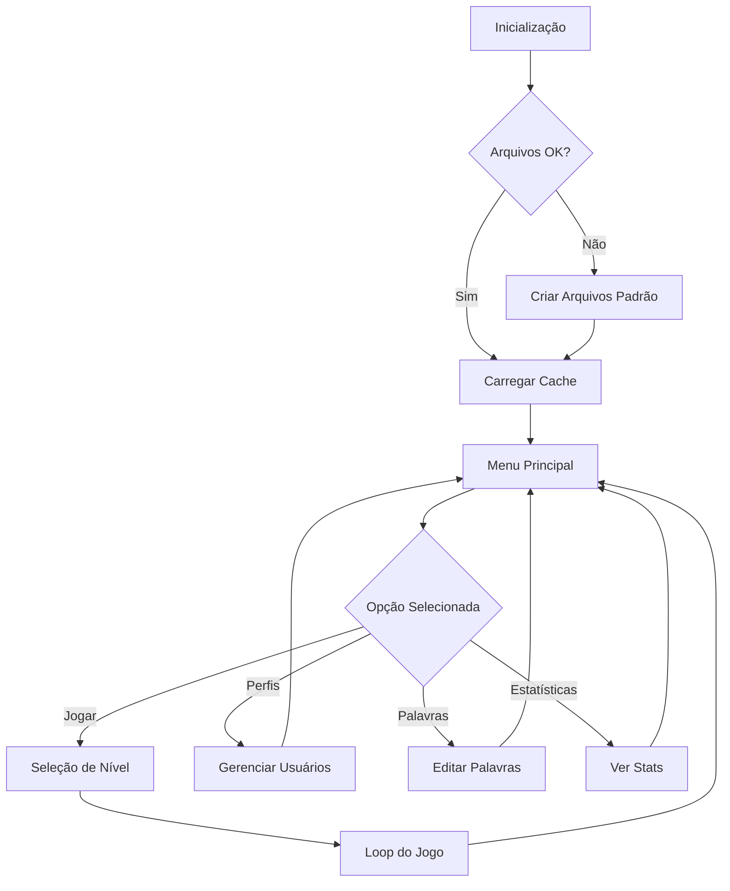

# 🎮 Jogo da Forca em C++

Um projeto acadêmico completo de Jogo da Forca desenvolvido em C++ com foco em boas práticas de programação, modularidade e robustez. O jogo é projetado para rodar no terminal e utiliza bibliotecas modernas como ncurses/pdcurses e pcre2.

## 📊 STATUS DO PROJETO

**🚀 EM DESENVOLVIMENTO ATIVO**

### ✅ Módulos Implementados

O projeto já possui uma base sólida com diversos módulos robustos e bem estruturados:

#### ⚙️ Módulo de Inicialização (`forcaInitialize`)
- **Sequência de Inicialização**: Executa verificações e preparações essenciais
- **Validação de Arquivos**: Verifica integridade, existência e permissões
- **Carregamento de Palavras**: Lê listas de palavras por nível de dificuldade
- **Sistema de Cache**: Carrega dados na memória para acesso rápido

#### 📂 Módulo de Arquivos (`forcaFiles`)
- **Gerenciamento de Caminhos**: Sistema organizado com pastas `default` e `custom`
- **Utilitários Completos**: `fileExist`, `canRead`, `canWrite`, `isEmpty`, `normalizePath`
- **Sistema de Restauração**: Criação automática de arquivos customizáveis
- **Operações Seguras**: Validação de permissões e tratamento de erros

#### 🔤 Módulo de Strings (`forcaStrings`)
- **Normalização**: `removeSpaces`, `removeAcentos`, `to_uppercase`, `to_lowercase`, `trim`
- **Funções PHP-like**: `explode` (com sobrecarga) e `implode` para vetores
- **Validação de Conteúdo**: Verificação de conformidade (apenas letras, etc.)

#### 🔍 Módulo de Regex (`forcaRegex`)
- **Wrapper PCRE2**: Abstração completa da biblioteca PCRE2
- **Funções preg_***: `preg_match`, `preg_match_all`, `preg_replace`
- **Suporte Avançado**: Delimitadores, flags (i, m, s), grupos nomeados
- **Gerenciamento de Memória**: Destrutores automáticos para limpeza

#### 🧰 Módulo de Utilitários (`forcaUtils`)
- **Limpeza Multiplataforma**: `clear_screen` para Windows e Unix-like
- **Validação Booleana**: `filter_validate_bool` inspirado no PHP
- **Funções Auxiliares**: Utilitários gerais do sistema

### 🔄 Funcionalidades Core em Desenvolvimento

#### 🎯 Sistema de Usuários
- Cadastro e login de usuários
- Perfis personalizados
- Estatísticas individuais por jogador
- Palavras personalizadas por usuário

#### 📝 Gerenciamento de Palavras
- Cache inteligente por nível de dificuldade
- Sistema CRUD (Criar, Ler, Atualizar, Deletar)
- Validação automática de conteúdo
- Backup e restauração de listas

#### 🎮 Lógica do Jogo
- Sistema de tentativas e validação
- Progressão visual da forca
- Sistema de dicas contextuais
- Estatísticas de partida em tempo real

## 🚧 Roadmap de Desenvolvimento

### 🎯 Fase 1: Interface Terminal (Em Andamento)
**Objetivo**: Construção da interface interativa completa

#### 🖥️ Interface com ncurses/pdcurses
- [ ] **Sistema de Menus Navegáveis**
  - Menu principal com navegação por setas
  - Submenus para configurações e estatísticas
  - Sistema de validação de entrada
  
- [ ] **Interface de Jogo Interativa**
  - Exibição visual da forca (ASCII art)
  - Palavra oculta com letras reveladas
  - Painel de letras já utilizadas
  - Indicador de tentativas restantes
  
- [ ] **Captura e Validação de Entrada**
  - Detecção de teclas especiais
  - Validação em tempo real
  - Feedback visual imediato
  
- [ ] **Sistema de Notificações**
  - Mensagens de erro e sucesso
  - Alertas contextuais
  - Confirmações de ações

#### 🔧 Melhorias Técnicas
- [ ] **Otimização de Performance**
  - Refinamento do sistema de cache
  - Otimização de operações de arquivo
  - Melhoria no gerenciamento de memória
  
- [ ] **Robustez e Tratamento de Erros**
  - Sistema abrangente de logging
  - Recuperação automática de falhas
  - Validação rigorosa de dados

### 🎯 Fase 2: Funcionalidades Essenciais (Opcional)
**Objetivo**: Melhorias básicas na experiência de jogo

#### ✨ Funcionalidades Simples
- [ ] **Sistema de Pontuação Básico**
  - Pontos por palavra acertada
  - Contagem de vitórias/derrotas
  
- [ ] **Estatísticas Simples**
  - Total de jogos
  - Percentual de acertos
  - Palavra mais difícil acertada
  
- [ ] **Melhorias de Usabilidade**
  - Dicas simples (primeira/última letra)
  - Confirmação antes de sair
  - Histórico da sessão atual

### 🎯 Fase 3: Interface Gráfica (Opcional)
**Objetivo**: Modernização com interface gráfica

#### 🖼️ Interface com CEF (Chromium Embedded Framework)
**Dependente de cronograma e recursos disponíveis**

- [ ] **Arquitetura Híbrida**
  - Backend C++ mantido
  - Frontend HTML5/CSS3/JavaScript
  - Comunicação via bindings CEF
  
- [ ] **Interface Visual Moderna**
  - Design responsivo e atrativo
  - Animações suaves
  - Temas personalizáveis

## 🧩 Arquitetura do Sistema

### 📁 Estrutura Modular

| Módulo | Arquivos | Responsabilidade Principal |
|--------|----------|---------------------------|
| **Core** | `forcaCore.h/.cpp` | Estruturas de dados centrais e definições |
| **Inicialização** | `forcaInitialize.h/.cpp` | Orquestração da inicialização do sistema |
| **Arquivos** | `forcaFiles.h/.cpp` | Gerenciamento completo de operações de arquivo |
| **Strings** | `forcaStrings.h/.cpp` | Manipulação e normalização de strings |
| **Regex** | `forcaRegex.h/.cpp` | Wrapper de alto nível para PCRE2 |
| **Utilitários** | `forcaUtils.h/.cpp` | Funções auxiliares multiplataforma |
| **Interface** | `forcaInterface.h/.cpp` | *[Planejado]* Sistema de interface ncurses |
| **Jogo** | `forcaGame.h/.cpp` | *[Planejado]* Lógica principal do jogo |
| **Usuários** | `forcaUsers.h/.cpp` | *[Planejado]* Gerenciamento de perfis |
| **Principal** | `main.cpp` | Ponto de entrada e loop principal |

### 🔄 Fluxo de Execução



# 📋 Guia de Instalação - Jogo da Forca

Este guia completo permite configurar o ambiente de desenvolvimento do zero e compilar o projeto "Jogo da Forca" tanto no Windows quanto no Linux.

## 📦 Git LFS (Large File Storage)

Este repositório utiliza **Git LFS** para armazenar arquivos grandes, como bibliotecas `.lib`, `.dll`, `.exe`, `.bin`, `.a` e recursos do CEF que ultrapassam o limite padrão do GitHub (100 MB).

> ⚠️ **IMPORTANTE**: Sem o Git LFS instalado, os arquivos grandes NÃO serão baixados corretamente. Você verá apenas arquivos de ponteiro e o projeto não funcionará.

### 🧠 Por que usar o Git LFS?

O GitHub permite arquivos de até **100 MB** por padrão. Acima disso:

- O push é **bloqueado** com erro
- Mesmo arquivos entre 50 MB e 100 MB geram **avisos**
- Você perde controle de versionamento de dependências grandes (ex: libs do CEF)

O Git LFS resolve isso:
- Ele **rastreia arquivos grandes separadamente**
- Substitui os arquivos reais no Git por pequenos "ponteiros"
- Os arquivos verdadeiros são armazenados em um **repositório LFS** à parte

### Instalação do Git LFS

#### 🪟 Windows

1. **Baixar o instalador:**
   - Acesse: [https://git-lfs.github.com/](https://git-lfs.github.com/)
   - Baixe e execute o instalador

2. **Configurar no terminal:**
   ```bash
   git lfs install
   ```

#### 🐧 Linux (Ubuntu/Debian)

```bash
sudo apt update
sudo apt install git-lfs
git lfs install
```

Para outras distribuições, consulte as [instruções oficiais](https://git-lfs.github.com/).

### Clonando o Repositório

#### 🔰 Método Recomendado (Garantido)

```bash
git lfs install
git clone https://github.com/pedrohrigolin/Jogo-da-Forca.git JogoDaForca
cd JogoDaForca
git lfs pull
```

> 💡 **Nota:** Mesmo com o Git LFS instalado, rodar `git lfs pull` após o clone garante que *todos* os arquivos grandes sejam baixados corretamente, evitando erros.

#### Se você já clonou antes de instalar o Git LFS

```bash
cd JogoDaForca
git lfs install
git lfs pull
```

### Atualizando o Repositório

Quando for atualizar seu repositório local:

```bash
git pull
git lfs pull
```

> ⚠️ Isso garante que os arquivos grandes sejam baixados corretamente em qualquer sistema, mesmo que o Git LFS não esteja 100% configurado localmente.

### Fazendo Commits com Arquivos Grandes

Sempre que fizer commits que incluam arquivos `.lib`, `.dll`, `.exe`, `.bin`, `.a`, use esta sequência para garantir que sejam versionados corretamente:

#### 🔢 Procedimento para Todo Commit

```bash
# 1. Adiciona todos os arquivos normalmente
git add .

# 2. Força o Git a reindexar os arquivos grandes com suporte ao Git LFS

# Linux / Git Bash
find . \( -path ./build -o -path ./bin \) -prune -o -type f \( -iname "*.lib" -o -iname "*.dll" -o -iname "*.exe" -o -iname "*.bin" -o -iname "*.a" \) -exec git add --force {} +

# PowerShell
Get-ChildItem -Recurse -Include *.lib,*.dll,*.exe,*.bin,*.a -File | Where-Object { $_.FullName -notmatch '\\build\\|\\bin\\' } | ForEach-Object { git add --force $_.FullName }

# 3. Commita normalmente
git commit -m "Sua mensagem de commit"

# 4. Realiza o push
git push
```

### Arquivos Rastreados pelo Git LFS

Este projeto já está configurado para rastrear automaticamente estes tipos de arquivo:

```text
*.lib
*.dll
*.exe
*.bin
*.a
```

Isso está definido no arquivo `.gitattributes`:

```text
*.lib filter=lfs diff=lfs merge=lfs -text
*.dll filter=lfs diff=lfs merge=lfs -text
*.exe filter=lfs diff=lfs merge=lfs -text
*.bin filter=lfs diff=lfs merge=lfs -text
*.a   filter=lfs diff=lfs merge=lfs -text
```

### Verificando se está Funcionando

Para ver se os arquivos foram adicionados com Git LFS corretamente:

```bash
git lfs ls-files
```

**Exemplo de saída esperada:**
```
0e09844f1b * vendor/cef/linux/Release/v8_context_snapshot.bin
039fce4b94 * vendor/cef/win/Debug/cef_sandbox.lib
eb3d384ba0 * vendor/cef/win/Release/cef_sandbox.lib
9709105d9e * vendor/cef/win/Release/cefclient.exe
2212160032 * vendor/cef/win/Release/chrome_elf.dll
7120a30bf9 * vendor/cef/win/Release/d3dcompiler_47.dll
b903485489 * vendor/cef/win/Release/dxcompiler.dll
473f5e8531 * vendor/cef/win/Release/dxil.dll
f280591dbd * vendor/cef/win/Release/libEGL.dll
77e9d8f6ae * vendor/cef/win/Release/libGLESv2.dll
fb91cfb039 * vendor/cef/win/Release/libcef.dll
1b3f10db0e * vendor/cef/win/Release/libcef.lib
366b320a55 * vendor/cef/win/Release/v8_context_snapshot.bin
1e72dd05e9 * vendor/cef/win/Release/vk_swiftshader.dll
c1a2ed8585 * vendor/cef/win/Release/vulkan-1.dll
```

> 💡 Se você vir uma lista como essa, significa que o Git LFS está funcionando corretamente e rastreando todos os arquivos grandes do projeto CEF.

---

## 🛠️ Configuração do Ambiente de Desenvolvimento

### 🪟 Windows

#### Fase 1: Preparação do Ambiente

##### 1. Git para Windows
- **Download:** [https://git-scm.com/download/win](https://git-scm.com/download/win)
- **Instalação:** Execute o instalador mantendo as opções padrão

##### 2. Visual Studio Build Tools 2022
- **Download:** [https://aka.ms/vs/17/release/vs_BuildTools.exe](https://aka.ms/vs/17/release/vs_BuildTools.exe)
- **Instalação:**
  -  **1.** Execute o `vs_BuildTools.exe`
  -  **2.** Na tela "Cargas de Trabalho", marque **apenas**: "Desenvolvimento para desktop com C++"
  -  **3.** Clique em "Instalar"

##### 3. vcpkg (Gerenciador de Dependências)
```cmd
git clone https://github.com/microsoft/vcpkg C:\vcpkg
C:\vcpkg\bootstrap-vcpkg.bat
```

##### 4. Ninja (Sistema de Build)

**Método 1 - Winget (Recomendado):**
```powershell
winget install Ninja-build.Ninja
```

**Método 2 - Manual:**
1. Baixe de: [https://github.com/ninja-build/ninja/releases](https://github.com/ninja-build/ninja/releases)
2. Extraia `ninja.exe` para `C:\tools\ninja`
3. Adicione `C:\tools\ninja` ao PATH do Windows:
   - Windows + R → `sysdm.cpl` → Variáveis de Ambiente
   - Editar variável `Path` → Novo → `C:\tools\ninja`

#### Fase 2: Compilação

1. **Abrir terminal correto:**
   - Menu Iniciar → "x64 Native Tools Command Prompt for VS 2022"

2. **Navegar para o projeto:**
   ```cmd
   cd JogoDaForca
   ```

3. **Configurar com CMake:**
   ```cmd
   cmake -G "Ninja" -D CMAKE_TOOLCHAIN_FILE="C:/vcpkg/scripts/buildsystems/vcpkg.cmake" -D VCPKG_TARGET_TRIPLET="x64-windows-static" -D CMAKE_BUILD_TYPE="Release" -S . -B build
   ```

4. **Compilar:**
   ```cmd
   cmake --build build
   ```

5. **Executar:**
   ```cmd
   .\bin\JogoDaForca.exe
   ```

---

### 🐧 Linux (Ubuntu/Debian)

#### Fase 1: Preparação do Ambiente

##### 1. Ferramentas Essenciais
```bash
sudo apt update
sudo apt install build-essential git
```

##### 2. CMake
```bash
sudo apt install cmake
```

##### 3. Ninja
```bash
sudo apt install ninja-build
```

##### 4. vcpkg
```bash
cd ~
git clone https://github.com/microsoft/vcpkg.git
./vcpkg/bootstrap-vcpkg.sh
```

##### 5. Dependências do CEF (GTK3)
```bash
sudo apt install libgtk-3-dev
```

#### Fase 2: Compilação

1. **Navegar para o projeto:**
   ```bash
   cd JogoDaForca
   ```

2. **Configurar com CMake:**
   ```bash
   cmake -G "Ninja" -D CMAKE_C_COMPILER=gcc -D CMAKE_CXX_COMPILER=g++ -D CMAKE_TOOLCHAIN_FILE="$HOME/vcpkg/scripts/buildsystems/vcpkg.cmake" -D VCPKG_TARGET_TRIPLET="x64-linux" -D CMAKE_BUILD_TYPE="Release" -S . -B build
   ```

3. **Compilar:**
   ```bash
   cmake --build build
   ```

4. **Executar:**
   ```bash
   ./bin/JogoDaForca
   ```

---

## 🔍 Troubleshooting

### Problemas Comuns

#### "Arquivos grandes não foram baixados"
- **Causa:** Git LFS não estava instalado no momento do clone
- **Solução:** 
  ```bash
  git lfs install
  git lfs pull
  ```

#### "Arquivos grandes não foram enviados no push"
- **Causa:** Arquivos grandes não foram reindexados corretamente
- **Solução:** Use `git add --force` nos arquivos grandes antes do commit

#### "ninja: command not found" (Linux)
- **Solução:** 
  ```bash
  sudo apt install ninja-build
  ```

#### "MSVC not found" (Windows)
- **Causa:** Terminal errado ou Build Tools não instalados
- **Solução:** Use o "x64 Native Tools Command Prompt for VS 2022"

#### Problemas com vcpkg
- **Verifique o caminho:** Certifique-se que o vcpkg está em `C:\vcpkg` (Windows) ou `~/vcpkg` (Linux)
- **Recompile o vcpkg:** Execute novamente o bootstrap

### Verificação da Instalação

**Verificar Git LFS:**
```bash
git lfs version
git lfs ls-files  # Lista arquivos rastreados pelo LFS
```

**Verificar ferramentas (Linux):**
```bash
gcc --version
cmake --version
ninja --version
```

**Verificar ferramentas (Windows):**
```cmd
cl
cmake --version
ninja --version
```

---

## 📝 Notas Importantes

- **Primeira vez:** A configuração do ambiente precisa ser feita apenas uma vez por máquina
- **Compilação Debug:** Para versão de debug, substitua `Release` por `Debug` no comando CMake
- **Localização do executável:** O jogo compilado estará sempre na pasta `bin/` na raiz do projeto
- **Git LFS:** Sempre instale o Git LFS **antes** de clonar repositórios que o utilizam
- **Push de arquivos grandes:** Use sempre `git add --force` para arquivos grandes antes do commit
- **Pull completo:** Sempre execute `git lfs pull` após `git pull` para garantir download dos arquivos grandes

---

## 🎯 Resumo dos Comandos

### Workflow Completo (Git + Git LFS)
```bash
# 1. Clonar repositório
git lfs install
git clone <URL_REPOSITORIO> JogoDaForca
cd JogoDaForca
git lfs pull

# 2. Fazer alterações no código
# ... suas modificações ...

# 3. Commit com suporte a arquivos grandes
git add .
# Reindexar arquivos grandes (Linux/Git Bash)
find . -type f \( -iname "*.lib" -o -iname "*.dll" -o -iname "*.exe" -o -iname "*.bin" -o -iname "*.a" \) -exec git add --force {} +
git commit -m "Sua mensagem"
git push

# 4. Atualizar repositório
git pull
git lfs pull
```

### Compilação (sempre que necessário)
```bash
# Configurar
cmake -G "Ninja" [opções específicas do SO] -S . -B build

# Compilar
cmake --build build

# Executar
./bin/JogoDaForca  # Linux
.\bin\JogoDaForca.exe  # Windows
```

---

## 📚 Documentação Técnica

### 🎯 Princípios de Design

- **Modularidade**: Cada módulo tem responsabilidade bem definida
- **Robustez**: Tratamento abrangente de erros e casos extremos
- **Performance**: Otimização com cache e estruturas eficientes
- **Portabilidade**: Compatibilidade entre Windows e sistemas Unix-like
- **Manutenibilidade**: Código limpo e bem documentado

### 🔧 Padrões Utilizados

- **RAII** (Resource Acquisition Is Initialization)
- **Strategy Pattern** para diferentes níveis de dificuldade
- **Factory Pattern** para criação de objetos de jogo
- **Observer Pattern** para notificações de eventos

### 📖 Convenções de Código

- **Nomes de Funções**: camelCase (`loadWordList`)
- **Nomes de Classes**: PascalCase (`WordManager`)
- **Constantes**: UPPER_SNAKE_CASE (`MAX_ATTEMPTS`)
- **Arquivos**: kebab-case (`forca-utils.cpp`)

## 🤝 Contribuição e Desenvolvimento

### 🎓 Contexto Acadêmico
Este é um projeto acadêmico desenvolvido para demonstrar:
- Domínio de C++ moderno
- Arquitetura de software modular
- Boas práticas de desenvolvimento
- Integração de bibliotecas externas

### 📋 TODO Imediato
- [ ] Finalizar sistema de cache de palavras
- [ ] Implementar interface ncurses básica
- [ ] Criar sistema de usuários simples
- [ ] Desenvolver lógica principal do jogo
- [ ] Adicionar funcionalidades básicas de jogo

### 🐛 Reporte de Issues
Para questões académicas ou sugestões de melhoria, abra uma issue no repositório com:
- Descrição clara do problema/sugestão
- Contexto de uso
- Exemplos quando aplicável

## 📄 Licença

Este projeto é desenvolvido para fins acadêmicos. Consulte o arquivo LICENSE para mais detalhes.

---