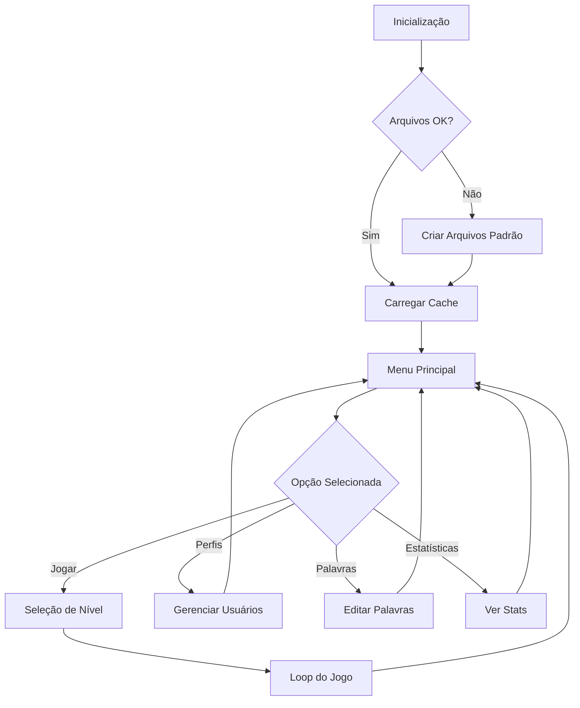

# 🎮 Jogo da Forca em C++

Um projeto acadêmico completo de Jogo da Forca desenvolvido em C++ com foco em boas práticas de programação, modularidade e robustez. O jogo é projetado para rodar no terminal e utiliza bibliotecas modernas como ncurses/pdcurses e pcre2.

## 📊 STATUS DO PROJETO

**🚀 EM DESENVOLVIMENTO ATIVO**

### ✅ Módulos Implementados

O projeto já possui uma base sólida com diversos módulos robustos e bem estruturados:

#### ⚙️ Módulo de Inicialização (`forcaInitialize`)
- **Sequência de Inicialização**: Executa verificações e preparações essenciais
- **Validação de Arquivos**: Verifica integridade, existência e permissões
- **Carregamento de Palavras**: Lê listas de palavras por nível de dificuldade
- **Sistema de Cache**: Carrega dados na memória para acesso rápido

#### 📂 Módulo de Arquivos (`forcaFiles`)
- **Gerenciamento de Caminhos**: Sistema organizado com pastas `default` e `custom`
- **Utilitários Completos**: `fileExist`, `canRead`, `canWrite`, `isEmpty`, `normalizePath`
- **Sistema de Restauração**: Criação automática de arquivos customizáveis
- **Operações Seguras**: Validação de permissões e tratamento de erros

#### 🔤 Módulo de Strings (`forcaStrings`)
- **Normalização**: `removeSpaces`, `removeAcentos`, `to_uppercase`, `to_lowercase`, `trim`
- **Funções PHP-like**: `explode` (com sobrecarga) e `implode` para vetores
- **Validação de Conteúdo**: Verificação de conformidade (apenas letras, etc.)

#### 🔍 Módulo de Regex (`forcaRegex`)
- **Wrapper PCRE2**: Abstração completa da biblioteca PCRE2
- **Funções preg_***: `preg_match`, `preg_match_all`, `preg_replace`
- **Suporte Avançado**: Delimitadores, flags (i, m, s), grupos nomeados
- **Gerenciamento de Memória**: Destrutores automáticos para limpeza

#### 🧰 Módulo de Utilitários (`forcaUtils`)
- **Limpeza Multiplataforma**: `clear_screen` para Windows e Unix-like
- **Validação Booleana**: `filter_validate_bool` inspirado no PHP
- **Funções Auxiliares**: Utilitários gerais do sistema

### 🔄 Funcionalidades Core em Desenvolvimento

#### 🎯 Sistema de Usuários
- Cadastro e login de usuários
- Perfis personalizados
- Estatísticas individuais por jogador
- Palavras personalizadas por usuário

#### 📝 Gerenciamento de Palavras
- Cache inteligente por nível de dificuldade
- Sistema CRUD (Criar, Ler, Atualizar, Deletar)
- Validação automática de conteúdo
- Backup e restauração de listas

#### 🎮 Lógica do Jogo
- Sistema de tentativas e validação
- Progressão visual da forca
- Sistema de dicas contextuais
- Estatísticas de partida em tempo real

## 🚧 Roadmap de Desenvolvimento

### 🎯 Fase 1: Interface Terminal (Em Andamento)
**Objetivo**: Construção da interface interativa completa

#### 🖥️ Interface com ncurses/pdcurses
- [ ] **Sistema de Menus Navegáveis**
  - Menu principal com navegação por setas
  - Submenus para configurações e estatísticas
  - Sistema de validação de entrada
  
- [ ] **Interface de Jogo Interativa**
  - Exibição visual da forca (ASCII art)
  - Palavra oculta com letras reveladas
  - Painel de letras já utilizadas
  - Indicador de tentativas restantes
  
- [ ] **Captura e Validação de Entrada**
  - Detecção de teclas especiais
  - Validação em tempo real
  - Feedback visual imediato
  
- [ ] **Sistema de Notificações**
  - Mensagens de erro e sucesso
  - Alertas contextuais
  - Confirmações de ações

#### 🔧 Melhorias Técnicas
- [ ] **Otimização de Performance**
  - Refinamento do sistema de cache
  - Otimização de operações de arquivo
  - Melhoria no gerenciamento de memória
  
- [ ] **Robustez e Tratamento de Erros**
  - Sistema abrangente de logging
  - Recuperação automática de falhas
  - Validação rigorosa de dados

### 🎯 Fase 2: Funcionalidades Essenciais (Opcional)
**Objetivo**: Melhorias básicas na experiência de jogo

#### ✨ Funcionalidades Simples
- [ ] **Sistema de Pontuação Básico**
  - Pontos por palavra acertada
  - Contagem de vitórias/derrotas
  
- [ ] **Estatísticas Simples**
  - Total de jogos
  - Percentual de acertos
  - Palavra mais difícil acertada
  
- [ ] **Melhorias de Usabilidade**
  - Dicas simples (primeira/última letra)
  - Confirmação antes de sair
  - Histórico da sessão atual

### 🎯 Fase 3: Interface Gráfica (Opcional)
**Objetivo**: Modernização com interface gráfica

#### 🖼️ Interface com CEF (Chromium Embedded Framework)
**Dependente de cronograma e recursos disponíveis**

- [ ] **Arquitetura Híbrida**
  - Backend C++ mantido
  - Frontend HTML5/CSS3/JavaScript
  - Comunicação via bindings CEF
  
- [ ] **Interface Visual Moderna**
  - Design responsivo e atrativo
  - Animações suaves
  - Temas personalizáveis

## 🧩 Arquitetura do Sistema

### 📁 Estrutura Modular

| Módulo | Arquivos | Responsabilidade Principal |
|--------|----------|---------------------------|
| **Core** | `forcaCore.h/.cpp` | Estruturas de dados centrais e definições |
| **Inicialização** | `forcaInitialize.h/.cpp` | Orquestração da inicialização do sistema |
| **Arquivos** | `forcaFiles.h/.cpp` | Gerenciamento completo de operações de arquivo |
| **Strings** | `forcaStrings.h/.cpp` | Manipulação e normalização de strings |
| **Regex** | `forcaRegex.h/.cpp` | Wrapper de alto nível para PCRE2 |
| **Utilitários** | `forcaUtils.h/.cpp` | Funções auxiliares multiplataforma |
| **Interface** | `forcaInterface.h/.cpp` | *[Planejado]* Sistema de interface ncurses |
| **Jogo** | `forcaGame.h/.cpp` | *[Planejado]* Lógica principal do jogo |
| **Usuários** | `forcaUsers.h/.cpp` | *[Planejado]* Gerenciamento de perfis |
| **Principal** | `main.cpp` | Ponto de entrada e loop principal |

### 🔄 Fluxo de Execução



## 🛠️ Compilação e Execução

### 📋 Pré-requisitos

- **Compilador C++17** (GCC 7+ ou equivalente)
- **CMake 3.15+**
- **Bibliotecas**:
  - `pdcurses` (Windows) ou `ncurses` (Unix-like)
  - `pcre2` para expressões regulares

### ⚙️ Processo de Build

#### 1️⃣ Preparar Ambiente
```bash
mkdir build
cd build
```

#### 2️⃣ Configurar com CMake
```bash
# Para MinGW (Windows)
cmake .. -G "MinGW Makefiles"

# Para Make (Linux/macOS)
cmake .. -G "Unix Makefiles"
```

#### 3️⃣ Compilar
```bash
cmake --build . --config Release
```

#### 4️⃣ Executar
```bash
# Windows
.\bin\forca.exe

# Linux/macOS
./bin/forca
```

### 🧹 Limpeza de Build
```bash
# Windows (PowerShell)
Remove-Item -Recurse -Force CMakeCache.txt, CMakeFiles

# Linux/macOS
rm -rf CMakeCache.txt CMakeFiles
```

## 📚 Documentação Técnica

### 🎯 Princípios de Design

- **Modularidade**: Cada módulo tem responsabilidade bem definida
- **Robustez**: Tratamento abrangente de erros e casos extremos
- **Performance**: Otimização com cache e estruturas eficientes
- **Portabilidade**: Compatibilidade entre Windows e sistemas Unix-like
- **Manutenibilidade**: Código limpo e bem documentado

### 🔧 Padrões Utilizados

- **RAII** (Resource Acquisition Is Initialization)
- **Strategy Pattern** para diferentes níveis de dificuldade
- **Factory Pattern** para criação de objetos de jogo
- **Observer Pattern** para notificações de eventos

### 📖 Convenções de Código

- **Nomes de Funções**: camelCase (`loadWordList`)
- **Nomes de Classes**: PascalCase (`WordManager`)
- **Constantes**: UPPER_SNAKE_CASE (`MAX_ATTEMPTS`)
- **Arquivos**: kebab-case (`forca-utils.cpp`)

## 🤝 Contribuição e Desenvolvimento

### 🎓 Contexto Acadêmico
Este é um projeto acadêmico desenvolvido para demonstrar:
- Domínio de C++ moderno
- Arquitetura de software modular
- Boas práticas de desenvolvimento
- Integração de bibliotecas externas

### 📋 TODO Imediato
- [ ] Finalizar sistema de cache de palavras
- [ ] Implementar interface ncurses básica
- [ ] Criar sistema de usuários simples
- [ ] Desenvolver lógica principal do jogo
- [ ] Adicionar funcionalidades básicas de jogo

### 🐛 Reporte de Issues
Para questões académicas ou sugestões de melhoria, abra uma issue no repositório com:
- Descrição clara do problema/sugestão
- Contexto de uso
- Exemplos quando aplicável

## 📄 Licença

Este projeto é desenvolvido para fins acadêmicos. Consulte o arquivo LICENSE para mais detalhes.

---